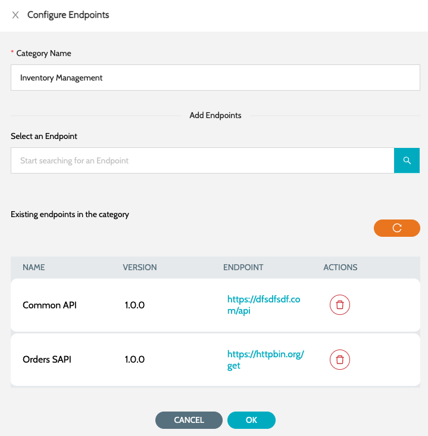

# Categories

## Categories

Category is a collection of Endpoints. Multiple endpoints can be added to each category, which can then be added to the status page

1. Navigate to **`IZ Pulse`** -> **`Categories`**&#x20;
2. Click on **`Configure Endpoints`** to add endpoints to the category

<figure><figcaption></figcaption></figure>

### See Also

* [Configure Schedule](../../../integral-zone/iz-suite/iz-pulse/configure-schedule.md)
* [Endpoints](../../../integral-zone/iz-suite/iz-pulse/endpoints/)
* [Status Pages](../../../integral-zone/iz-suite/iz-pulse/status-pages/)
