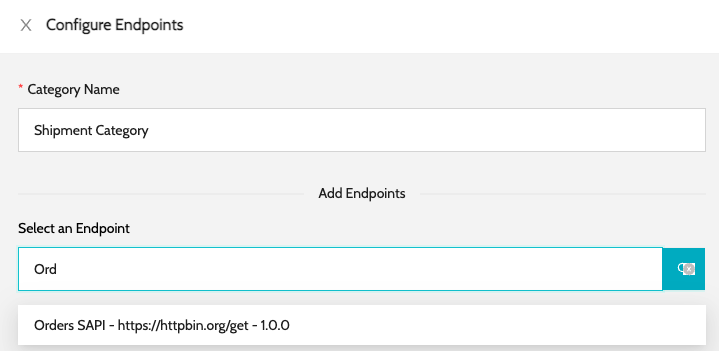
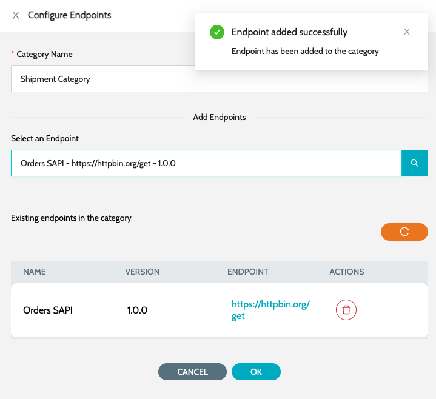

# Configure Category

### Basic Details

1. Navigate to **`IZ Pulse`** -> **`Categories`** and click on **`Create Category`**
2. Enter a name for the category and click on Submit

### Add Endpoints

1.  Search for a **`Endpoint`** and select the same to add it as part of the category  

    <figure><figcaption></figcaption></figure>
2.  The selected endpoints will be displayed in a table 

    <figure><figcaption></figcaption></figure>

### See Also

* [Configure Schedule](../about-iz-pulse/configure-schedule.md)
* [Endpoints](../about-iz-pulse/endpoints/)
* [Categories](./)
* [Status Pages](../about-iz-pulse/status-pages/)
