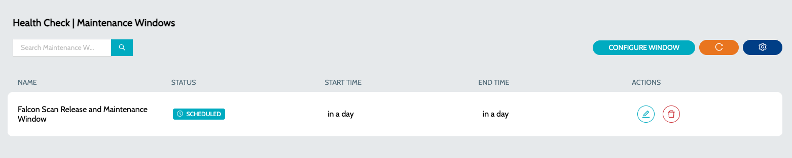

# Maintenance Windows

A maintenance window refers to a designated period of time during which planned maintenance activities or system updates are performed. Maintenance windows can be performed on a **`Status Page`**, **`Category`** or **`Endpopint`**. Maintenance windows are commonly scheduled during periods of low user activity to minimize the impact on users and business operations.

Communication with stakeholders is crucial during the planning and execution of maintenance windows to inform users about potential downtime or disruptions. All users subscribed to the **`Status Pages`** will receive the maintenance window updates.

### Maintenance Windows

1.  Navigate to **`IZ Pulse`** -> **`Maintenance Window`**  

    <figure><figcaption></figcaption></figure>
2. Each maintenance window is associated with -
   1. Start time - Start date and time of the maintenance window
   2. End time - End date and time of the maintenance window
   3. Name - Name of the maintenance window
   4. Description - Description of the maintenance window
   5. Notify Before - Duration in minutes before which the notification should be sent to subscribed users
   6. Status Pages - Endpoints in the status page which will be under maintenance
   7. Categories - Endpoints in the categories which will be under maintenance
   8. Endpoints - Endpoints which will be under maintenance
3. Click on the **`Configure Window`** action to create a new maintenance window. Refer to [Configure Maintenance Window](configure-maintenance-window.md).

### See Also

* [Configure Schedule](../about-iz-pulse/configure-schedule.md)
* [Categories](../categories/)
* [Status Pages](../about-iz-pulse/status-pages/)
