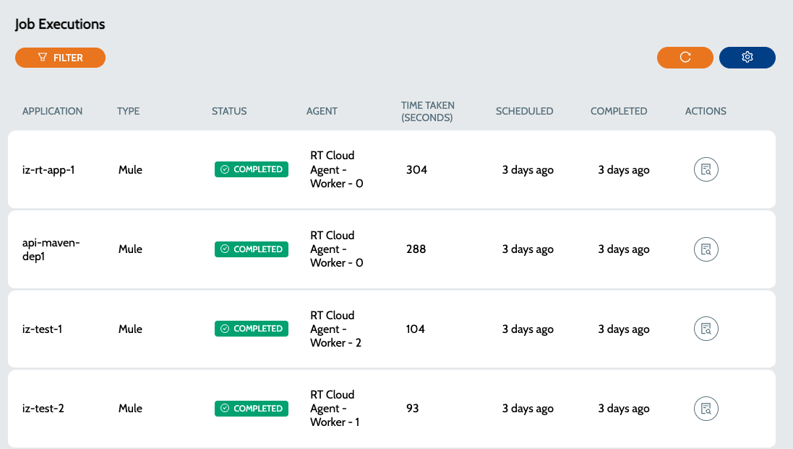
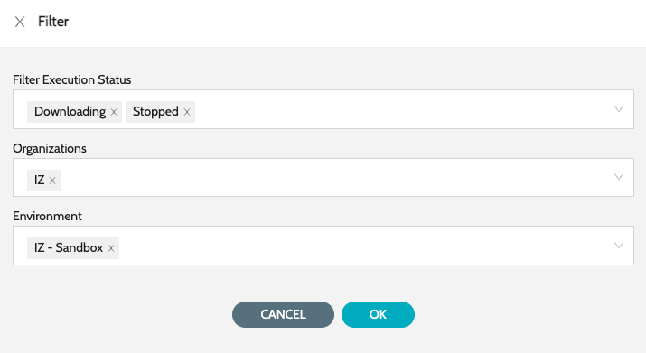

# Job Executions

After the jobs are executed according to the set schedule, the status and logs for each execution will be accessible.

### Execution Log

1. Navigate to **`Schedules`** -> **`Jobs`**&#x20;

<figure><figcaption></figcaption></figure>

2. Click on **`Execution Log`** to view the execution log
3. Use the filter option to filter the executions&#x20;

<figure><figcaption></figcaption></figure>

### See Also

* [Job Schedules](job-schedules.md)
