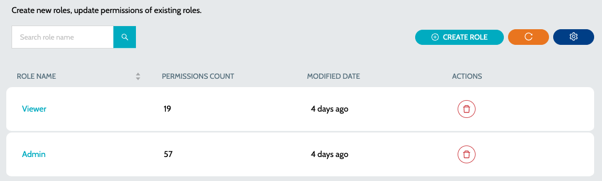
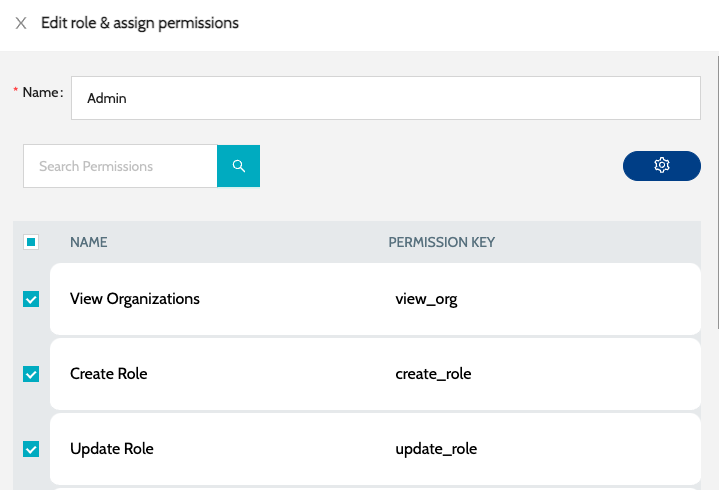
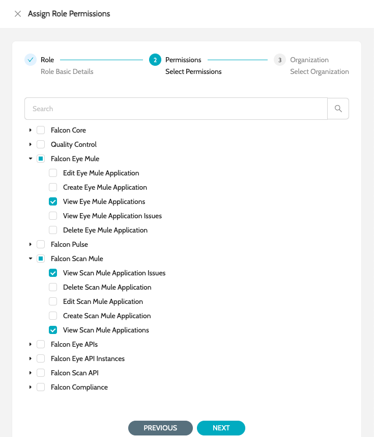
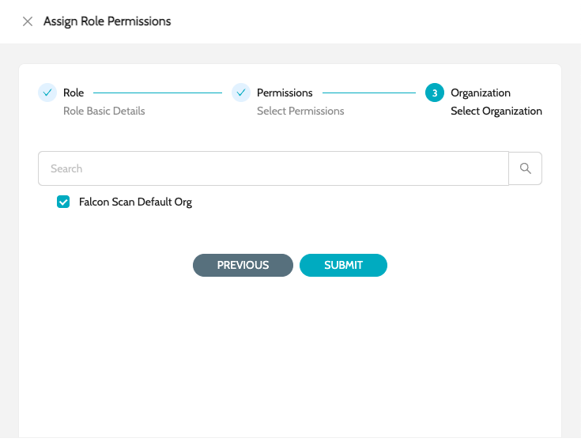

# Roles

### Built-in Roles

| Role Name                                           | Description                                                                | Modules .6+                      |
| --------------------------------------------------- | -------------------------------------------------------------------------- | -------------------------------- |
| **`IZ Core Admin`** .6+                             | Admin access to all IZ Core Modules                                        | **`Organization`**               |
| **`Global Settings`**                               | **`Agents`**                                                               | **`Users`**                      |
| **`Schedules`**                                     | **`Audit`** .5+                                                            | **`Quality Control Admin`** .5+  |
| Admin access to Quality Control Settings            | **`Quality Gates`**                                                        | **`Quality Profiles`**           |
| **`Rules`**                                         | **`Metric Profiles`**                                                      | **`Metrics`** .4+                |
| **`IZ Pulse Admin`** .4+                            | Admin access to IZ Pulse Settings                                          | **`Status Pages`**               |
| **`Categories`**                                    | **`Endpoints`**                                                            | **`Maintenance Schedules`**      |
| **`IZ Scan CLI`**                                   | Role with appropriate permissions to be used with IDE Plugin or CICD Scans | **`IZ Scan CLI / IDE`** .3+      |
| **`_ORG_ IZ Eye Admin`** .3+                        | Admin access to IZ Eye for a specific organization                         | **`Mule Application`**           |
| **`Exchange APIs`**                                 | **`API Manager Apps`** .2+                                                 | **`_ORG_ IZ Scan Admin`** .2+    |
| Admin access to IZ Scan for a specific organization | **`Mule Projects`**                                                        | **`API Projects`** .6+           |
| **`IZ Core Viewer`** .6+                            | View access to all IZ Core Modules                                         | **`Organization`**               |
| **`Global Settings`**                               | **`Agents`**                                                               | **`Users`**                      |
| **`Schedules`**                                     | **`Audit`** .5+                                                            | **`Quality Control Viewer`** .5+ |
| View access to Quality Control Settings             | **`Quality Gates`**                                                        | **`Quality Profiles`**           |
| **`Rules`**                                         | **`Metric Profiles`**                                                      | **`Metrics`** .4+                |
| **`IZ Pulse Viewer`** .4+                           | View access to IZ Pulse Settings                                           | **`Status Pages`**               |
| **`Categories`**                                    | **`Endpoints`**                                                            | **`Maintenance Schedules`** .3+  |
| **`_ORG_ IZ Eye Viewer`** .3+                       | View access to IZ Eye for a specific organization                          | **`Mule Application`**           |
| **`Exchange APIs`**                                 | **`API Manager Apps`** .2+                                                 | **`_ORG_ IZ Scan Viewers`** .2+  |
| View access to IZ Scan for a specific organization  | **`Mule Projects`**                                                        | **`API Projects`**               |

### Roles

To view all roles in the system -

1. Navigate to **`Organization`** -> **`Roles`**&#x20;

<figure><figcaption></figcaption></figure>

2. Click on the role name to edit the permissions assigned to the role&#x20;

<figure><figcaption></figcaption></figure>

3. Choose the required set of permissions and click on Submit

### Create Role

To create a new role -

1. Navigate to **`Organization`** -> **`Roles`** and click on **`Create Role`**&#x20;

Choose the required set of permissions&#x20;

<figure><figcaption></figcaption></figure>

3. Choose the appropriate Organization and Environments (if applicable)&#x20;

<figure><figcaption></figcaption></figure>

4. Click on Submit

### See Also

* [Organizations](organizations.md)
* [Users](users.md)
* [Invite User](invite-user.md)
