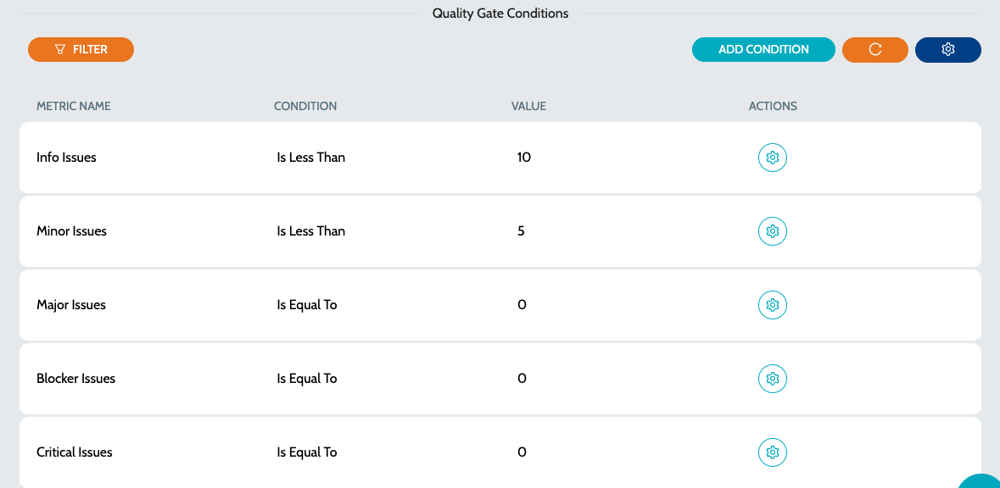

# Create Quality Gates

## Configure Quality Gate

Create a new Quality Gate -

1. Navigate to **`Quality Control`** -> **`Quality Gates`**
2. Click on **`New Quality Gate`**
3. Enter the basic details -
   1. **`Quality Gate Name`** - Enter a name of for the Quality Gate and click in **`Submit`**&#x20;
4. Once the Quality Gate is created, start adding conditions to match the organization standards
5. Click on **`Add Condition`** to add a new condition. Parameters include -
   1. **`Key`** - Metric Key to be validated
   2. **`Condition`** - Indicated the mathematical condition to be applied
   3.  **`Value`** - Value to validate the metric value against\
       &#x20;

       <figure><figcaption></figcaption></figure>
6. Click on **`Submit`** to create the Quality Gate condition&#x20;
7. Click on **`Configure Condition`** in the row to edit any of the existing conditions

### See Also

* [Quality Profiles](../profiles/quality-profiles.md)
* [Metric Profiles](../profiles/metric-profiles.md)
* [Quality Rules](../rules/quality-rules.md)
* [Metric Rules](../rules/metric-rules.md)
