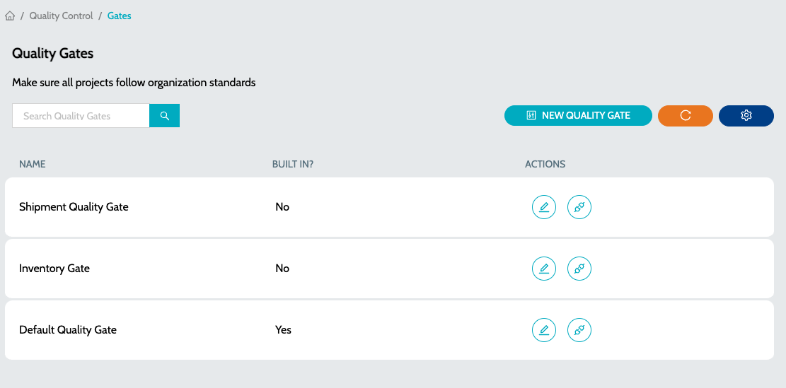
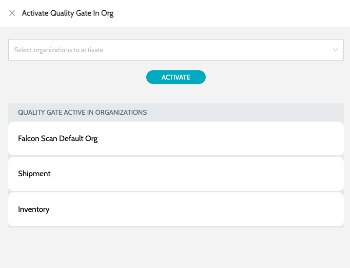

# Quality Gates

## Quality Gates

Quality Gates make sure that all the projects follow the organization standards before being deployed/promoted to any environment

1.  Navigate to **`Quality Control`** -> **`Quality Gates`**  

    <figure><figcaption></figcaption></figure>
2. Details include -
   1. **`Name`** - Name of the rule
   2. **`Built In`** - Indicates if the Quality Gate is built in
   3. **`Actions`** - Actions include -
      1. **`Edit Quality Profile`** - Modify the conditions of the existing Quality Gate
      2.  **`Activate In Org`** - Activate the Quality Gate in any of the available organizations 

          <figure><figcaption></figcaption></figure>

### See Also

* [Quality Profiles](../profiles/quality-profiles.md)
* [Metric Profiles](../profiles/metric-profiles.md)
* [Metric Rules](../rules/metric-rules.md)
