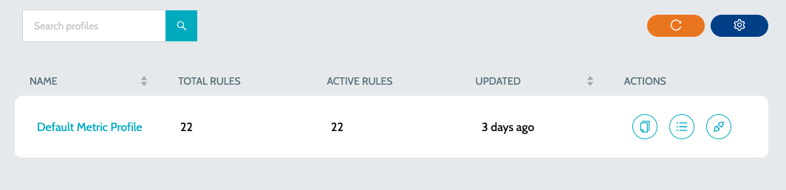

# Metric Profiles

A metric profile comprises a set of rules that are employed to calculate/gather the metrics of an application. To view the list of available Metric Profiles -

1.  Navigate to **`Metric Profiles`** and select the language specific profile. Eg: Mule Metric Profiles, API Metric Profiles\
    &#x20;

    <figure><figcaption></figcaption></figure>
2. Details include -
   1. **`Name`** - Name of the Quality Rule
   2. **`Total Rules`** - Total number of rules in the quality profile
   3. **`Active Rules`** - Total number of active rules in the quality profile
3. Actions include -
   1. **`Clone Profile`** - Clone the profile and create a new one
   2. **`View Rules`** - View the list of rules in the Metric Profile
   3.  **`Activate Profile in Org`** - Activate the Quality profile in organization. All the applications in the organization will be scanned using the selected profile\
       &#x20;

       <figure><figcaption></figcaption></figure>

### See Also

* [Quality Profiles](quality-profiles.md)
* [Quality Rules](../rules/quality-rules.md)
* [Metric Rules](../rules/metric-rules.md)
