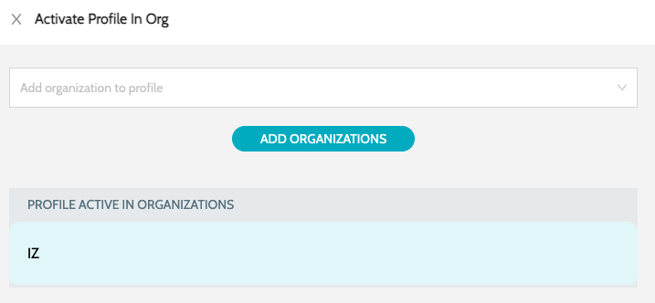
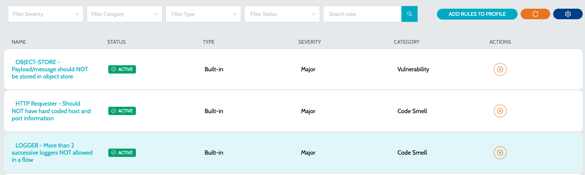

# Quality Profiles

### Profiles

A quality profile comprises a set of rules that are employed during the process of scanning an application. To view the list of available Quality Profiles -

1.  Navigate to **`Quality Profiles`** and select the language specific profile. E.g.: Mule Rule Profiles, API Rule Profiles 

    <figure><figcaption></figcaption></figure>
2. Details include:
   1. **`Name`** - Name of the Quality Rule
   2. **`Total Rules`** - Total number of rules in the quality profile
   3. **`Active Rules`** - Total number of active rules in the quality profile
3. Actions include:
   1. **`Clone Profile`** - Clone the profile and create a new one
   2. **`View Rules`** - View the list of rules in Quality Profile
   3.  **`Activate Profile in Org`** - Activate the Quality profile in organization. All the applications in the organization will be scanned using the selected profile 

       <figure><figcaption></figcaption></figure>

### Activate / Deactivate Rules

1. Navigate to **`Quality Profiles`** and select the language specific profile. E.g.: Mule Rule Profiles, API Rule Profiles
2.  Click on the **`View Rules`** action item against the profile 

    <figure><figcaption></figcaption></figure>
3. Click on the **`Deactivate Rule`** or **`Activate Rule`** action item to remove or add rule to the profile

### Add Rule to Profile

1. Navigate to **`Quality Profiles`** and select the language specific profile. E.g.: Mule Rule Profiles, API Rule Profiles
2. Click on the **`View Rules`** action item against the profile
3. Select and add any additional rules to the profile

### See Also

* [Metric Profiles](metric-profiles.md)
* [Quality Rules](../rules/quality-rules.md)
* [Metric Rules](../rules/metric-rules.md)
