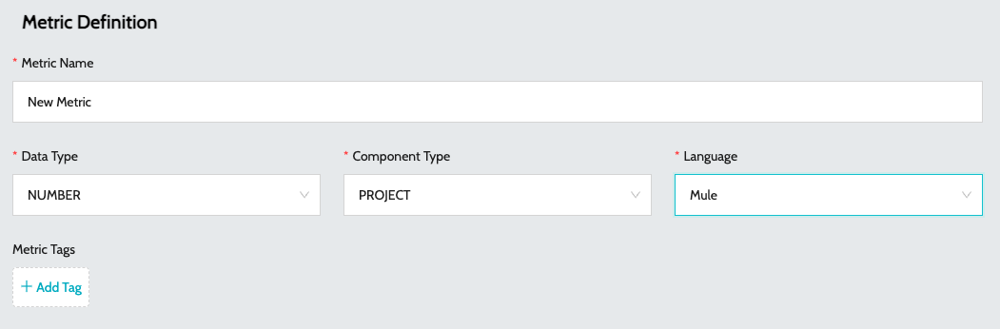
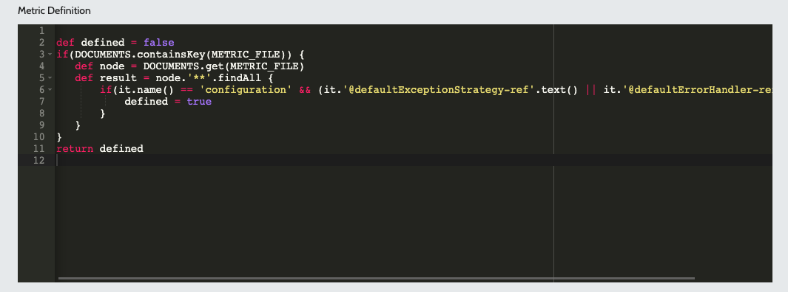

# Create Metric Rule

To create a new Metric Rule -

1. Navigate to **`Rules`** -> **`Metric Rules`**
2. Click on **`Add Metric`**
3. Enter the basic details -
   1. **`Metric Name`** - Name of the metric
   2. **`Data Type`** - Return data type of the metric
   3. **`Component Type`** - Metric component type **`FILE`** level or **`PROJECT`**
   4. **`Language`** - Language for which the rule is applicable. E.g.: Mule, API
   5.  **`Metric Tags`** - Tags associated with the rule. Tags can be used to filter metrics\
       &#x20;

       <figure><figcaption></figcaption></figure>
   6. **`Metric Description`** - Description of the metric in Markdown format
   7.  **`Metric Definition`** - Definition of the metric. Metric rules are specified in Groovy\
       &#x20;

       <figure><figcaption></figcaption></figure>
4. Click on **`Submit`** to create the metric

### See Also

* [Quality Profiles](../profiles/quality-profiles.md)
* [Metric Profiles](../profiles/metric-profiles.md)
* [Quality Rules](quality-rules.md)
* [Metric Rules](metric-rules.md)
