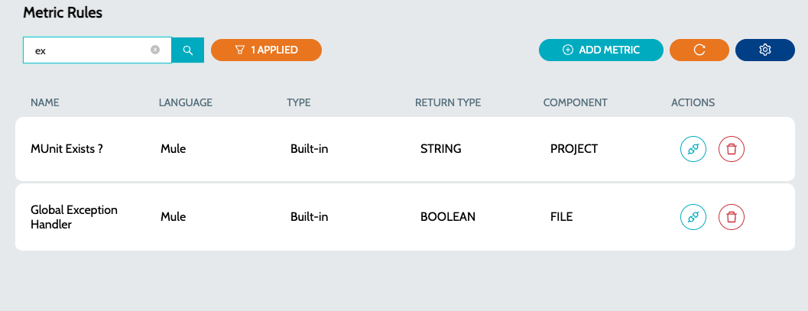
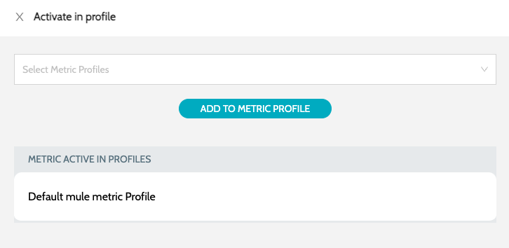

# Metric Rules

Metric Rules serve as the guidelines utilized for collecting metrics of a specific application type

1.  Navigate to **`Rules`** -> **`Metric Rules`**  

    <figure><figcaption></figcaption></figure>
2. Details include -
   1. **`Name`** - Name of the rule
   2. **`Language`** - Language for which the rule is applicable. E.g.: Mule, API
   3. **`Return Type`** - Return type of the metric. Return types will be used for aggregating metrics
   4. **`Component`** - Indicates whether the metric is a **`FILE`** level or **`PROJECT`** level metrics
3.  Click on **`Activate In Profile`** action to activate the metric in any of the Metric Profiles\
    &#x20;

    <figure><figcaption></figcaption></figure>

### See Also

* [Quality Profiles](../profiles/quality-profiles.md)
* [Metric Profiles](../profiles/metric-profiles.md)
* [Quality Rules](quality-rules.md)
