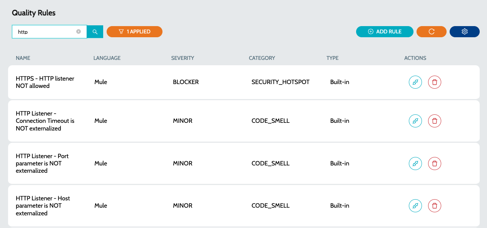
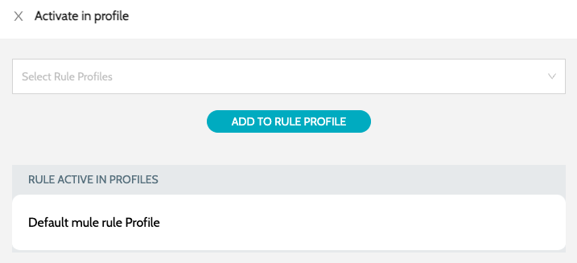

# Quality Rules

Quality Rules serve as the guidelines utilized for conducting static code analysis.

1.  Navigate to **`Rules`** -> **`Quality Rules`**  

    <figure><figcaption></figcaption></figure>
2. Details include -
   1. **`Name`** - Name of the rule
   2. **`Language`** - Language for which the rule is applicable. E.g.: Mule, API
   3. **`Severity`** - Severity of the rule. Value can be one of -
      1. CRITICAL
      2. BLOCKER
      3. MAJOR
      4. MINOR
      5. INFO
   4. **`Category`** - Category of the rule. Value can be one of -
      1. BUG
      2. CODE SMELL
      3. VULNERABILITY
      4. SECURITY HOTSPOT
3.  Click on **`Activate Rule`** action to activate the rule in any of the Quality Profile\
    &#x20;

    <figure><figcaption></figcaption></figure>

### Built-in and Custom Rules

* **Built-in rules** are delivered and updated with IZ Suite. New and revised built-in rules are applied automatically by the seed data process after an upgrade.
* **Custom rules** are created with **`Add Rule`** or by cloning a built-in rule.


In a multi-tenant installation built-in rules are read-only. To change the name, severity, category or definition of a built-in rule, clone it and use the clone in your quality profiles


### See Also

* [Quality Profiles](../profiles/quality-profiles.md)
* [Metric Profiles](../profiles/metric-profiles.md)
* [Metric Rules](metric-rules.md)
