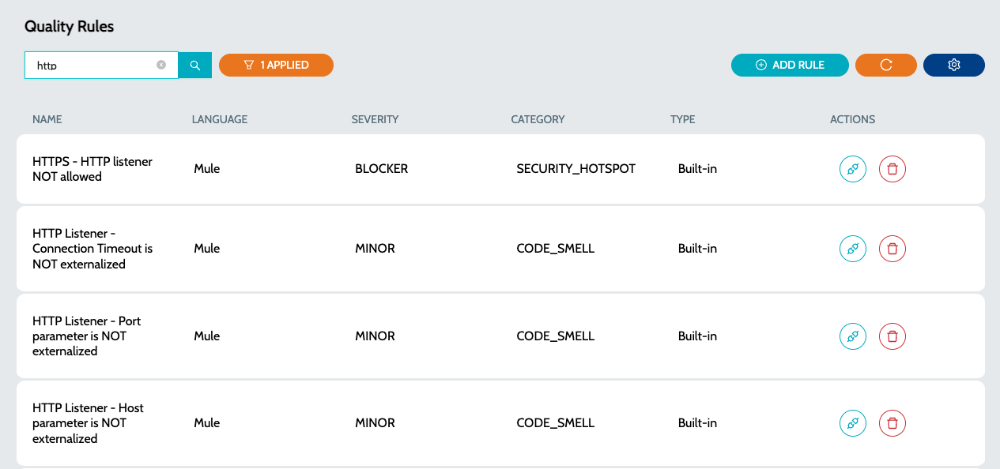
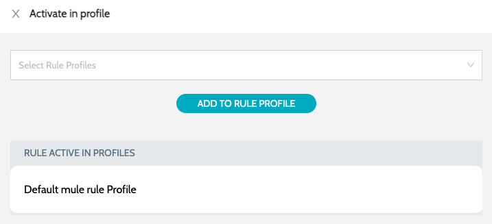

# Quality Rules

Quality Rules serve as the guidelines utilized for conducting static code analysis.

1.  Navigate to **`Rules`** -> **`Quality Rules`**  

    <figure><figcaption></figcaption></figure>
2. Details include -
   1. **`Name`** - Name of the rule
   2. **`Language`** - Language for which the rule is applicable. E.g.: Mule, API
   3. **`Severity`** - Severity of the rule. Value can be one of -
      1. CRITICAL
      2. BLOCKER
      3. MAJOR
      4. MINOR
      5. INFO
   4. **`Category`** - Category of the rule. Value can be one of -
      1. BUG
      2. CODE SMELL
      3. VULNERABILITY
      4. SECURITY HOTSPOT
3.  Click on **`Activate Rule`** action to activate the rule in any of the Quality Profile\
    &#x20;

    <figure><figcaption></figcaption></figure>

#### Rule Descriptions 

Every built-in rule has a description in Markdown, shown when you open the rule and in the IDE plugins:

1. What the rule checks and why it matters, including what it deliberately does not report.
2. Examples: a **Non Compliant** and a **Compliant** code example. AWS rules show the equivalent template JSON, or the setting to change in the AWS Console where the issue is fixed there.
3. **References**: links to the official documentation behind the rule. Security rules link the OWASP Top 10 2021 and CWE entries they map to.

Rules that offer auto-fix also describe what the fix changes.

#### Rule Tags 

Every built-in rule carries one to five short, lower-case tags, which are shown in the **`Tags`** column. Type a tag in **`Search Rule`** to list the rules that carry it, and use tags in the **`Rule`** filter.

&#x20;For example:

* AWS rules: **`aws`**, the service (such as **`aws-lambda`**, **`sqs`** or **`elb`**), the area and the topic, for example **`aws`**, **`aws-lambda`**, **`security`**, **`encryption`**
* Java rules: the area and topics, plus the OWASP Top 10 category for security rules, for example **`security`**, **`spring-boot`**, **`owasp-a05`**
* Python PEP 8 rules: **`pep8`** and the matching **`pycodestyle`** code, for example **`pep8`**, **`whitespace`**, **`e225`**

#### How Built-in Rules Are Classified 

Built-in rules are assigned a severity and category consistently:

* **Vulnerability** - a definite, exploitable flaw. An end-of-life engine or runtime (for example a deprecated Lambda runtime) is a **Critical** Vulnerability.
* **Security Hotspot** - security-sensitive code or configuration that needs review. Security Hotspots are rated **Major** or **Minor** only.
* **Bug** - code or configuration that will not behave as intended.
* **Code Smell** - maintainability and style issues. Rules that only report scan coverage or inventory are **Info** Code Smells.

### Built-in and Custom Rules

* **Built-in rules** are delivered and updated with IZ Suite. New and revised built-in rules are applied automatically by the seed data process after an upgrade.
* **Custom rules** are created with **`Add Rule`** or by cloning a built-in rule.


In a multi-tenant installation built-in rules are read-only. To change the name, severity, category or definition of a built-in rule, clone it and use the clone in your quality profiles


### See Also

* [Quality Profiles](../profiles/quality-profiles.md)
* [Metric Profiles](../profiles/metric-profiles.md)
* [Metric Rules](metric-rules.md)
