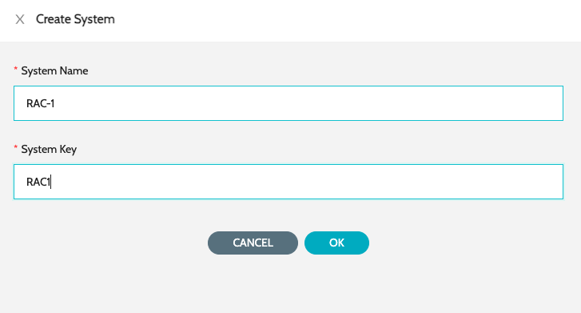
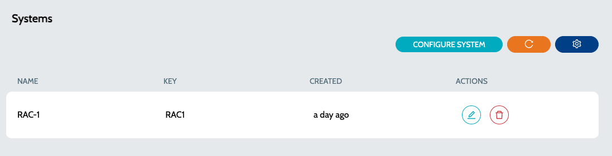
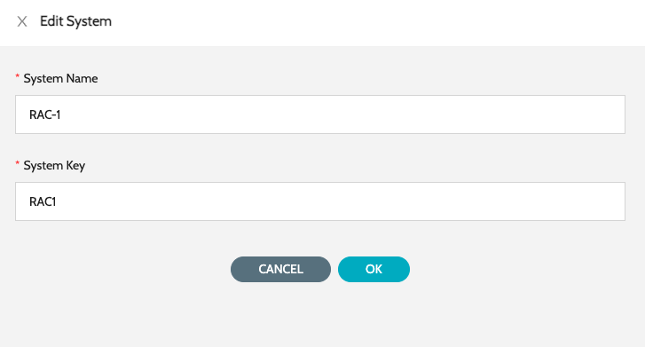

# Configure system

Systems can be used to tag entities to any specific **`Agent Worker`**. For example, if a certain task has to be executed on a specific agent on a specific machine, then both the agent and task will be associated with the same system.

### Create System:

1. Navigate to **`Global Settings`** -> **`Systems`** -> click on **`Configure System`**
2. Enter **`System Name`** and **`System Key`** and click on **`Submit`**&#x20;

<figure><figcaption></figcaption></figure>

### Update System:

1. Navigate to **`Global Settings`** -> **`Systems`**&#x20;

<figure><figcaption></figcaption></figure>

2. Click on **`Edit`** action against the system and update the values

<figure><figcaption></figcaption></figure>

### See Also

* [Create Agent](../agent/create-agent.md)
* [Update Agent](../agent/update-agent.md)
