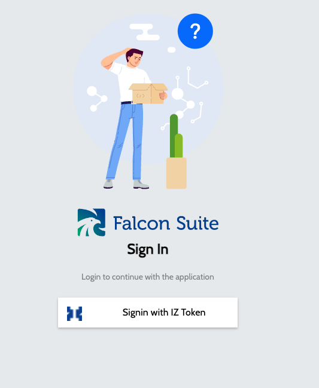
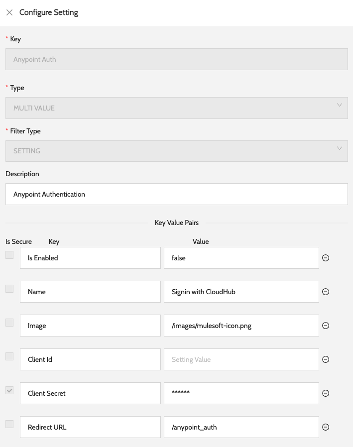
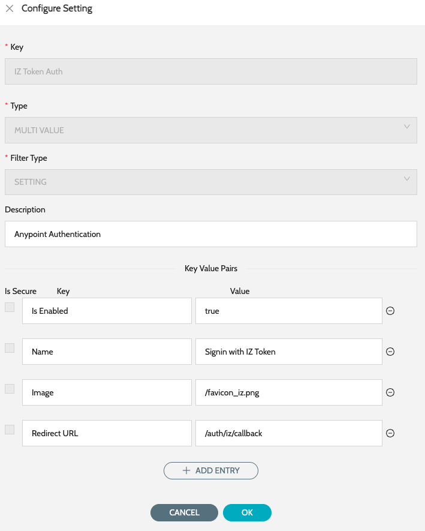

# Initial Setup

### Default Login:


* This step is required if the instance is being configuring for the first time.


1. Navigate to the UI and click on **`Signin with IZ Token`**
2. Enter the default token **`clqvx342w00003b6qnxuu9bri`** and click on **`Login`**&#x20;

<figure><figcaption></figcaption></figure>

### Enable Anypoint SSO:

#### In Anypoint Platform

1. Login to https://anypoint.mulesoft.com/
2. Navigate to **`Access Management`** -> **`Connected Apps`**
3. Click on **`Create App`** and select the following details
   1. Name - IZ Suite Web
   2. Type - App acts on behalf of a user
   3. Grant types - Authorization Code
   4. Website URL - URL that will be displayed to the users
   5. Redirect URIs - \<FALCON\_HOST>/anypoint\_auth
   6. Add Following Scopes -
      1. Open ID -> Profile
4. Click on Save
5. Note the **`Client Id`** and **`Client Secret`** which will be used in the next step

#### In IZ Suite

1. Navigate to **`Global Settings`** -> **`Settings`**
2. Search for Auth and edit the **`Anypoint Auth`** settings&#x20;

<figure><figcaption></figcaption></figure>

3. Update the value of **`Is Enabled`** key to **`true`**
4. Update the value of **`Client Id`** key to the Connected Apps Client Id
5. Update the value of **`Client Secret`** key to the Connected Apps Client Secret
6. Click on **`Save`**
7. Logout and Login using **`Signin with CloudHub`**
8. Enter the License key shared by the Integral Zone support team

### Disable IZ Token Login:

1. Navigate to **`Global Settings`** -> **`Settings`**
2. Search for Auth and edit the **`IZ Token Auth`** settings&#x20;

<figure><figcaption></figcaption></figure>

3. Update the value of **`Is Enabled`** key to **`false`** and click on **`Save`**

### See Also

* [Create Agent](../agent/create-agent.md)
* [Update Agent](../agent/update-agent.md)
