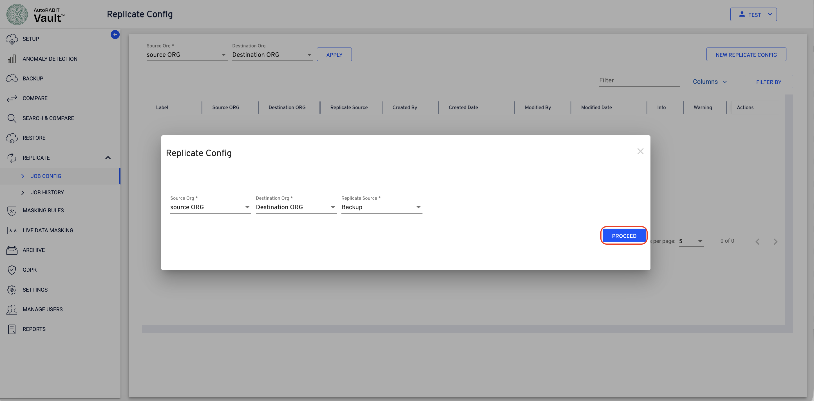
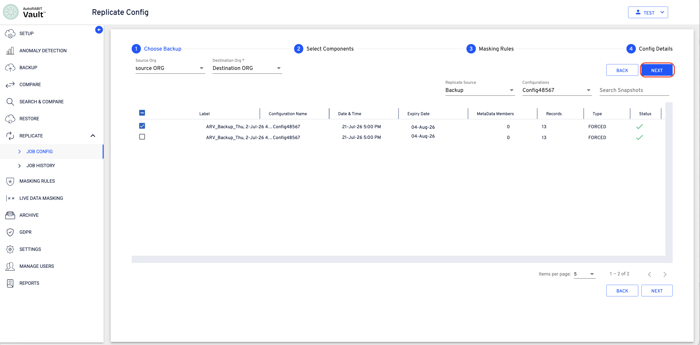
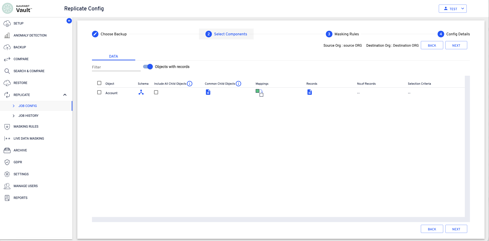
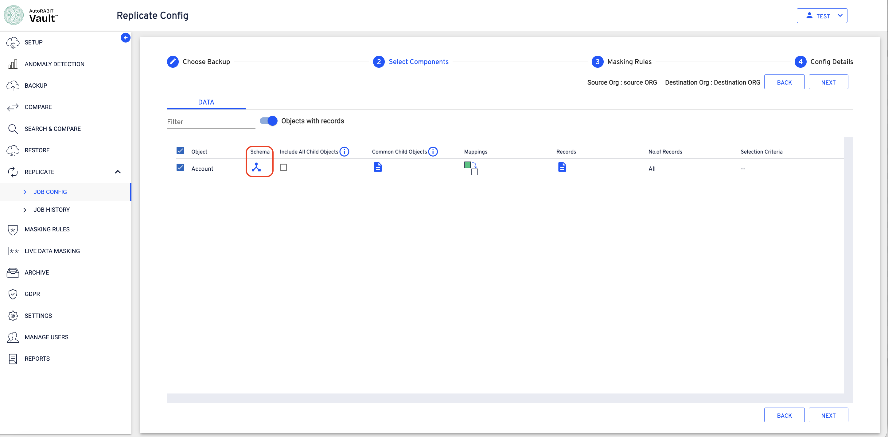
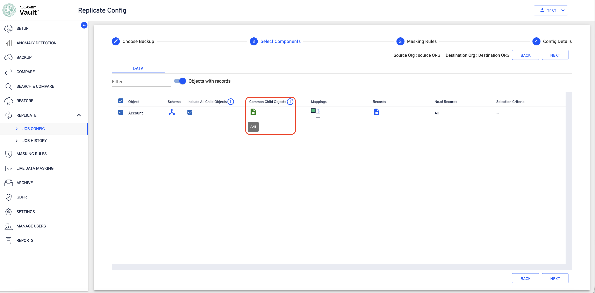
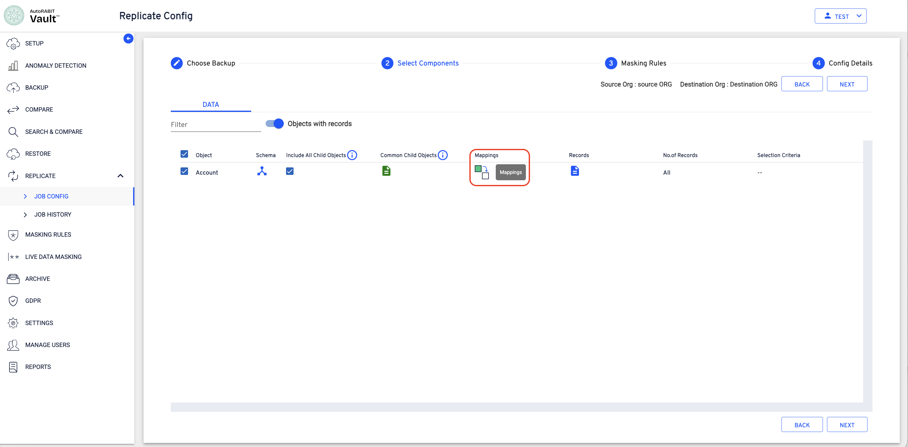
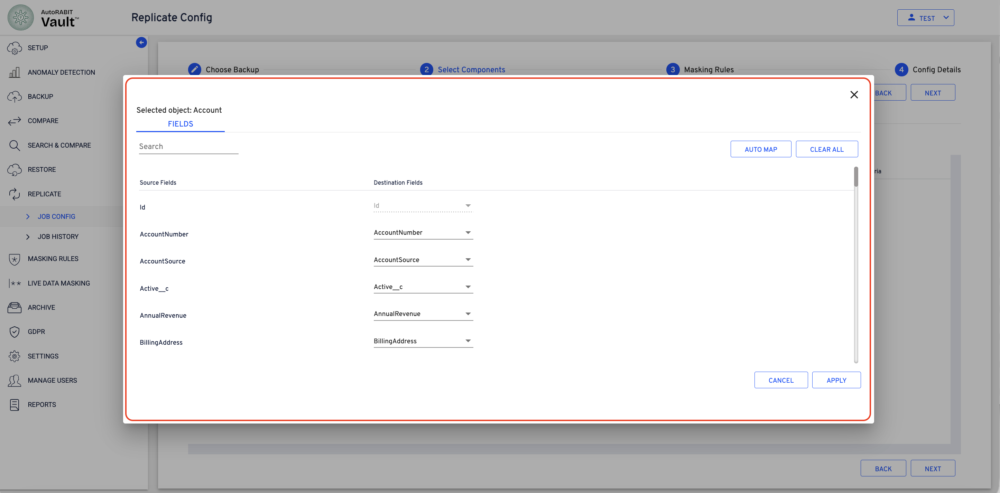

# Replicate

## AutoRABIT Vault Replicate User Guide

_Creating, configuring, and running a Replicate job_

The Replicate workflow supports moving selected data from a source org to a destination org by using an available backup snapshot as the replication source. The configuration also captures field mappings, record selections, masking behavior, runtime controls, and notification settings.

## Workflow Overview

The Replicate Config flow is organized into four main stages: Choose Backup, Select Components, Masking Rules, and Config Details. Each stage captures a specific part of the replication setup and carries the selected information forward into the final configuration review.

* Choose Backup identifies the source org, destination org, replication source, and backup snapshot used for replication.
* Select Components defines the objects, related schema, field mappings, and records included in the replication scope.
* Masking Rules applies optional job-level masking rules before data is replicated to the destination org.
* Config Details stores operational settings, notifications, selected data scope, and masking summary before the configuration is saved or executed.

## Create a Replicate Config

The workflow begins from Replicate > Job Config. A new Replicate Config is created by selecting the required Source Org, Destination Org, and Replicate Source. After these values are selected, Proceed opens the step-based configuration flow.

The Replicate Source determines the type of source data used for the configuration. In this workflow, Backup is selected as the source, so AutoRABIT Vault displays backup snapshots available for the selected org combination.

<figure><figcaption></figcaption></figure>

## Choose Backup

The Choose Backup stage displays available backup snapshots for the selected source and destination orgs. The list can be narrowed by configuration and searched through the Search Snapshots field. A snapshot is selected from the list before moving to the next stage.

The snapshot table provides the label, configuration name, date and time, expiry date, metadata members, record count, type, and status. A valid snapshot must be selected before the workflow proceeds.

<figure><figcaption></figcaption></figure>

## Select Components

The Select Components stage defines the data scope for replication. The Data tab lists the available objects and supports filtering the list. The Objects with records toggle helps limit the view to objects that contain records in the selected backup snapshot.

Each object row provides options to review the schema, include child objects, review common child objects, configure mappings, select records, and define selection criteria. Selecting an object includes it in the replication scope.

<figure><figcaption></figcaption></figure>

After an object is selected, the row displays the selected object state and enables the available object-level actions. The schema action opens the relationship view for the selected object.

<figure><figcaption></figcaption></figure>

The schema view presents parent and child relationships for the selected object. Search Objects helps locate related objects, and Search Direction controls whether parent relationships, child relationships, or both are displayed. The selected relationships are saved back to the component selection stage.

>)

Child object and relationship actions provide additional control over how related data is included. The object row remains selected, and the component summary reflects the selected record scope as the workflow progresses.

<figure><figcaption></figcaption></figure>

The object row also provides access to record and mapping options. These controls define how fields are mapped and which records are included when the replication job runs.

<figure><figcaption></figcaption></figure>

The field mapping window displays source fields and destination fields for the selected object. Auto Map maps matching fields automatically, while Clear All removes the current mappings. Individual destination field selections can also be adjusted before applying the mappings.

<figure><figcaption></figcaption></figure>

The updated object row confirms that mapping information is available for the selected object. The workflow continues by reviewing or selecting the records that need to be replicated.

<figure><figcaption></figcaption></figure>

The record selection window displays the records available for the selected object. Columns, operators, search text, file-based input, pagination, and row checkboxes support focused record selection. Apply stores the selected record set for the replication configuration.

<figure><figcaption></figcaption></figure>

The Masking Rules stage allows job-level masking rules to be added to the Replicate Config. A note states that when job-level and organization-level masking rules share the same field, the job-level masking rule takes priority.

If no masking rules are configured, the table displays No Masking Rules. New Masking Rule opens the rule creation window.

<figure><figcaption></figcaption></figure>

A masking rule is created by entering the rule name, selecting the object, selecting a field type, choosing a masking style, and selecting the required fields. The rule is associated with the selected Salesforce org shown in the masking rule window.

<figure><figcaption></figcaption></figure>

Field Type filters the available fields by data type. After a field type is selected, the matching fields become available for selection in the field list.

<figure><figcaption></figcaption></figure>

Masking Style defines how the selected fields are masked during replication. Available masking styles are displayed based on the selected field type.

<figure><figcaption></figcaption></figure>

After the masking style is selected, the applicable fields are selected from the list. Save creates the rule for the current Replicate Config.

<figure><figcaption></figcaption></figure>

The Add to Org masking rules option makes the rule available in the destination org masking rules list. This is optional and is used when the same rule must be available beyond the current job-level configuration.

<figure><figcaption></figcaption></figure>

After the rule is saved, AutoRABIT Vault confirms that the masking rule has been created successfully.

<figure><figcaption></figcaption></figure>

The newly created masking rule appears in the Masking Rules table. The table shows the rule name, rule type, object, field type, masking style, created date, modified date, and actions. The view action opens the rule details.

<figure><figcaption></figcaption></figure>

The rule details view displays the saved rule values and selected fields in a read-only view. This supports verification before the configuration moves to the final details stage.

<figure><figcaption></figcaption></figure>

After the masking rule is reviewed, Next moves the workflow to Config Details.

<figure><figcaption></figcaption></figure>

## Configure Replicate Details

The Config Details stage captures the final configuration details and runtime options. Replicate Config Label identifies the configuration, Batch Size controls processing volume, and Email notification defines the recipients for job notifications.

The runtime options control Salesforce-side behavior during replication. These include disabling workflows, validation rules, triggers, and flows, enabling serial mode for Bulk API, ignoring failed records, and overriding data with blank values when required.

<figure><figcaption></figcaption></figure>

The Data section summarizes the selected objects and record scope. The Masking Info section summarizes the masking rules applied to each selected object, including rule name, rule type, field type, and masking style.

<figure><figcaption></figcaption></figure>

Before saving or running the job, AutoRABIT Vault displays important replication considerations. These include potential failures caused by active triggers, process builders, workflows, flows, and validation rules; Salesforce metadata size limits; inactive owners; and missing dependencies.

<figure><figcaption></figcaption></figure>

The Replication Config Info window provides a final review of configuration details and masking information. Save & Run stores the configuration and immediately starts the replication job.

<figure><figcaption></figcaption></figure>

## Review Replicate History

When Save & Run is used, AutoRABIT Vault creates the Replicate job and displays the execution result in Replicate History. The history table shows the label, configuration name, job info, source org, destination org, date and time, duration, metadata success and failure counts, successful records, failed records, and available actions.

The action icons provide access to job details, logs, reports, delete, and rerun options depending on the available job state and permissions.

<figure><figcaption></figcaption></figure>

## Review and Manage Saved Replicate Configs

After a configuration is saved or run, it appears in Replicate > Job Config. The Job Config table displays the label, source org, destination org, replicate source, created and modified information, warning status, and available actions.

The available actions allow the configuration to be run, edited, or deleted. The information icon opens configuration details for review.

<figure><figcaption></figcaption></figure>

## Save the Configuration Without Running

The configuration can also be saved without immediate execution. Save stores the Replicate Config and keeps it available in Job Config for later review or execution.

<figure><figcaption></figcaption></figure>

The same replication considerations are displayed before saving the configuration. The message highlights conditions that may affect replication success and must be acknowledged before proceeding.

<figure><figcaption></figcaption></figure>

The Replication Config Info window provides the final review when the configuration is saved without running. Save stores the configuration and returns to the Job Config list.

<figure><figcaption></figcaption></figure>

AutoRABIT Vault confirms that the Replicate Config is created successfully after the configuration is saved.

<figure><figcaption></figcaption></figure>

The saved configuration remains available in Job Config and can be run later using the run action. The list also provides edit, delete, warning, and information controls as applicable.

<figure><figcaption></figcaption></figure>

## Result

At the end of the workflow, the Replicate Config is either saved for later use or saved and executed immediately. When executed, the job appears in Replicate History with execution metrics and job-level actions. When saved, the configuration remains available in Job Config for future execution, review, or maintenance.
