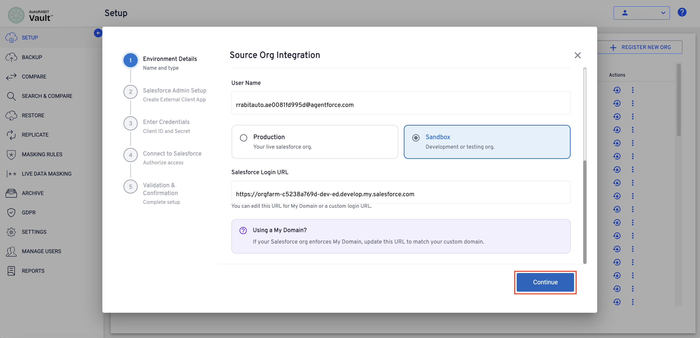
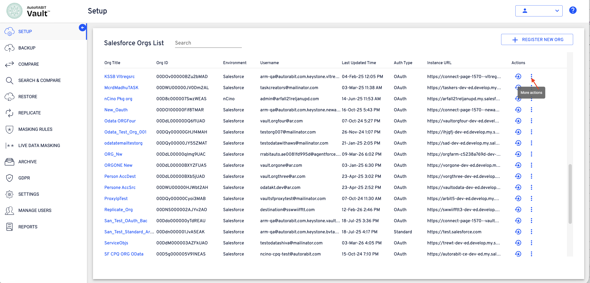
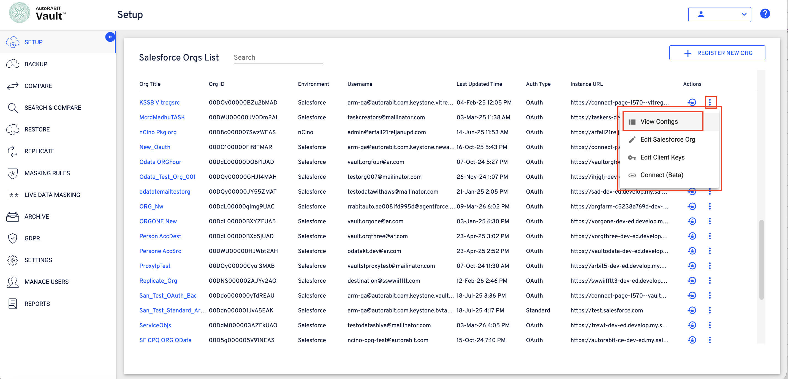
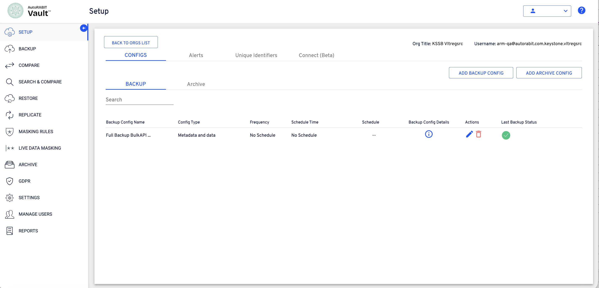
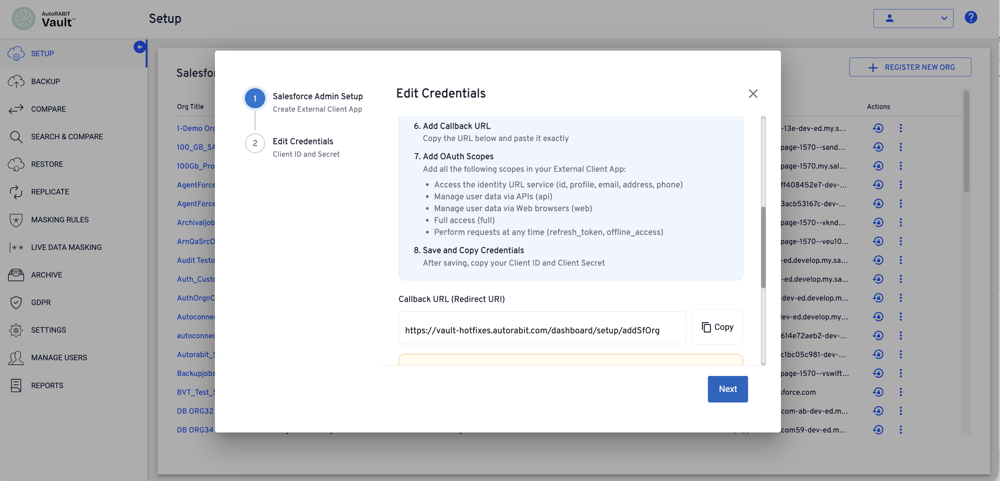
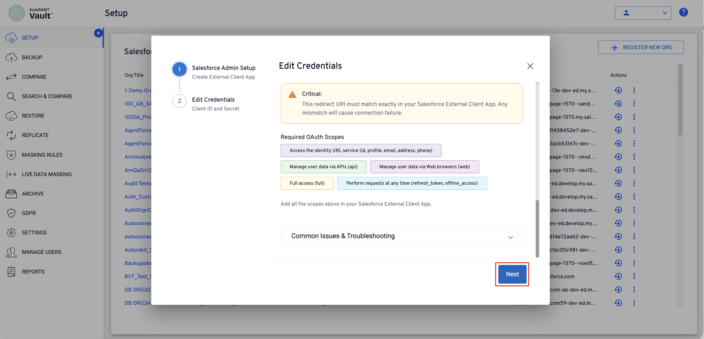
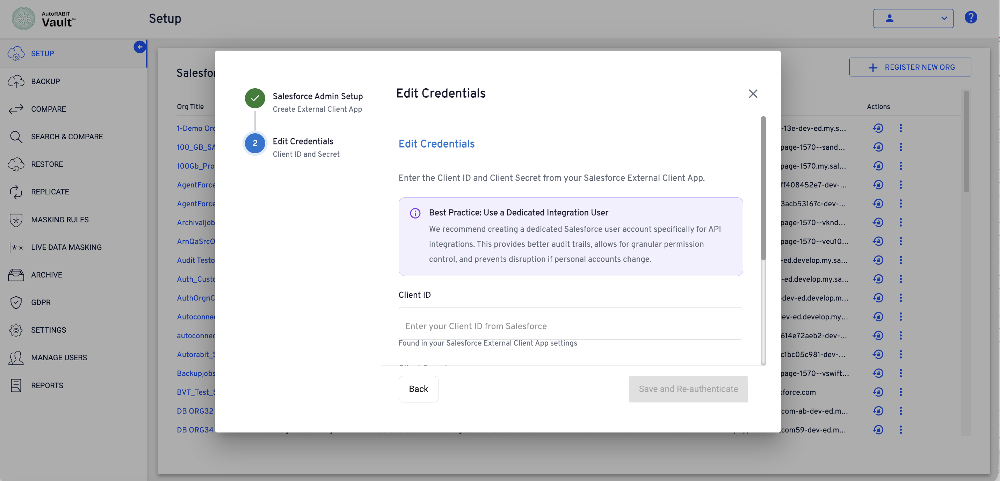
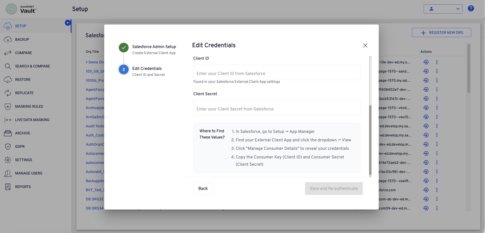
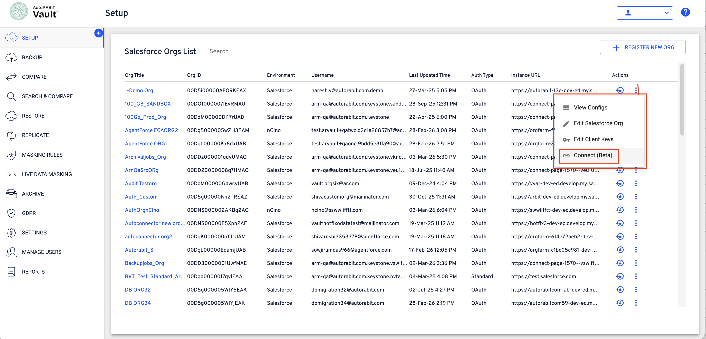
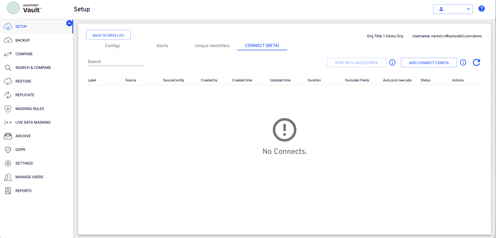

# Register Salesforce Org - Authorization Code (OAuth)

## Introduction

Salesforce has introduced the **External Client App (ECA)** framework as the new standard for managing OAuth-based integrations. This framework replaces the legacy **Connected App** model for newly created integrations and provides a more secure and structured way to configure external applications that access Salesforce resources.

To align with Salesforce’s updated authentication framework, AutoRABIT Vault now supports integration using **External Client Apps**. This approach ensures compatibility with Salesforce’s latest OAuth standards while maintaining secure access between AutoRABIT Vault and Salesforce environments.

This guide explains how to register a Salesforce organization in AutoRABIT Vault using the **External Client App (ECA)** configuration and authorize AutoRABIT Vault to access Salesforce through OAuth.

## Overview

Registering a Salesforce organization in AutoRABIT Vault involves configuring an OAuth connection using a **Salesforce External Client App**. This process establishes a secure authorization flow that allows AutoRABIT Vault to interact with Salesforce APIs.

The setup process includes the following stages:

1. **Registering the Salesforce organization in AutoRABIT Vault** by providing environment details.
2. **Creating an External Client App in Salesforce** to enable OAuth authentication.
3. **Configuring required OAuth scopes and callback settings** within Salesforce.
4. **Providing the Client ID and Client Secret in AutoRABIT Vault**.
5. **Authorizing AutoRABIT Vault to access Salesforce** through the OAuth authorization process.
6. **Validating the connection** and completing the org registration.

Once the setup is complete, the Salesforce organization becomes available in AutoRABIT Vault and can be used for operations such as **Backup, Compare, Search & Compare, Restore, Replication, and Data Masking**.

## Step-By-Step Guide: Registering a Source Salesforce Org in AutoRABIT Vault

### Navigate to the Salesforce Orgs Setup Page

On the **AutoRABIT Vault Setup** page, the **Salesforce Orgs List** displays all registered Salesforce environments.

To register a new Salesforce organization:

1.  Click **REGISTER NEW ORG**.

    <figure><figcaption></figcaption></figure>

This action opens the **Source Org Integration** setup wizard.

### Configure Environment Details

The **Source Org Integration** wizard begins with **Environment Details**. This step captures the basic configuration required to connect the Salesforce environment.

<figure><figcaption></figcaption></figure>

Configure the following fields:

* **Environment Type** – Select the appropriate environment:
  * **Salesforce** – Standard Salesforce organization.
  * **nCino** – nCino environment running on Salesforce.
* **Salesforce API Version** – Select the API version used for integration.
* **Org Title** – Enter a recognizable name for the organization. This name helps identify the org within AutoRABIT Vault.
* **User Name** – Enter the Salesforce username used for authentication.

### Select Salesforce Environment Type

After entering the username, select the type of Salesforce environment.

<figure><figcaption></figcaption></figure>

Available options include:

* **Production** – Used for live Salesforce environments.
* **Sandbox** – Used for development or testing environments.

Once the environment type is selected, provide the **Salesforce Login URL**.

This field supports both:

* Default Salesforce login URLs
* Custom **My Domain** login URLs

If Salesforce enforces **My Domain**, the login URL must match the configured domain.

Click **Continue** to proceed.

### Create the Salesforce External Client App

The next step guides the creation of a **Salesforce External Client App** required for OAuth authentication.

<figure><figcaption></figcaption></figure>

AutoRABIT Vault displays the configuration steps that must be completed in Salesforce.

**Complete the following actions in Salesforce:**

1. Navigate to **Setup → App Manager**.
2. Click **New External Client App**.
3. Enable **OAuth Plugin**.
4. Select **Authorization Code (Web Server) Flow**.
5. Disable the **PKCE security option**.
6. Add the **Callback URL** provided in AutoRABIT Vault.

After completing the configuration in Salesforce, return to AutoRABIT Vault.

Click **I've completed the setup** to continue.

### Configure OAuth Scopes

Add the required OAuth scopes in the Salesforce External Client App.

 (1) (1) (1) (1)>)

<figure><figcaption></figcaption></figure>

The following scopes must be enabled:

* **Access the identity URL service (id, profile, email, address, phone)**
* **Manage user data via APIs (api)**
* **Manage user data via Web browsers (web)**
* **Full access (full)**
* **Perform requests at any time (refresh\_token, offline\_access)**

Ensure the **Callback URL (Redirect URI)** matches exactly with the value provided in AutoRABIT Vault.

Any mismatch will result in connection failure.

### Enter OAuth Credentials

After completing the Salesforce External Client App configuration, provide the OAuth credentials in AutoRABIT Vault.

<figure><figcaption></figcaption></figure>

Enter the following details:

* **Client ID** – The Consumer Key generated from the Salesforce External Client App.
* **Client Secret** – The Consumer Secret generated from the Salesforce External Client App.

<figure><figcaption></figcaption></figure>

These values are available in Salesforce under the External Client App configuration.

#### Where to Find the Credentials in Salesforce

1. Navigate to **Setup → App Manager**.
2. Locate the created **External Client App**.
3. Open the dropdown menu and select **View**.
4. Click **Manage Consumer Details**.
5. Copy the **Consumer Key (Client ID)** and **Consumer Secret (Client Secret)**.

Paste these values into the corresponding fields in AutoRABIT Vault.

Click **Continue** to proceed to the authorization step.

### Authorize AutoRABIT Vault to Access Salesforce

The **Connect to Salesforce** step initiates the OAuth authorization process.

<figure><figcaption></figcaption></figure>

<figure><figcaption></figcaption></figure>

AutoRABIT Vault displays the connection details for verification:

* **Org Title** – The name assigned during configuration.
* **Type** – The selected Salesforce environment (Production or Sandbox).
* **Login URL** – The Salesforce login endpoint used for authentication.

This step establishes a secure connection between AutoRABIT Vault and the Salesforce organization.

Click **Connect to Salesforce** to begin the authorization process.

### Complete Salesforce Authorization

After clicking **Connect to Salesforce**, the following process occurs:

1.  The browser redirects to the Salesforce login page.

    <figure><figcaption></figcaption></figure>
2.  Authentication occurs using the provided Salesforce credentials.

    <figure><figcaption></figcaption></figure>
3.  Salesforce displays the permissions requested by AutoRABIT Vault.

    <figure><figcaption></figcaption></figure>

    <figure><figcaption></figcaption></figure>
4. Select **Allow** to grant the required access.
5. After authorization, Salesforce redirects back to AutoRABIT Vault automatically.

AutoRABIT Vault then completes the validation and confirms the connection.

### Validation and Setup Completion

After the authorization process is completed, AutoRABIT Vault validates the Salesforce connection and displays a **Connection Successful** confirmation.

<figure><figcaption></figcaption></figure>

The **Validation & Confirmation** step displays the environment details of the connected Salesforce org, including:

* **Org Title** – The name assigned during org registration.
* **Salesforce Org ID** – The unique identifier of the Salesforce environment.
* **Instance URL** – The Salesforce instance endpoint used for API communication.
* **Login URL** – The login endpoint used for authentication.

This confirmation indicates that the Salesforce organization has been successfully connected to AutoRABIT Vault.

### Test the API Connection

To verify that AutoRABIT Vault can communicate with the Salesforce environment, perform an API connectivity test.

1.  In the **Test Your Connection** section, click **Test API Connection**.

    <figure><figcaption></figcaption></figure>

### Verify the API Connection Status

If the connection test succeeds, AutoRABIT Vault displays a confirmation message indicating that the API communication is working correctly.

<figure><figcaption></figcaption></figure>

A notification message appears confirming that the **API connection test was successful**.

This validation ensures that AutoRABIT Vault can securely interact with the Salesforce environment using the configured OAuth credentials.

### Complete the Org Registration

After the connection test is successful:

1.  Click **Finish**.

    <figure><figcaption></figcaption></figure>

AutoRABIT Vault completes the org registration process and closes the **Source Org Integration** wizard.

The newly connected Salesforce organization now appears in the **Salesforce Orgs List** within the **Setup** section and is available for AutoRABIT Vault operations such as **Backup, Compare, Search & Compare, Restore, Replication, and Masking**.

### Confirm Successful Org Registration

After clicking **Finish**, AutoRABIT Vault displays a confirmation message indicating that the Salesforce organization has been successfully registered.

<figure><figcaption></figcaption></figure>

This confirmation verifies that the integration process has completed successfully and the Salesforce environment is now available for AutoRABIT Vault operations.

Click **OK** to close the confirmation message.

### Verify the Registered Salesforce Org

After the confirmation message is closed, the **Salesforce Orgs List** page displays the newly registered organization.

The list provides key details for each connected environment, including:

1. **Org Title**
2. **Org ID**
3. **Environment Type**
4. **Username**
5. **Last Updated Time**
6. **Authentication Type**
7. **Instance URL**

The newly added organization now appears in this list and is ready to be used within AutoRABIT Vault.

### Re-authenticate an Existing Org (If Required)

If authentication credentials expire or require renewal, the Salesforce organization can be re-authenticated directly from the **Salesforce Orgs List**.

<figure><figcaption></figcaption></figure>

To re-authenticate an organization:

1. Locate the required org in the **Salesforce Orgs List**.
2. Navigate to the **Actions** column.
3. Click the **Re-authenticate** icon.

AutoRABIT Vault redirects to the Salesforce login page to complete the authentication process.

### Authenticate Through Salesforce Login

When the **Re-authenticate** action is initiated, the Salesforce login screen appears.

 (1) (1)>)

Enter the following credentials:

* **Username**
* **Password**

Click **Log In** to authenticate the connection.

After successful authentication, AutoRABIT Vault restores the secure connection with the Salesforce environment.

### Access Additional Org Actions

After the Salesforce org is successfully registered, additional management options are available for the connected org.

1. Navigate to **Setup**.
2. Locate the required org in the **Salesforce Orgs List**.
3.  In the **Actions** column, click the **More actions (⋮)** icon.

    <figure><figcaption></figcaption></figure>

A menu appears displaying additional management options for the selected Salesforce org.

### View Org Configurations

The **More actions** menu provides multiple options for managing the registered Salesforce org.

<figure><figcaption></figcaption></figure>

To view the configurations associated with the org:

1. Click **View Configs**.

AutoRABIT Vault opens the configuration view for the selected Salesforce org, allowing management of backup and archive configurations.

### View Backup Configurations

The **Configs** page displays the configurations created for the selected Salesforce org.

This page includes the following sections:

* **Configs Tab** – Displays configuration settings associated with the org.
* **Backup** – Lists backup configurations created for the org.
* **Archive** – Displays archive configurations, if configured.

The **Backup** section provides details such as:

* **Backup Config Name**
* **Config Type**
* **Frequency**
* **Schedule Time**
* **Backup Config Details**
* **Actions**
* **Last Backup Status**

<figure><figcaption></figcaption></figure>

From this page, new configurations can be created using:

* **Add Backup Config** – Create a new backup configuration.
* **Add Archive Config** – Create a new archive configuration.

The **Back to Orgs List** option allows navigation back to the **Salesforce Orgs List** page.

### Open the Salesforce Org Edit Option

AutoRABIT Vault allows updating the configuration details of a registered Salesforce org.

1. Navigate to **Setup**.
2. Locate the required org in the **Salesforce Orgs List**.
3. In the **Actions** column, click the **More actions (⋮)** icon.
4. Select **Edit Salesforce Org**.

<figure><figcaption></figcaption></figure>

AutoRABIT Vault opens the **Environment Details** window for the selected Salesforce environment.

### Update Salesforce Org Configuration

1.  The **Environment Details** window allows modification of the registered Salesforce org configuration.

    <figure><figcaption></figcaption></figure>

    <figure><figcaption></figcaption></figure>
2. Update the required fields as needed:

* **Environment Type** – Select **Salesforce** or **nCino**.
* **Salesforce API Version** – Choose the API version used for integration.
* **Org Title** – Modify the display name for the org.
* **Org Type** – Select **Production** or **Sandbox**.
* **Salesforce Login URL** – Verify or update the login endpoint if a **My Domain** or custom login URL is used.

2. After reviewing the changes, click **Save** to apply the updated configuration.

AutoRABIT Vault updates the Salesforce org details while maintaining the existing connection settings.

### Open Client Key Configuration

1. In the **Salesforce Orgs List**, locate the required org.
2. Click the **More Actions (⋮)** menu under the **Actions** column.
3.  Select **Edit Client Keys**.

    <figure><figcaption></figcaption></figure>

The **Edit Credentials** configuration wizard opens, allowing the External Client App credentials to be configured.

### Configure Salesforce External Client App

The first stage of the wizard provides guidance for creating an **External Client App** in Salesforce.

1.  In the **Salesforce Admin Setup** section, follow the instructions to create an External Client App in Salesforce:

    1. Navigate to **Setup → App Manager**.
    2. Create a **New External Client App**.
    3. Enable the **OAuth Plugin**.
    4. Select **Authorization Code (Web Server) Flow**.
    5. Disable the **PKCE security option** if required.

    <figure><figcaption></figcaption></figure>
2.  Copy the **Callback URL (Redirect URI)** displayed in AutoRABIT Vault and add it to the External Client App configuration in Salesforce.

    <figure><figcaption></figcaption></figure>
3.  Configure the following **OAuth scopes** in Salesforce:

    1. Access the identity URL service
    2. Manage user data via APIs
    3. Manage user data via Web browsers
    4. Full access
    5. Perform requests at any time (refresh\_token, offline\_access)

    <figure><figcaption></figcaption></figure>
4. Ensure that the **Redirect URI in Salesforce exactly matches the Callback URL displayed in AutoRABIT Vault** to prevent connection failures.
5. After completing the Salesforce configuration, click **Next** to proceed.

### Enter Client Credentials

1. In the **Edit Credentials** step, enter the following values from the Salesforce External Client App:
   1.  **Client ID** – The Consumer Key generated in Salesforce.

       <figure><figcaption></figcaption></figure>
   2.  **Client Secret** – The Consumer Secret generated in Salesforce.

       <figure><figcaption></figcaption></figure>
2. These values can be retrieved in Salesforce by navigating to: **Setup → App Manager → External Client App → Manage Consumer Details**.
3. After entering the credentials, proceed to save and re-authenticate the connection.

AutoRABIT Vault uses these credentials to securely establish OAuth authentication with the Salesforce org.

### Open Connect Configuration

1. In the **Salesforce Orgs List**, locate the required Salesforce org.
2. Click the **More Actions (⋮)** menu under the **Actions** column.
3.  Select **Connect (Beta)**.

    <figure><figcaption></figcaption></figure>

The **Connect (Beta)** configuration page opens for the selected org.

### Access the Connect (Beta) Page

1.  After selecting **Connect (Beta)**, the **Connect (Beta)** tab opens within the org configuration screen.

    <figure><figcaption></figcaption></figure>
2. This page displays all configured **Connect jobs** for the selected org.
3. The following options are available on this page:

* **Sync with Salesforce** – Synchronizes connect configurations with Salesforce.
* **Add Connect Config** – Creates a new Connect configuration.
* **Refresh** – Reloads the connect configuration list.

3. If no configurations exist, the page displays the message **“No Connects.”**
4. To create a new configuration, click **Add Connect Config**.

