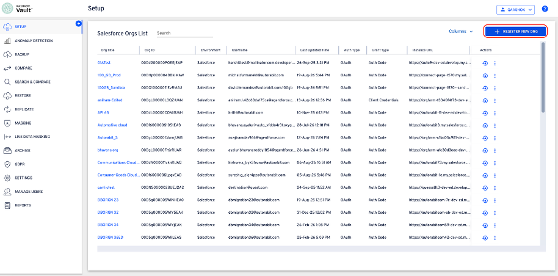

# Register Salesforce ORG - Client Credentials Flow

Configure and verify a server-to-server connection between AutoRABIT Vault and Salesforce.

| **Audience:** AutoRABIT Vault administrators and Salesforce administrators responsible for Salesforce org registration and External Client App configuration. |
| ------------------------------------------------------------------------------------------------------------------------------------------------------------- |

## Overview

This guide explains how to register a Salesforce org in AutoRABIT Vault by using the Client Credentials Flow. The workflow collects the Salesforce org details, presents the External Client App requirements, validates the client credentials, and provides an API connection test after registration.

| **Responsibility boundary:** AutoRABIT Vault provides the Salesforce configuration requirements and validates the completed connection. A Salesforce administrator performs the External Client App configuration in the target Salesforce org. |
| ----------------------------------------------------------------------------------------------------------------------------------------------------------------------------------------------------------------------------------------------- |

## Before You Begin

Confirm that the following access and information are available before starting the registration:

* Access to the AutoRABIT Vault Setup page and permission to register a Salesforce org.
* Salesforce administrative access to create or configure an External Client App.
* The Salesforce username that will run the integration.
* The My Domain URL for the target Salesforce org.
* The Client ID and Client Secret generated for the External Client App.


**Security:** Treat the Client Secret as confidential. Do not include it in documentation, screenshots, tickets, or unsecured communication.


## Registration Workflow

* Select the Client Credentials Flow.
* Enter the Salesforce environment details.
* Complete the External Client App configuration in Salesforce.
* Enter and verify the client credentials.
* Test the registered API connection.

## Register the Salesforce Org



### Start the Registration

#### Open Salesforce org management

In AutoRABIT Vault, select **Setup** from the navigation menu. On the **Salesforce Orgs List** page, select **REGISTER NEW ORG**.

<figure><figcaption></figcaption></figure>

&#x20;                                                 _Start a new Salesforce org registration._

#### Select the authentication method

In the **Source Org Integration** window, select **Client Credentials Flow**. Select **Next** to continue.

<figure><figcaption></figcaption></figure>

&#x20;                                                 _Select Client Credentials Flow as the authentication method._



### Enter the Environment Details

#### Select the environment type

For **Environment Type**, select **Salesforce**.

<figure><figcaption></figcaption></figure>

&#x20;                                                 _Select Salesforce as the environment type._

#### Select the API version

From **Salesforce API Version**, select the API version required for the connection.

<figure><figcaption></figcaption></figure>

&#x20;                                                 _Select the Salesforce API version._

#### Complete the Salesforce org details

Enter a meaningful name in **Org Title** and the integration user in **User Name**. Select **Production** or **Sandbox**, enter the Salesforce host in **My Domain URL**, and then select **Continue**.

<figure><figcaption></figcaption></figure>

&#x20;                                                 _Enter the Salesforce org and environment details._


**My Domain URL:** Enter the My Domain host for the target Salesforce org. Use the value applicable to the org being registered.




### Configure the External Client App in Salesforce

AutoRABIT Vault displays the Salesforce configuration requirements for the External Client App. Complete these activities in the target Salesforce org before confirming the setup in AutoRABIT Vault.

#### Review the configuration checklist

Review the initial Salesforce Admin Setup instructions displayed in AutoRABIT Vault.

<figure><figcaption></figcaption></figure>

&#x20;                                                 _Review the External Client App setup requirements._

#### Configure authentication and access policies

In Salesforce, create or update the External Client App using the OAuth flow, scopes, policies, Run As user, and IP relaxation settings specified in AutoRABIT Vault.

<figure><figcaption></figcaption></figure>

&#x20;                                                 _Review the OAuth scopes and policy requirements._

#### Copy the callback URL and confirm the scopes

Select **Copy** beside the callback URL and add the copied value to the External Client App. Add every OAuth scope listed by AutoRABIT Vault.

<figure><figcaption></figcaption></figure>

&#x20;                                                 _Copy the callback URL and confirm the required OAuth scopes._


**Important:** Copy the callback URL exactly as displayed. Do not add spaces or change the protocol, domain, or path.


#### Review troubleshooting guidance

If the Salesforce configuration cannot be completed or validated, expand **Common Issues & Troubleshooting** and review the applicable guidance.

<figure><figcaption></figcaption></figure>

&#x20;                                                 _Review common configuration issues and corrective guidance._

#### Confirm the Salesforce setup

After completing the configuration in Salesforce, select **I’ve completed the setup**.

<figure><figcaption></figcaption></figure>

&#x20;                                                 _Confirm that the Salesforce configuration is complete._



### Enter the Client Credentials

Retrieve the Consumer Key and Consumer Secret from the configured External Client App in Salesforce. The Consumer Key is entered as the Client ID, and the Consumer Secret is entered as the Client Secret.

#### Enter the credentials

Enter the Salesforce Consumer Key in **Client ID** and the Consumer Secret in **Client Secret**.

<figure><figcaption></figcaption></figure>

&#x20;                                                 _Enter the Client ID and Client Secret._

#### Continue to verification

Review the entered values and select **Continue**.

<figure><figcaption></figcaption></figure>

&#x20;                                                 _Continue to the credential review step._



### Review and Verify the Configuration

#### Review the registration details

On **Review & Verify**, confirm the environment details, username, My Domain URL, API version, and Consumer Key.

<figure><figcaption></figcaption></figure>

&#x20;                                                 _Review the Salesforce environment and credential details._


**Before proceeding:** If any value is incorrect, select **Back** and update it before verification.


#### Verify and save

Select **Verify & Save**.

<figure><figcaption></figcaption></figure>

&#x20;                                                 _Start credential verification and save the org._

#### Allow verification to complete

AutoRABIT Vault validates the supplied configuration. Do not close the registration window while verification is in progress.

<figure><figcaption></figcaption></figure>

&#x20;                                                 _Credential verification in progress._



### Confirm Registration and Test the Connection

#### Confirm successful registration

When verification succeeds, AutoRABIT Vault displays **Connection Successful** and confirms that the Salesforce org has been registered.

<figure><figcaption></figcaption></figure>

&#x20;                                                 _Confirm successful Salesforce org registration._

#### Start the API connection test

Select **Test API Connection** to verify communication with the registered Salesforce org.

<figure><figcaption></figcaption></figure>

&#x20;                                                 _Start the API connection test._

#### Allow the connection test to complete

AutoRABIT Vault tests the API connection. Remain on the page until the test completes.

<figure><figcaption></figcaption></figure>

&#x20;                                                 _API connection test in progress._

#### Confirm the test result and finish

A successful test displays **Successfully connected to the Salesforce org**. Select **Finish** to close the registration flow.

<figure><figcaption></figcaption></figure>

&#x20;                                                 _Confirm the successful API connection._



## Expected Result

The Salesforce org is registered in AutoRABIT Vault through the Client Credentials Flow. The completed registration displays a successful connection status, and the API connection test confirms communication with the registered org.

## Troubleshooting

| **Issue**                     | **Check**                                                                                               | **Recommended action**                                                                                     |
| ----------------------------- | ------------------------------------------------------------------------------------------------------- | ---------------------------------------------------------------------------------------------------------- |
| Callback URL is rejected      | The callback URL in Salesforce does not match the value displayed in AutoRABIT Vault.                   | Copy the callback URL again and remove any added spaces or characters.                                     |
| Credential verification fails | The Client ID, Client Secret, My Domain URL, or Run As user may not match the Salesforce configuration. | Compare the values in AutoRABIT Vault with the configured External Client App and correct any differences. |
| API connection test fails     | The app policies, OAuth scopes, or Salesforce user permissions may be incomplete.                       | Expand **Common Issues & Troubleshooting** in the registration flow and validate each listed requirement.  |
