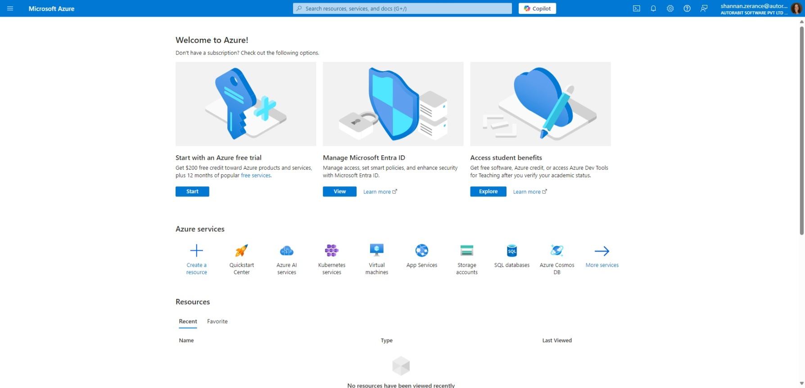

# SSO with Microsoft Entra ID for Vault

### Overview 

This step-by-step guide explains how to set up **Single Sign-On** in Vault with **Microsoft Entra ID—**formerly Microsoft Azure Active Directory (AD)—as your **SAML 2.0 Identity Provider (IdP)**.

When you integrate Vault with Entra ID, you can:

1. Control in Entra ID who has access to Vault
2. Enable your users to be automatically signed in to Vault with their Entra ID accounts
3. Manage your accounts in one central location - the Azure portal.

### Prerequisites 

To get started, you need the following items:

1. An **Entra ID** subscription.
2. You will need to be an **Administrator** in Vault and in Entra ID to configure SSO.
3. Add Vault as a **non-gallery** application.&#x20;

### In Entra ID 

1. Sign in to your Azure management portal.

<figure><figcaption></figcaption></figure>

2. Select the **Entra ID** service from the left sidebar. Click **Enterprise applications**.
3. Click on **+** **New application.**
4. On the next screen, click on the **+ Create your own application** button.
5. Enter the name of the app as [VAULT ](https://www.autorabit.com/products/vault-data-backup-recovery/)and choose the third option i.e., **Integrate any other application you don't find in the gallery (Non-gallery).**
6. Click **Create.**

<figure><figcaption></figcaption></figure>

7. Once the **VAULT** application is created, click on **Set up single sign on.**
8. On the **Select a Single sign-on method** dialog, select **SAML** mode to enable single sign-on.
9. On the **Set up Single Sign-On with SAML** page, click the **Edit (pencil)** icon for **Basic SAML Configuration** to edit the settings.
10. On the **Basic SAML Configuration** section, perform the following steps:
    * In the **Identifier (Entity ID)** field, enter the URL in the following format: **\<instanceURL>/ARVault/saml/metadata.** For example- If your instance is **https://xyz.com**, then the Identifier (Entity ID) would be: **https://xyz.com/ARVault/saml/metadata**
    * In the **Reply URL** field, enter the URL in the following format: **\<instanceURL>/ARVault/saml/SSO. For example-** If your instance is **https://xyz.com**, then the payload URL would be: **https://xyz.com/ARVault/saml/SSO**
11. Click **Save.**&#x20;

<figure><figcaption></figcaption></figure>

12. Click the **Edit (pencil)** icon for **User Attributes & Claims** to edit the attributes settings.

<figure><figcaption></figcaption></figure>

13. On the **User Attributes & Claims** section, delete the auto-generated claims available in the **Additional claims** section.

<figure><figcaption></figcaption></figure>

14. Next, click on **+Add New Claim.**

<figure><figcaption></figcaption></figure>

15. In the **Manage Claim** page, fill in the below details:&#x20;

| Name                 | Source    | Source Attribute          |
| -------------------- | --------- | ------------------------- |
| 
firstname 
 | Attribute | 
user.givenname 
 |

16. Click **Save**.
17. Follow similar steps to add two more claims as mentioned in the below table:

    | Name                       | Source    | Source Attribute                                                                                                                                                                                                                                                                                                                                                                                            |
    | -------------------------- | --------- | ----------------------------------------------------------------------------------------------------------------------------------------------------------------------------------------------------------------------------------------------------------------------------------------------------------------------------------------------------------------------------------------------------------- |
    | 
Lastname 
        | Attribute | 
user.surname 
                                                                                                                                                                                                                                                                                                                                                                                     |
    | customerid                 | Attribute | Enter your Vault's Customer Id. (You'll find your Customer ID under the **Profile** section in your Vault account.                                                                                                                                                                                                                                                                                          |
    | restrictAutoCreationOfUser | Attribute | 
For <strong>Yes</strong>, a new user account won't be created within Vault even if the user is already registered with the OKTA service provider. The user is not permitted access to Vault if the account is not created in Vault.  For <strong>No</strong>, the restriction is revoked, and a new user account gets created in Vault, and the user will be able to access the Vault feature.
 |

    <figure><figcaption></figcaption></figure>
18. On the **Set up Single Sign-On with SAML** page, in the **SAML Signing Certificate** section, find **Federation Metadata XML** and click **Download** to download the XML file and save it on your computer.

<figure><figcaption></figcaption></figure>

### In Vault 

Now that your Azure SSO implementation is set up, you’ll need to follow just a few more steps to configure SSO in your Vault account.&#x20;

1. Login to your Vault account.&#x20;
2. Go to **Settings > SSO Configurations**.
3. Enter the username with which you accessed your Azure account.
4. Choose the **Configure Using** as **Metadata File**. Browse for the metadata **XML** file that you have downloaded previously in your local machine and upload them.

<figure><figcaption></figcaption></figure>

5. Click **Update**.
6. Click on **Activate** to enable the SSO feature with your Vault account.

<figure><figcaption></figcaption></figure>

7. Now, sign out from your Vault account.
8. Go to the Vault login page. This time you need to login via SSO, so, therefore, click on **Login with SSO.**

<figure><figcaption></figcaption></figure>

9. Enter the Customer ID linked for your account and click on **Sign In**.

<figure><figcaption></figcaption></figure>


**Troubleshooting**:

Vault throws the following error when a user tries to log into Vault via SSO: _"Your user is not available in the account with provided customer id. Please contact the administrator to create a user for you in the account"_

The error usually occurs if:

1. The user details are not assigned inside Azure to login into the Vault application.
2. The administrator has set the **restrictAutoCreationOfUser** to **Yes** inside **Attribute Statements** while configuring Azure AD SSO. If it is set to Yes, the user is not permitted access to Vault if the account is not created in Vault.&#x20;

