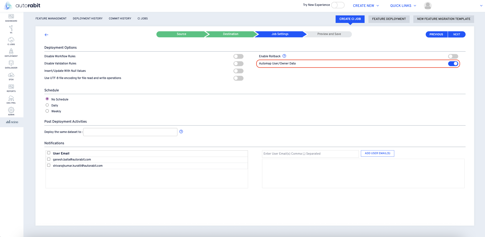
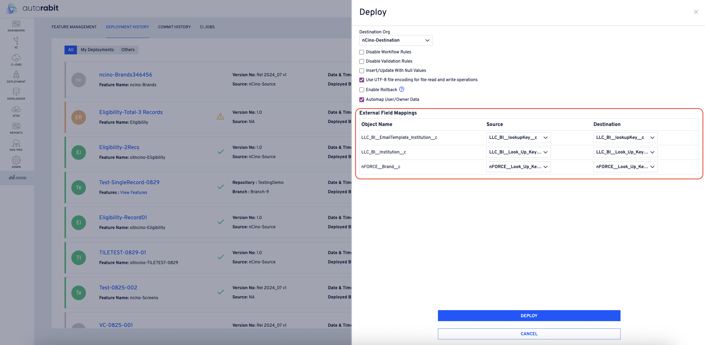
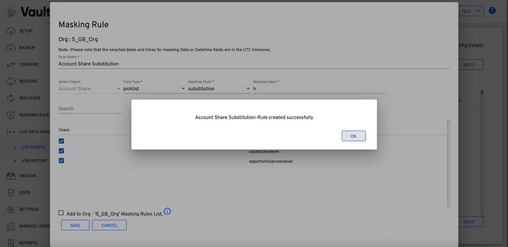
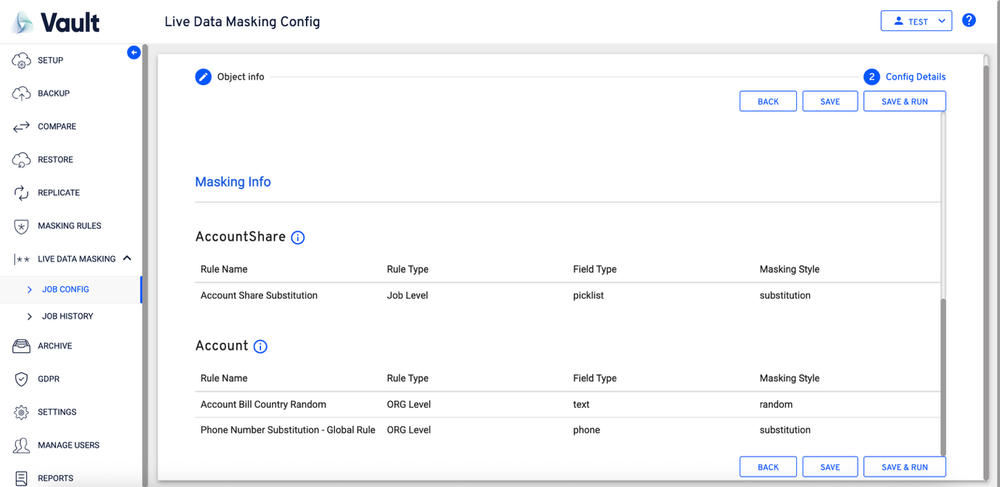

# Data Seeding

## **Data Seeding Templates**

### Introduction

This allows the user to create a job in the replicate module and reuse the configuration as long as it is required. The user can avoid the job creation each time they have to work on the ‘Replicate’ module.

### Feature Overview

This is a reusable template, which can be used to run, clone, and create a job every time a new job begins.

### Step-by-Step Guide

While creating the job configuration, the user can select from any of the Backup, Hierarchical Backup, Archive, or Salesforce Live Data.

### Job Configuration – Backup, Hierarchical Backup & Archive

1. Access the “Job Config” under the “Replicate” module and create the “New Replicate Config” as shown below.

2. On clicking “New Replicate Config,” the user will be prompted with “Replicate Config” with the dropdowns “Source”, “Destination,” and “Replicate Source.”

3. Replicate Source has the following values:
   * Backup
   * Hierarchical backup
   * Archive
   * Salesforce Live Date
4. _**For any selection of Backup, Hierarchical Backup & Archive**_
5. The user will land on the **“Replicate Config”** page:

6. **This will have the following options for the user to select:**

* Source Org: Source of the data for Replicate operation
* Destination Org: Destination to which the data will be moved during the replicate operation
* Replicate Source: Defines the kind of data that will be sourced to the replicate operation
* Configurations: For the “Replicate Source” selected, provides the available configurations under the “Replicate Source”

7. User will also have the table with the list of configurations created for the source selected.
8. User can select the required ‘configs’ from the list of ‘configs’ selected
9. On clicking “Next”, the user will land on the “Select Components” page. The user can observe “Metadata” and “Data” tabs.

10. The user can make the required selections under both the “Metadata” & “Data” tabs and continue to the next section.
    1. **Include all child objects:** Selection ensures that all the child’s directly related, and the recursively related, objects will also be included.
    2. **Mappings:** The user can click open and observe how the fields have been mapped for data transfer between the environments.

3. **Records**: The user can select the records by clicking the icon under the “Records” column.

4. **Search Text:** The user can search the fields.
5. **Slider:** By enabling and disabling the slider, the user can make the search case sensitive or case-insensitive
6. **Choose File**: The user can input the file using this option
7. **CHANGE VIEW**: The user can the additional fields required to be displayed on the page and can remove the fields that are not required.

11. **Masking Rules:** The user can create and publish the rules under this section.
12. The user clicks on the “New Masking Rule” button to create the rule.
    1. The rules that are created in a ‘Job Config’ will be specific to that unless it is published.

13. The following page will be displayed to the user on clicking the “New Masking Rule” button.

14. The user has to input the following for the creation of a rule:
    1. Rule Name: Label/Name of the rule being created
    2. Select Object: The object on which the rule is being created
    3. Field Type: Type of field on which the rule is being created
    4. Masking Style: Defines the pattern which will replace the data of the ‘Field Type” selected
    5. “Add To VaultData Masking Rules List”: By selecting this checkbox, the user can directly add this rule to the global rules list.
    6. The user can also publish a rule after saving the rule, by clicking the publish icon on the rule.

7. Once the user clicks the “Publish”, the following popup would be displayed to the user for confirmation

8. On clicking “OK” the rule will be published and be available with the global list of rules associated with the ORG
9. On completing all the required actions, the user can click “NEXT” to continue to the “Config Details” section.

15. The user can fill in all the required detail of the “Config Details”
    1. **Replicate Config Label**: The user can enter the name of the config to be created.
    2. **Batch Size**: The user can specify the custom batch size and which Vault will utilize for processing the data.
    3. **Email Notification**: The email to which the notifications can be triggered and sent.
    4. The user can switch on all the required triggers available on the page.
    5. **Schedule**: The user can set a custom schedule through the “Schedule” option available
       1. The user’s set schedule will be utilized to run the job at different intervals
    6. **Metadata**: The user can observe the selected ‘meta data’ components during the config creation.
    7. **Data:** The user can observe the objects that are selected during the config creation
    8. On completing all the required selections, the user can select either “SAVE” or “SAVE & RUN”

1. **SAVE:** Will save the config created. It will not trigger the job automatically while saving the job.
   1. The user will observe “SAVE” on the “Replication Config Info” page if “SAVE” is selected.
2. **SAVE & RUN:** Will save the config created and will trigger the job created to run, and, redirect the user to the “JOB HISTORY” page.
   1. The user can observe the related job running on the “JOB HISTORY” page
   2. The user will observe “SAVE & RUN” on the “Replication Config Info” page if “SAVE & RUN” is selected.

### JOB CONFIG – SALESFORCE LIVEDATA

1. The user selects “Salesforce Live Data” on the “Replicate Config” window.

1. If the user selects “Salesforce Live Data”, then the user will land directly on the “Select Components” section of the Flow.
2. The User Can Verify Both The “Metadata” & “Data” tabs to go through the meta data components and objects in the data tabs, as shown below:

1. **Include all child objects:** Ensures that all the child’s directly related, and the recursively related child’s will also be included
   1. To ensure optimal performance, only fixe objects were allowed to be selected. If any further child’s are to be selected, the selection can be made by going through the schema

**Mappings**: The user will click on the mappings to map the fields on the source against the fields on the destination

1. The mappings section contains three tabs: Fields, Record Type & Related Picklist
   1. The user can perform ‘AUTOMAP’ & ‘CLEAR ALL’ on the values of the tabs.

1. FIELDS: The fields on source are mapped against the field(s) on the destination
2. RECORD TYPE: The record type on the source are mapped against the record type on the destination
3. RESTRICTED PICKLIST: On selecting the ‘restricted picklist’ from the source, the source field values will be mapped against the field values on the destination
4. On completing the required selection on the tabs under the mappings, the users can perform ‘**APPLY’ & ‘CLEAR ALL.’**
5. FILTERS: The user can input the query and can set the filter criteria for the records to be filtered
   1. Once the user clicks the “Publish”, the following popup would be displayed to the user for confirmation.
6. On clicking “OK” the rule will be published and be available with the global list of rules associated with the ORG
7. On completing all the required actions the user can click “NEXT” to continue to the “Config Details” section.
   1. **Ignore Failed Records:** Enabling it, will ensure that the null’s available in the source ORG will be pushed to the destination ORG
8. **SAVE:** Will save the config created. It will not trigger the job automatically while saving the job.
   1. The user will observe “SAVE” on the “Replication Config Info” page if “SAVE” is selected.
9. **SAVE & RUN:** Will save the config created and will trigger the job created to run, and, redirect the user to the “JOB HISTORY” page.
   1. The user can observe the related job running on the “JOB HISTORY” page
   2. The user will observe “SAVE & RUN” on the “Replication Config Info” page if “SAVE & RUN” is selected.

### Job Configuration – Actions

1.  Every entry has the following actions:

    * Run
    * Edit
    * Clone
    * Schedule
    * Delete

    <figure><figcaption></figcaption></figure>
2. **RUN**: By clicking on the run icon, the following “Select Data to Replicate” screen will pop-up.

<figure><figcaption></figcaption></figure>

1. Clicking the “REPLICATE NOW” will trigger the job and will create a new entry on the “JOB HISTORY” page.
2. The user can verify and update any/all the details provided by the user during the “JOB CONFIG” creation.\
   Any changes or updates done to the “CONFIG” created will only be applicable to the entry created in the “JOB HISTORY” section. The CONFIG will remain as it is created in its original state.
3. **EDIT**: If the user clicks on the edit icon, the user will land on the edit flow of the CONFIG, and, the user can perform modifications to the “JOB CONFIG” created.\
   The changes made to the config will affect the config entirely
4. &#x20;**CLONE**: Clicking on the clone icon will pop the “Replicate Config” window to the user.

* The user can select the “Source” and “Destination” ORGs and enter the label and click “CLONE” to commence the clone operation.
* The “Masking Rules” of the selected destination ORG, will be displayed to the user for selection.
* On clicking CLONE, an entry will be created on the “JOB HISTORY” page.

<figure><figcaption></figcaption></figure>

5. **SCHEDULE**: Will set a schedule for the config to automatically run periodically.
   * On clicking the “Schedule” icon, the “Replication Config Schedule” will be displayed to the user.
   * The user can select all the required entries to set the schedule.
   * On completing the required selection, the user can click on the “SAVE SCHEDULE” button to save/set the schedule to the config being edited.

<figure><figcaption></figcaption></figure>

6. **DELETE**: Will delete the CONFIG from the list of configs available. If a config is deleted, the corresponding job in the history will not be deleted.

### Job History

1. On successfully creating a “Job Config”, it will automatically create an entry which runs on the “Job History” page.
2. Observe the jobs created and ran for the configs created.
3. On clicking any of the job labels, the user can observe the job-related details such as METADATA & DATA.

<figure><figcaption></figcaption></figure>

<figure><figcaption></figcaption></figure>

1. The user can observe the “Replicate Source Info” by clicking on the info icon.

<figure><figcaption></figcaption></figure>

<figure><figcaption></figcaption></figure>

<figure><figcaption></figcaption></figure>

3. You'll find insights into the outcomes within the "MetaSuccess" and "MetaFailure" categories. Take a closer look at individual successes within the "SuccessRecords" and setbacks within the "FailedRecords." Simply click on the associated links to access detailed information for each category, enhancing your understanding of both success and failure records.

<figure><figcaption></figcaption></figure>

<figure><figcaption></figcaption></figure>

<figure><figcaption></figcaption></figure>

4. Under the actions, the user can view the following “Replicate Summary”, “View Log” as shown below.

<figure><figcaption></figcaption></figure>

### Masking Rules

1. The user can create the ‘Masking Rules’ through the “New Masking Rules” option.
2. The user has to select the ORG for which the rule is being created, as shown below.

<figure><figcaption></figcaption></figure>

1. On clicking the “Select Orgs” option, the user can look at the list of ORGs available.
2. By clicking the “New Masking Rules” button, the user can open the “Masking Rule” window.

<figure><figcaption></figcaption></figure>

5. The user has to input all the required details and click **save** to create the rules.
6. The rules created here will be globally available at the ORG level for user(s) to select during the creation of config(s).

<figure><figcaption></figcaption></figure>

7. On inputting the required details, the user can click on save to save the rule, and the user will receive the following error.

<figure><figcaption></figcaption></figure>

8. On clicking “OK,” the rule created will be available in the Masking Rules section.

<figure><figcaption></figcaption></figure>

9. The user can clone the rules created. This will help them avoid future redundant effort.

<figure><figcaption></figcaption></figure>

