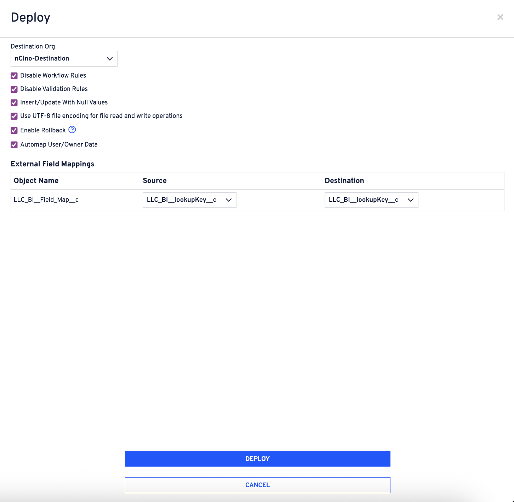
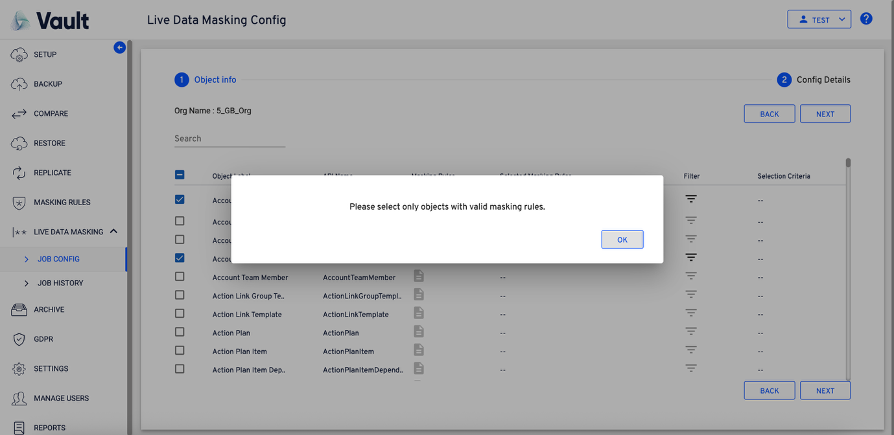
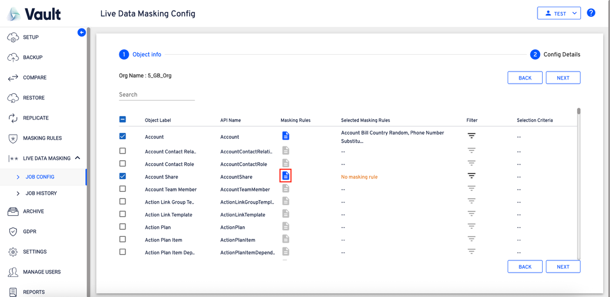
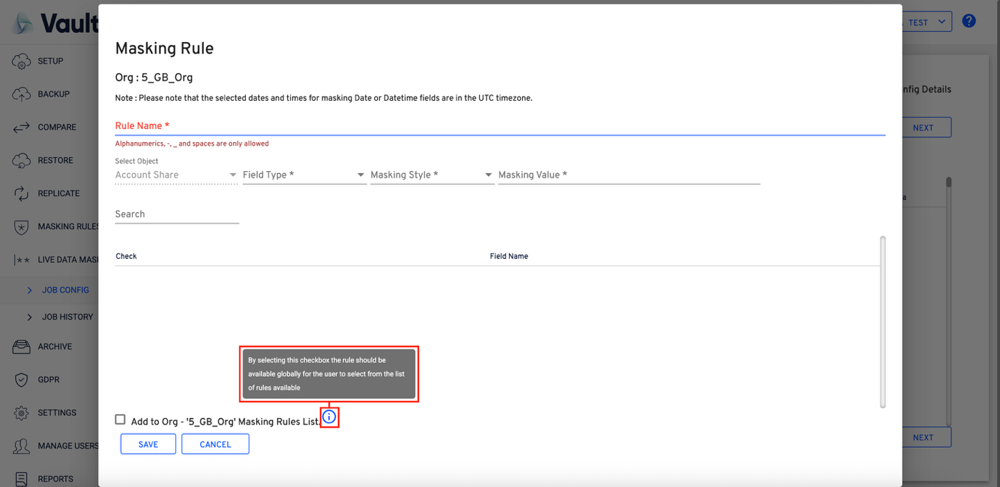
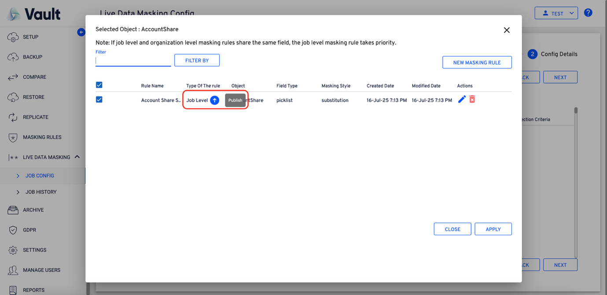
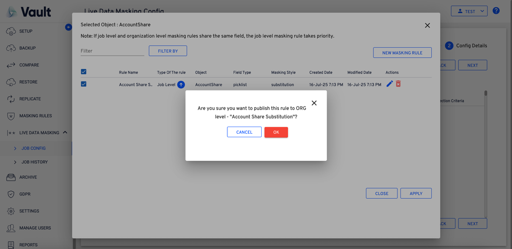
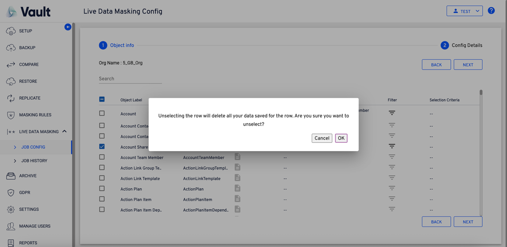
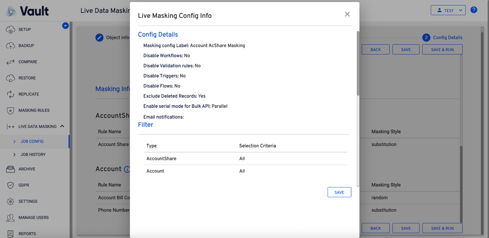

# Live Data Masking

**Live Data Masking** enables on-the-fly data masking within Salesforce, eliminating the need to build full configurations when masking is required for specific object data. It supports both the use and reuse of existing **Global Rules** and the creation of **Local Rules** for targeted masking. When both global and local rules are defined for the same fields and conditions, local rules take precedence. This approach also supports rule reuse through **cloning**, enhancing flexibility and efficiency in data protection.

**Step-By-Step Guide**:

1. Observe the new module “Live Data Masking” and click on the “JOB CONFIG” to land on the “Live Data Masking Config” creation screen.
2. Observe the “Salesforce Orgs” and the NEW CONFIG creation options available on this screen
3. The drop-down “Salesforce Orgs” contains the list of ORGs available for selection.
4. Select the required ORG at the “Salesforce Orgs” drop-down.
5.  Observe the following screen for the first time creation of the “Masking Rule Config” or first-time creation of “Masking Rule Config” on any ORG.

    
6.  Once the object is selected, continue with the “Masking Config” creation.

    
7. Click on the “NEW CONFIG” button to initiate the config creation.
8.  Now, the flow will navigate to the “Object Info” section of the config creation.

    
9.  Select the required objects to continue with the rules creation.

    
10. If there any rules available created under that object, all the available rules will come selected as depicted in the above screen.
11. If any object doesn’t hold the rules, the following “No masking rule” will be displayed under the “Selected Masking Rules” column.
    1. **Note: -** All the available selected rules will be displayed in a coma separated fashion under the “Selected Masking Rules”.
12. Click on any object that holds rules to view the available rules

    
13. Click on the View icon to view the masking rules.

    
14. Observe the rule and click cancel or anywhere outside the “Masking Rule” window to close the window.
15. Every selected object should have at least one rule associated to it. Observe the following screen flows.

    
16. Clicking on ”Next” would show the following message prompting to create at least one rule for the selected object.

    
17. Click on the “Masking Rules” icon to initiate the rules creation.

    
18. A “Selected Object” window will be opened, for creating a new rule.
19. Click on the “NEW MASKING RULE” button to initiate the rule creation.

    
20. A “Masking Rule” window will be opened to create the rule.

    
21. **Observe the following on the window**:
    1. **Org Name**: Provides the org name.
    2. **Rule Name**: Enter the rule name here.
    3. **Select Object**: It represents the object on which the masking rule is being created.
    4. **Field Type**: Provides the list of “Field Types” from the object.
    5. **Masking Style**: Enter the required pattern which should reflect on the selected ‘Field Type’.
    6. **Masking Value**: Enter the pattern that should be applied for the selected field type.
22. Add to Org “ORGNAME” Masking Rules List:
    1. Selecting this will make sure, the rule being created will be a global rule.
23. Observe the following screen for reference:

    
24. Select the “Add to Org ‘ORG NAME” Masking Rule List”, if the rule should be a global rule.
25. On entering all the required details, click on the “SAVE” button to save the created masking rule.
26. On clicking save a dialogue with info would be displayed confirming the save on the masking rule.

    
27. Upon saving the masking rule, the workflow automatically navigates to the **Selected Object** screen, where the newly created rule will be displayed and available for further configuration or review.

    
28. Observe the upward (Publish) icon beside the “Type Of The Rule” to publish the local to become a global rule.
29. Click on the icon to publish the local rule to become a global rule.

    
30. Click on to continue with the rule creation. The flow will navigate to the object info section of the masking config creation.

    
31. Observe the account object unchecked during the masking config creation. This will throw a message to the user asking for confirmation about unselecting the object from the flow creation.

    
32. On selecting the required objects, click on the “NEXT” to continue with the “masking config” creation
33. Clicking next will navigate to the “Config Details” section of the flow.

    
34. Observe the screen for the details:

    1. **Org Name:** Represents the org name
    2. Label: Enter the required label in this field.
    3. **Batch Size:** Specify the batch size at which the data should be processed while the data masking is being performed.
    4. **Email notification**: Select an email from the list. This will send an email to the person whose email is selected
    5. **Disable Workflows**\
       Enable this toggle to temporarily disable active workflows during the data masking operation.
    6. **Disable Validation Rules**\
       Enable this toggle to prevent validation rules from executing while masking data.
    7. **Disable Triggers**\
       Enable this toggle to bypass Apex triggers during the masking process.
    8. **Disable Flows**\
       Enable this toggle to deactivate Salesforce Flows for the duration of the data masking operation.
    9. **Exclude Deleted Records**\
       Enable this toggle to ensure that deleted records are excluded from the masking operation.
    10. **Enable Serial Mode for Bulk API**\
        Enable this toggle to process Bulk API operations sequentially (one after another) to reduce the risk of record-locking or related execution errors.

    
35. The **“Masking Info”** section of the **“Config Details”** page will provide the information about the list of rules created per object.

    
36. Click **“SAVE”** or **“SAVE & RUN”** to save the config.
37. **SAVE**: Saving the config will show the following screen, followed by a confirmation message on saving the config.

    
38. Clicking on “OK” will continue with saving the flow and navigate to the “JOB CONFIG” page.
39. The saved job has to be run on the job config page to perform the actual data masking on the data in Salesforce.
40. Click on the “Play” icon to run the config.

    <figure><figcaption></figcaption></figure>
41. On initiating the job run a “Selected Data To Masking” window will be displayed to verify the details of the run.

    <figure><figcaption></figcaption></figure>

    <figure><figcaption></figcaption></figure>
42. Observe the icon on the screen below while the job run is in progress.

    <figure><figcaption></figcaption></figure>
43. Clicking the “SAVE & RUN” will save the config and run it to perform the data masking.

    <figure><figcaption></figcaption></figure>

    <figure><figcaption></figcaption></figure>
44. On completing the saving, the flow navigates to the “JOB CONFIG” screen.

    <figure><figcaption></figcaption></figure>
45. Observe the Rollback option, which provides the ability to revert any deployed masking operations, if required.
46. Click on the rollback button available to initiate the rollback operation.
    1. To support the rollback operation, the deployed data will be retained for a period of “7 days” and on elapsing the retention period, the data will be deleted permanently.
47. On clicking the rollback, the following “Rollback” window will be displayed.

    <figure><figcaption></figcaption></figure>
48. Select the required objects to rollback the masking’s. On selecting at least one object the “Rollback” button will become enabled.

    <figure><figcaption></figcaption></figure>
49. On clicking the rollback option, the following window will be displayed for confirming the rollback

    <figure><figcaption></figcaption></figure>
50. For every rollback operation performed, a new entry will be created at the “JOB HISTORY” page. This job can be identified with the “Job Type – Rollback”.

    <figure><figcaption></figcaption></figure>
51. Click on the “info” icon under the “Job Info” to open the “Live Masking Config Info”.

