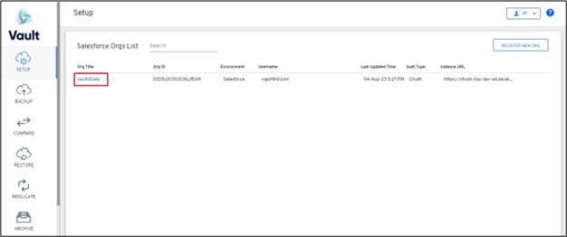
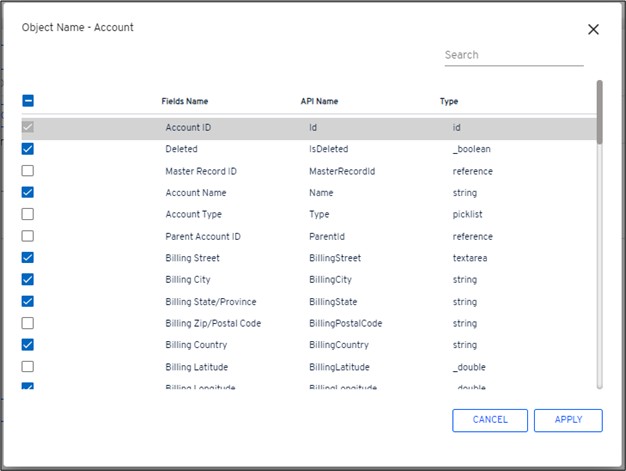

# Vault Connect

### User Guide

### Introduction

This document provides complete information about the new feature Vault Connect, which will enhance the user’s capability to better utilize Vault in viewing archived Salesforce data from an external data source.

### Feature Overview

1\.      OData protocol is an open and platform-independent protocol that can be integrated with the system of the user’s choice (along with Salesforce) as it exposes REST APIs for consuming and querying data from the underlying archives.

2\.      External objects support most of the capabilities that standard and custom objects have in Salesforce.

3\.      No need to install any managed packages or write custom scripts in Salesforce.

### Step-by-Step Guide

1\.      Create Connect Config

a.      Log in to the **Vault** application.

 (1) (1) (1).png>)

&#x20;

b.      Navigate to the setup module of the Vault application.

i.        Click on the required Org.

&#x20;

&#x20;

c.       Click on the **Connect (Beta)** module of the Vault application.

d.      On landing on the Connect (Beta) tab of the Vault setup, the user will see the following message on the screen:

&#x20;

.png>)

&#x20;

e.      Once the customer reaches out to AutoRABIT support team as specified on the above screen, our technical team will perform due diligence to enable Vault Connect for the customer(s).

f.        When Vault Connect is enabled on the application, the user will see the following screen on the Connect (Beta) tab of the Vault Setup module.

&#x20;

.png>)

&#x20;

g.       Click on the **Add Connect Config** button on the application.

&#x20;

.png>)

&#x20;

h.      A pop-up will be displayed with the following information:

i.        How/where to config the external data source;

ii.       OData URL for configuring the external data source; and

iii.     What to select when creating Auth. Providers.

&#x20;

.png>)

&#x20;

i.        Copy the URL from the pop-up shown.

i.        **Note:** The same URL can be copied from the pop-up and opened by clicking on the information icon available beside the **Add Connect Config** button.

&#x20;

.png>)

&#x20;

.png>)

&#x20;

j.        Select the required config from the Archive Config section and click on the **Next** button.

&#x20;

.png>)

&#x20;

k.       On clicking **Next,** you will be redirected to the **Jobs** section.

&#x20;

.png>)

&#x20;

l.        Select the required **Job** and click on Next.

m.    On clicking Next, you will be redirected to the **Objects** section.

&#x20;

.png>)

&#x20;

n.      The following operations can be performed:

i.        Include/exclude the required objects from the list of objects available.

&#x20;

.png>)

&#x20;

ii.       Include/exclude the fields as required from the list of Fields available.

1\.      Click on the **File** icon from the **Fields** column.

&#x20;

.png>)

&#x20;

2\.      The following pop-up will be displayed, where the user can exclude the fields as required and click on **Apply** field.

&#x20;

o.      On clicking Save, you will be prompted to enter the **Name** and **Description** for the config being created.

&#x20;

.png>)

&#x20;

p.      On entering the required details, click on **Save.**

q.      On clicking Save, you will be shown a pop-up that says, **“Config has been created/updated successfully,”** and you will be redirected to the **Connect Config Summary**.

&#x20;

.png>)

&#x20;

r.       On the Connect Config Summary, you can view all the configurations created.

&#x20;

2\.      **View the Archived Data In Salesforce**

a.      Log in to the Salesforce org for which you want to view the data.

b.      **Create Auth. Providers**

i.        **Go to** → **Auth. Providers** under setup.

**ii.       Click on the Auth. Providers under setup.**

&#x20;

.png>)

&#x20;

**1.**      Click on **New.**

&#x20;

.png>)

&#x20;

**2.**      Select the **Provider Type – Salesforce**

&#x20;

.png>)

&#x20;

3\.      Provide **Name** and **URL Suffix** and click on **Save.**

o   **Note:** Do not change the remaining settings on the layout.

&#x20;

.png>)

&#x20;

4\.      On completing the required selections, click on the Save button.

&#x20;

c.       Create External Data Sources

i.        **Go to** → **External Data Sources** under setup.

&#x20;

.png>)

&#x20;

**1.**      Click on **New External Data Sources.**

&#x20;

.png>)

&#x20;

2\.      Provide **External Data** source.

3\.      Provide Name.

4\.      Type → Salesforce Data: OData 4.0

&#x20;

.png>)

&#x20;

5\.      Under the parameters section, **select or provide** the following:

a.      **URL:** Provide the URL copied while creating the connect configuration.

&#x20;

.png>)

&#x20;

b.      Leave the rest of the settings in the Parameters section as is.

c.       **Go to → Authentication section** under setup.

&#x20;

.png>)

&#x20;

i.        **Identity type** → Named Principal

ii.       **Authentication Protocol** → OAuth 2.0

iii.     **Authentication Provider** → On clicking the **LookUp** glass, you can select the **“Auth. Provider”** created earlier.

.png>)

&#x20;

iv.     Select the **Authentication Provider**.

v.       Click on **Save on the External Data Sources screen.**

vi.     On **Save**, click the **Validate and Sync**.

.png>)

&#x20;

vii.   You will be shown all the objects selected as part of the config creation.

viii. On selecting the required objects, the **Sync** button on Salesforce will be enabled.

&#x20;

.png>)

&#x20;

ix.     Select all the objects you want to sync or select which objects’ data you want to view in Salesforce.

.png>)

&#x20;

x.       Click on the **Sync** button.

xi.     On completion, you can see all the objects selected.

&#x20;

.png>)

d.      **Create Tabs:** Customers can view the archived data under these tabs.

i.        **Go to → Tabs** under setup.

1\.      Click on the **New** button.

&#x20;

.png>)

&#x20;

2\.      Under **Objects**, you can see the objects that are part of the Config created with the naming convention **“Object\_\_X”.**

&#x20;

.png>)

&#x20;

3\.      Select the Object for which you want to create the tab.

&#x20;

.png>)

&#x20;

4\.      On clicking the hourglass, the Tab Style Selector window will open. Then select the Tab Style from the available options.

&#x20;

.png>)

&#x20;

5\.      On selecting the Tab Style, continue with the Tab creation process.

6\.      On completion of the Tab creation, a new tab will be added to the Custom Object Tabs section.

.png>)

&#x20;

7\.      The user can follow the above-specified process to continue to create the custom tabs as needed for all the available/required tabs. You will see a suffix of “\_X” for the custom tabs created.

8\.      Open the tab(s) created, and you can view the **Archived** data.

&#x20;

### Troubleshooting

1. Files and attachments are not supported for viewing through external objects in Salesforce. This will be supported in the upcoming version of Vault Connect scheduled for the end of Q4’23.
2. Salesforce OData 4.0 adapter has a limitation on the number of callouts per hour. This will be addressed with the support for the Salesforce OData 4.01 adapter in subsequent versions of the capability.
3. Relationships between external objects and Salesforce objects need to be established manually (like if cases are archived and they are related to accounts that are not archived, the reference to accounts that are in the Salesforce object will be available in the external object but will not be reflected as a lookup relationship). The plan is to support the automated recreation of these references by the end of Q4 2023.
4. All the limitations of Salesforce external objects are applicable as mentioned in this article: [Help and Training Community](https://help.salesforce.com/s/articleView?language=en\_US\&id=sf.platform\_connect\_general\_limits.htm\&type=5)
5. The solution only supports customers configured with AWS S3 as a storage option in Vault.
6. There is a max limit of 5GB of archived data per customer supported for connecting to Salesforce external data source as part of the beta program. This can be extended to a higher limit by raising a request with [support@autorabit.com](mailto:support@autorabit.com).
7. Fields of type XmlObjectWrapper are not supported.
8. Fields of the object that have soapType as double, values will be truncated according to the precision and scale, as defined in the metadata of the object’s field.\
   \
   For example: If a field holds decimal value information for that object, precision and scale values will be predefined.\
   &#x20;\
   **Precision:** The maximum number of digits in a numeric value includes all numbers to the left and to the right of the decimal point (but excludes the decimal point character).\
   \
   **Scale:** The number of digits to the right of the decimal point in a numeric value must be less than the precision value.

**Example 1:**\
Define a custom number field, e.g., "Number." Give it length = 3 and decimal places = 1 (scale). It might seem that this is done to restrict the precision of the field to one decimal place. However, on the UI level (on a standard edit page), if you try to type in, for example, 237.631, it will round it off to 237.631. Here precision is 4 and scale is 1.\
When mapping it back to Salesforce as the external object’s field, the value will be truncated to 237.6.

**Example 2:**\
Say a field holds info on geo location latitude and longitude and their precision and scale are 5 and 2, respectively. Assign the value as 77.2090, then when mapping it back to Salesforce as the external object’s field, it will be truncated to 77.20.
