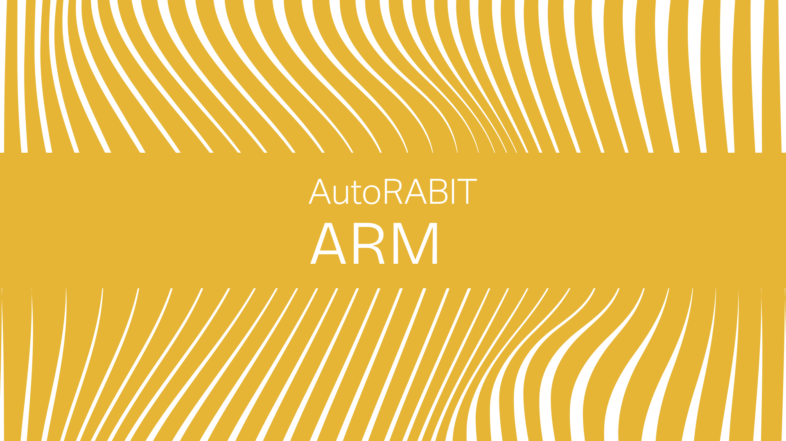

# Release Notes 26

<figure><figcaption></figcaption></figure>

## ARM **Release Notes 26.3.13**

**Release Date: 27 September 2026**

#### Salesforce Standard Authentication Retirement Notifications 

Added notifications to help customers prepare for Salesforce’s retirement of username- and password-based **Standard authentication**.

Warnings are displayed for Salesforce orgs using Standard authentication in the following areas:

* Salesforce Org registration and configuration
* Environment Provisioning template execution
* CI Job, Deployment, and Environment Provisioning email notifications

The warning is not displayed for orgs using OAuth or OAuth via ECA. Customers can migrate existing Standard-authenticated orgs to **OAuth via ECA**, including orgs whose Standard connection has already stopped working, without affecting their existing mappings, CI Jobs, schedules, or permissions.

#### Salesforce API Version 68.0 Support – Phase 1 

Added ARM compatibility with Salesforce API version 68.0 across metadata retrieval, deployment, validation-only deployments, Org Compare, and EZ-Commit workflows. ARM continues to support Salesforce organizations running earlier API versions.

As part of Phase 1, added support for the following Agentforce metadata types:

* AiAgentDefinition
* AiAgentDefinitionVersion
* AiSurface
* AiResponseFormat
* AiTestingDefinition
* AgentPlatformSettings
* AgentforceForDevelopersSettings
* AgentforcePlatformTracingSettings
* BotEmailDefinition

These metadata types are supported across retrieval, commit, change detection, deployment, merge, and filtering workflows. Support for the remaining metadata types introduced with API version 68.0 is planned for the next release.

#### Cascading Selection for Custom Setting Data – Environment Provisioning 

Enhanced Custom Setting selection while creating Environment Provisioning migration templates.

Selecting a Custom Setting now automatically selects all eligible fields. After retrieving records, selecting all records automatically selects every eligible field within those records. Selecting an individual record also selects its eligible fields.

Users can still refine the migration by deselecting individual records or fields. Existing behavior for mandatory, system, and non-editable fields remains unchanged. This enhancement applies to List and Hierarchy Custom Settings where applicable.

#### Target Branch Credentials for Pull Request Creation in EZ-Merge 

Fixed an issue where the **Create Pull Request on Merged Changes** option used the credentials of the user who registered the repository instead of the credentials configured for the target branch.

With this fix, ARM uses the target branch credentials when creating the pull request. The help link for this option has also been updated to direct users to the relevant Knowledge Base article.

#### Merge Conflict Handling Improvements 

Fixed an issue where attempting to download large conflicted Profile files could fail and invalidate the user session.

With this fix, the **Download Files** option is not displayed in Merge Request history when conflicts are present, preventing failed downloads and unexpected logout. An additional issue with the **Revert** action after selecting the source or destination version during conflict resolution has also been resolved.

#### SCA Run Options Fix in CI Jobs – New UI 

Fixed an issue where the selected **Run on** option under **Run SCA Analysis** was not retained when reopening a CI Job in Edit mode.

Also fixed an issue where the applicable SCA run options and **Mark Build As Unstable If It Doesn’t Meet Below Criteria** setting were not displayed when SonarQube was selected.

With this fix, saved SCA options are displayed correctly, and the applicable SonarQube configuration options are available in the New UI.

***

## DataLoader + DataLoader Pro Release Notes **26.3.13**

**Release Date:** **27 September 2026**

#### Accurate Save Messaging for DataLoader Pro Jobs

When **Skip mappings** was selected while saving a DataLoader Pro job, the application could display an incorrect message. Save-message handling was corrected to accurately reflect the selected mapping behavior. The correction applies to new and existing jobs with single or multiple objects in both the existing and new interfaces.

#### Preserved Query Changes in Cloned DataLoader Extract Jobs

Changes made to a SOQL query while cloning a DataLoader Basic Extract Job were not retained, causing the cloned job to use the original query. Query-modification handling was corrected so the edited query is saved with the cloned job. The cloned job now executes using the updated query criteria in both the existing and new interfaces.

***

## ARM **Release Notes 26.3.12.1**

**Release Date: 23 Sep 2026**

#### GitLab OAuth Support for Repository Registration 

Added **OAuth authentication support for GitLab repositories**, providing a secure alternative to Personal Access Token (PAT) and SSH authentication.

Users can now authorize ARM through GitLab OAuth and register GitLab repositories using the generated **Client ID and Client Secret**. ARM also supports re-authorization when OAuth access needs to be renewed or updated.



## ARM **Release Notes 26.3.12**

**Release Date: 20 Sep 2026**

#### Org Sync Performance and Stability Improvements

Improved **Org Sync performance and application stability** by allowing a maximum of **two Org Sync jobs to run at the same time**.

Any additional manual or scheduled Org Sync requests are automatically queued and will start once an active job is completed. The queued status is displayed in the **ARM UI** for better visibility.

#### Salesforce API 67 Settings Metadata Support

Added ARM support for the following **Settings metadata types introduced in Salesforce API version 67**:

* EmailAuthorizationSettings
* EnterpriseApiSettings
* EvidenceMgmtSettings
* IndustriesInsuranceSettings
* LaborCostOptimCrewMgmtSettings
* QualityManagementSettings
* ServiceIssueManagementSettings
* ServiceItsmChangeManagementSettings
* ThunderbirdVoiceSettings

These metadata types are now supported across applicable ARM workflows, including **retrieval, EZ-Commit change detection, constructive and destructive changes, and deployment**.

#### Installation Key Handling Fix in CI Jobs

Fixed an issue where the Installation Key could be incorrectly processed while saving or updating package installation CI Jobs, resulting in an **Invalid InstallationKey for SubscriberPackageVersion** error.

With this fix, the Installation Key is processed correctly when users enter or update the value, preventing the masked value from interfering with the newly entered key. This fix applies to **CI Job types 9 and 10** in both the **Old and New UIs**.

#### Installed Package Validation Fix in EZ-Commit and EZ-Merge

Fixed an issue where configurations containing only **InstalledPackage** metadata could fail during validation with a **Missing Active RSS Component** error, even though the same configuration could be deployed successfully.

With this fix, InstalledPackage metadata is handled correctly during validation deployments. The fix applies to **EZ-Commit and EZ-Merge** workflows for both **DX and non-DX repositories**.

#### CI Job Queue Processing Fix

Fixed an issue where validation and deployment CI Jobs could remain in the **Pending** state with a message indicating that another deployment to the same destination was in progress, even when no active job was running.

With this fix, ARM correctly identifies and clears inactive queue entries, allowing eligible CI Jobs to proceed automatically without manual intervention.

The fix applies to both **manually triggered and webhook-triggered CI Jobs**.

#### Dotfile Details Logout Fix in Commit History

Fixed an issue where expanding `.gitignore` or other dotfiles under **Commit History → File Changes** could unexpectedly redirect users to the login page.

With this fix, dotfile details are loaded correctly, allowing users to view the file changes without being unexpectedly logged out.

#### Duplicate Repository Name Validation

Fixed an issue where different users could register repositories using the same repository name with different repository URLs.

With this fix, ARM validates repository names across registered repositories. If the repository name is already in use, registration is prevented and an appropriate validation message is displayed.

#### Org Sync Schedule Email Field Fix – New UI

Fixed an issue where the **Email Notification** field was missing when configuring an Org Sync schedule in the **New UI**.

With this fix, the Email Notification field is restored and displayed as **mandatory**, consistent with the Old UI.

***

## DataLoader + DataLoader Pro Release Notes **26.3.12**

**Release Date:** **20 Sep 2026**

#### Reliable Loading for Test Environment Jobs 

Resolved an issue where editing a Test Environment job repeatedly requested Salesforce organization and object data, leaving the page stuck in a loading state. Job initialization now runs only once and prevents duplicate requests. Users can open and edit Test Environment jobs normally. Automatic Timeout Status for Stalled Jobs

Jobs that remain in progress for more than 24 hours are now automatically marked as **Timeout** when the status scheduler runs. This prevents outdated job statuses from remaining active indefinitely. The update applies across DataLoader Jobs, and Feature Management operations.

#### Correct Job Statuses Following Instance Restarts 

Jobs interrupted by an instance restart no longer remain indefinitely in an **In Progress** state. Interrupted jobs are now marked as **Aborted** or **Failed**, preventing stale records from blocking later processing. The correction covers DataLoader Jobs, and Feature Management activities.

#### Automatic Recovery of Stalled nCino and DataLoader Jobs 

DataLoader jobs could remain in an **In Progress** state when processing was interrupted or the status was not updated for more than 24 hours. Status-handling logic was corrected to move these stalled jobs to the appropriate terminal status. This prevents inactive jobs from appearing to run indefinitely and ensures that subsequent DataLoader processing can continue normally.

***

## ARM **Release Notes 26.3.11**

**Release Date: 13 Sep 2026**

#### Apache Tomcat 11.0.24 Upgrade – Enhancement

ARM now runs on **Apache Tomcat 11.0.24** on Shared, Dedicated, and On-Premises instances. This replaces **11.0.22** and includes Tomcat security and stability updates. Application startup and existing ARM workflows are unchanged.

#### Salesforce Org Delete After Clone Fix

Fixed an issue where a cloned Salesforce org could not be deleted if the org name contained a leading or trailing space. ARM showed **Salesforce org does not exist** even though the org was visible in the UI.

With this fix, org names are trimmed when registering or cloning. Cloned orgs can be deleted in both the Classic UI and the New UI. Re-authentication no longer clears the cloned flag or the original registration date.

#### EZ-Merge Validating Salesforce XML Log Fix

Fixed an issue where **EZ-Merge** showed **No log data available** during the **Validating Salesforce XML** stage when **Skip Flow/Layout/Profile/Perm.Set Access-Setting Duplicity Check** was enabled.

With this fix, that stage writes execution details to the process log in both the Classic UI and the New UI, for DX and Non-DX repositories.

#### EZ-Commit Folder Metadata Duplicate Member Fix

Fixed an issue where removing a folder-based metadata type and adding it again listed the same members twice. This affected folder types such as **ReportFolder**, **DashboardFolder**, **DocumentFolder**, and **EmailFolder**.

With this fix, removing the folder clears its members. Adding the same folder again lists each member only once in both the Classic UI and the New UI, for DX and Non-DX repositories.

#### CI Job Abort Cleanup Fix

Fixed an issue where aborting a CI Job from the UI could leave an unhandled interruption error in the agent log during job cleanup.

With this fix, abort completes for Version Control to Org and Org to Org CI Jobs without that agent error.

#### Scratch Org Create Button Fix – New UI

Fixed an issue in the New UI where **Create Scratch Org** stayed disabled on the last step of the Scratch Org flow when only the main user was present.

With this fix, the button is enabled for a single main user and for orgs with multiple permitted users.

#### SCA Job Name Validation Fix

Fixed an issue where an SCA job name that included **\\** or **;** could be saved, then failed on Run or Delete. A semicolon in the name could also end the user session.

With this fix, new SCA job names reject those characters. Existing jobs can still be run, scheduled, deleted, and viewed in logs and history.

#### Branching Baseline Revision Details Fix – New UI

Fixed an issue in the New UI where **Branching Baseline** Revision Details could fail to render the revision value.

With this fix, Revision Details open from a completed baseline row and show author, date, message, file count, and revision without an error.

***

## ARM **Release Notes 26.3.10**

**Release Date: 6 Sep 2026**

#### API 67 Metadata Types – Enhancement

ARM now supports the following Salesforce API 67 metadata types across commit, constructive changes, and deployment:

* AdminSuccessSettings
* AgentforceAccountManagementSettings
* AgenticCtxtDecorDefinition
* DataMaskPolicy
* DataMaskSettings

These types can be retrieved, compared, committed, and deployed when the org is on API 67.0 or later. Settings types can be updated but cannot be deleted, which matches Salesforce Metadata Coverage. Existing metadata types are unchanged.

#### Run Tests Based on Changes Deployment Log – Enhancement

When **Run Tests Based on Changes** is used, the deployment log previously showed only the final consolidated list of Apex test classes. It was not clear which classes came from the deployed Apex, dependency mapping, or default org test classes.

With this enhancement, the deployment log lists:

* Test classes identified from the Apex classes in the package
* Default Apex test classes configured on the Salesforce org
* The final consolidated list passed to Salesforce

This applies to Version Control to Org and Org to Org deployments in both the Classic UI and the New UI.

#### Data Retention Audit Cleanup Fix

Fixed issues where the daily Data Retention job did not delete eligible **Workspace Audit** and **Mailer Audit** records. The job could report success while old audit rows were left in place.

With this fix, ARM normalizes legacy audit values and completes Workspace Audit and Mailer Audit cleanup according to the configured retention period.

#### Release Label and High-Volume Page Load Fix

Fixed an issue where Release Labels and other high-volume pages could stop responding with a DynamoDB throughput error. Opening a label with a large number of revisions could leave the page stuck.

With this fix, ARM retries and handles temporary DynamoDB capacity limits so Release Labels, CI Jobs, Deployments, EZ-Commit, EZ-Merge, Feature Migration, Data Loader, and Administration pages can load and complete.

#### EZ-Commit Prompt Metadata File Diff Fix

Fixed an issue where EZ-Commit file diff failed for **Prompt** metadata destructive changes with no matching SFDX folder type. After the diff, Prompt could also show **No Modifications** because the file extension was incorrect.

With this fix, Prompt metadata is recognized in DX and Non-DX repositories. File diff and constructive and destructive commits complete, and Prompt files use the **.prompt-meta.xml** extension.

#### EZ-Commit Picklist Record Type Scope Fix

Fixed an issue where committing picklist changes on one object could show extra file changes on Record Types for other objects. Deactivating or activating picklist values on the selected object updated unrelated objects that shared similar picklist labels.

With this fix, EZ-Commit applies picklist and Record Type updates only to the selected object in both DX and Non-DX repositories.

#### Unused API Token Endpoint Removal

Removed an unused API endpoint that returned API token values in the HTTP response body.

Token creation and use in the application and the VS Code plugin are unchanged.

***

## DataLoader + DataLoader Pro Release Notes **26.3.10**

**Release Date:** **6 Sep 2026**

#### Correct Empty Relationship Fields in Data Loader Exports

Resolved an issue where empty User Role or Manager fields could incorrectly display the user’s name in exported CSV files. Data Loader now leaves these relationship fields blank when no value is available. The correction applies to normal and aggregate queries in both the existing and new interfaces.

***

## ARM **Release Notes 26.3.9.1**

**Release Date: 2 Sep 2026**

#### Salesforce Winter ’27 (API 68.0) Deploy Result Parsing Fix

Fixed an issue that caused EZ-Merge, deployments, and CI Jobs to fail after Salesforce upgraded sandboxes to Winter ’27 (API 68.0). When an Apex test level was selected, ARM could not parse the updated Metadata API deploy result and failed with "Cannot invoke "com.sforce.soap.metadata.DeployDetails.getComponentFailures()" because "deployDetails" is null". Validations that ran without a test level completed successfully, and the same deployment could succeed directly in Salesforce. ARM Salesforce libraries are now updated to API 68.0 so deploy results and test coverage responses parse correctly across all Apex test levels.

**Impacted Areas:**

* EZ-Merge
* Deployments
* CI Jobs
* Pre-Validated Commit
* Pre-Validated Merge
* Salesforce Code Coverage Reports

***

## ARM **Release Notes 26.3.9**

**Release Date: 30 Aug 2026**

#### Support Custom Package XML Filenames in Deployment – Enhancement

Custom Deployment previously required the uploaded Salesforce package manifest to be named exactly **package.xml**. Customers maintaining multiple manifests, such as `qa.xml`, `uat.xml`, or `production.xml`, had to rename the file before each deployment.

Custom Deployment now accepts any `.xml` filename that contains a valid Salesforce Package manifest, consistent with EZ-Commit. ARM validates the XML contents rather than the filename, processes accepted files internally as **package.xml**, and rejects non-package metadata files such as Profile or CustomObject XML. Existing deployments that use **package.xml** continue to work without change.

#### Extend Deployment Approval Auto-Reject Timeout to 7 Days – Enhancement

Pending L1 and L2 deployment approvals were automatically rejected after **3 days (72 hours)**, which did not always give approvers enough time to complete review.

Pending L1 and L2 approvals now remain active for **7 days (168 hours)** before auto-rejection. A notification email is sent **24 hours before auto-rejection** to the primary and secondary approvers and the deployment creator. The notification includes the deployment identifier, pending approval level, auto-rejection date and time, and the action required to avoid rejection. Approvals or rejections completed before the warning window do not trigger the reminder. Existing approval statuses, including **Auto Rejected**, are unchanged.

#### Display Actual Static Code Analysis Pass/Fail Result – Enhancement

ARM previously displayed a green tick when Static Code Analysis execution completed, even when the CodeScan or SonarQube Quality Gate had failed. This made it appear as though analysis had passed.

ARM now keeps the existing completion indicator and displays the actual Quality Gate result next to **Static Code Analysis** as **Analysis: PASS** or **Analysis: FAIL**. PASS and FAIL use the corresponding success and failure treatments. The result is shown only after the final outcome is received from CodeScan or SonarQube and applies to **Commit**, **Merge**, and **Quick Merge** in both the Classic UI and the New UI. This display applies to **CodeScan** and **SonarQube** only.

#### ECA Concurrent Session Lockout Fix

Fixed an issue where an ECA-enabled Salesforce org could be locked out with an **INVALID\_SESSION\_ID** error when a CI Job using **Deploy from Salesforce Org** and an **EZ-Commit** ran at the same time against the same source org. After the conflict, **Re-Authorize** did not reliably restore the org.

With this fix, ARM coordinates refresh-token rotation for the same org so concurrent CI Job and EZ-Commit operations can complete without invalidating each other’s session. Re-authorization restores org connectivity when needed, and single-operation workflows are unchanged.

#### OAuth and OAuth-with-ECA Registration and Re-Authorization Fix

Fixed issues where Salesforce org registration and re-authorization failed in several OAuth flows. OAuth to **OAuth-with-ECA** re-authorization did not complete, new OAuth registrations and re-authorization below API version 64 failed, and OAuth to OAuth-with-ECA re-authorization failed when **PKCE** was disabled.

With this fix, PKCE is supported for the standard OAuth flow as well as OAuth via ECA. Registration, re-authorization, token refresh, and test connection succeed with PKCE enabled or disabled, including when converting an existing org from OAuth to **OAuth via ECA**.

#### EZ-Merge Git Push Status Fix

Fixed an issue where **EZ-Merge** could be marked **Successful** when the remote Git push was rejected, for example by branch protection rules. The locally created commit revision was still shown as successful, and users had to inspect logs to discover that the push had failed.

With this fix, ARM validates the remote Git push result before marking the merge complete. If the push is rejected, the merge is marked **Failed**, the local commit revision is not shown as a successful revision, and the Git rejection error is displayed to the user. Merges that push successfully continue to be marked **Successful**.

#### Revision Number Display Fix in Commits, Merges, and CI Jobs

Fixed an issue where the full Git commit hash was displayed after merge conflict resolution, in merge notifications, in the EZ-Commit label section, and in CI Jobs.

With this fix, revision numbers are displayed as a **short SHA** across **Commit**, **Merge**, and **CI Job** views in both the Classic UI and the New UI.

#### Profile Compare Deploy View Fix

Fixed an issue in **Profile Compare** where **Deploy** and **Update and Deploy** applied permission changes to the target org, but the comparison grid did not refresh to show the post-deployment state. The grid could display stale or inverted source and target values.

With this fix, comparison data is refreshed after Deploy and Update and Deploy so the grid reflects the actual org state. Permissions continue to be applied only to the target org.

#### Vlocity Release Label Merge Board Type Fix

Fixed an issue where the **Board Type** field was not auto-populated during **Release Label Merge** for Vlocity release labels. The field remained blank and required manual input, unlike non-Vlocity release label merges.

With this fix, Board Type is automatically populated from the selected Vlocity release label and repository configuration for both release label and commit label merge workflows.

#### CI Job DynamoDB Throughput Error Fix

Fixed an issue where CI Jobs could fail during build processing with a DynamoDB throttling error indicating that throughput exceeded the current table or index capacity.

With this fix, CI Job processing handles this condition correctly so scheduled, webhook, pull request, and parallel CI Job executions can complete without this failure.

#### Quick Deploy After Validate Only Fix

Fixed an issue where **Quick Deploy** was unavailable after a successful **Validate Only** deployment to a Production org when the test level was set to **Salesforce Defaults**. In the Classic UI, the label name was disabled. In the New UI, a valid Asynchronous ID was not available for selection.

With this fix, Quick Deploy is available after a successful Validate Only deployment to Production when using Salesforce Defaults. The label name is populated and ARM-generated Asynchronous IDs are available. Quick Deploy remains unavailable after Validate Only on non-production orgs when Salesforce Defaults are used, which is expected.

#### Branching Baseline Commit Log Fix

Fixed an issue where initiating a **Branch Baseline** could fail with a UI exception while loading commit logs, including the message **Error parsing SCM commit log file**. Concurrent access to the commit log file could corrupt the file and block the baseline.

With this fix, ARM locks the commit log file during read and write operations and releases the lock when the operation completes. Branch Baseline can retrieve commit logs and proceed even when push protection is enabled or configuration files such as `.gitignore` and `package.xml` are missing from the branch.

***

## DataLoader + DataLoader Pro Release Notes **26.3.9**

**Release Date:** **30 Aug 2026**

#### Data Loader Pro Job Configuration Settings Not Retained 

Resolved an issue where selected Data Loader Pro job settings were not retained during execution.

Options such as disabling workflows and validation rules and processing null values are now saved and applied correctly.

***

## ARM **Release Notes 26.3.8**

**Release Date: 23 Aug 2026**

#### Create Pull Request for Merged Changes in ez-Merge – New Enhancement (New UI) 

Introduced the **Create Pull Request On Merged Changes** option in ez-Merge. When enabled, ARM applies the merged changes to a temporary branch, validates them, and creates a pull request targeting the selected destination branch instead of committing the changes directly.

The option is available only when **Pre-validation Merge** is configured and supports all pull-request-enabled repositories. Pull request details and the URL are available in the new **Pull Request Creation** process log.



#### Duplicate Picklist Member Selection Fix in EZ-Commit – New UI 

Fixed an issue where a Custom Object already added as a Picklist member remained available in the dropdown and could be selected again without any feedback.

With this fix, previously added Custom Objects are no longer displayed in the dropdown, preventing duplicate selection and improving the metadata selection experience.

#### Branching Baseline Gitignore Handling Fix 

Fixed an issue where the Branching Baseline process replaced the repository’s existing `.gitignore` file with a default version. This caused ignored files, such as `manifest/package.xml`, to be included and could trigger repository push-protection violations.

With this fix, ARM retains and applies the existing `.gitignore` file during the Branching Baseline process. The default `.gitignore` file is used only when one is not already available in the repository.

#### EZ-Commit File Diff Failure Fix – Old UI 

Fixed an issue where Picklist metadata was incorrectly treated as a Custom Field when reusing a previously validated EZ-Commit label. This caused false deleted components and resulted in a file-diff failure.

With this fix, Picklist values are correctly processed as Picklist metadata, preventing false destructive entries and file-diff failures.

#### SonarQube SCA Execution with S3 Fix 

Fixed an issue where SonarQube SCA executions failed when using S3 and incorrectly displayed the **Updating CodeScan Project** message.

With this fix, the S3-specific analysis path is restricted to CodeScan, ensuring SonarQube SCA executions are processed correctly.

#### Ignore Missing Visibility Setting Display Fix 

Fixed an issue where the **Ignore Missing Visibility** setting was not displayed in the commit history details.

With this fix, the setting and its configured value are now visible under **More** on the Commit History Details page.

#### Standard Field Changes Detection Fix in EZ-Commit – New UI 

Fixed an issue where changes to standard field permissions were not detected or displayed during comparison in EZ-Commit.

With this fix, standard field permission changes are correctly retrieved and displayed in the New UI.

#### Skipped Components Exclusion Fix 

Fixed an issue where components configured as skipped were still included during repository-to-org deployments, even when **Do Not Include Skip Members During Deployment** was enabled.

With this fix, skipped components are correctly excluded from CI Job and Manual Deployment workflows for both DX and non-DX repositories.

#### Password Reset Screen Responsiveness Fix 

Fixed an issue where the password reset screen became unresponsive when a Pendo survey appeared during login, preventing users from entering a new password.

With this fix, users can complete the password reset process without interference from Pendo notifications.

#### Support Contact Information on Password Reset – Enhancement 

Added the AutoRABIT Support email address to the password reset message. Users who do not receive the reset email or continue experiencing login issues can now contact [**support@autorabit.com**](mailto:support@autorabit.com) directly for assistance.

#### CheckmarxOne Analysis Report Category Display Fix – New UI 

Fixed an issue where the **Critical** category was missing from CheckmarxOne SCA analysis reports and appeared as an unlabeled column.

With this fix, all severity categories—Critical, High, Medium, Low, and Information—are displayed correctly.

#### AI Bundle Metadata Processing Fix 

Fixed issues where **AiAuthoringBundle** and **GenAiPlannerBundle** metadata could be incorrectly included or processed during commit, CI Job, and deployment workflows.

With this fix, bundle metadata is handled correctly based on user selection, exclusion lists, and skipped members for both DX and non-DX repositories, preventing unintended deployment failures.

***

## DataLoader + DataLoader Pro Release Notes **26.3.8**

**Release Date:** **23 Aug 2026**

#### Data Loader Pro Org Re-Registration Consistency

Corrected inconsistent behavior between manual and scheduled executions after a Salesforce source org was re-registered with different name casing. The system now correctly identifies the source and destination orgs regardless of case sensitivity in the registration name.

***

## ARM **Release Notes 26.3.7**

**Release Date: 16 Aug 2026**

#### Vlocity CI Job Deployment Report Fix - New UI 

Fixed an issue in the New UI where **Deployment Reports** for Vlocity CI Jobs displayed a **"Reports not available"**&#x6D;essage even when the deployment completed successfully. The CI Job deployment flow has been updated to capture and store Vlocity deployment results correctly, allowing users to view component-level deployment details directly from the CI Job History.

#### Vlocity Deployment Validation Flow Fix 

Fixed an issue where **Vlocity deployments and Quick Merge workflows** could fail or remain stuck due to unsupported validation and Static Code Analysis (SCA) options being processed for Vlocity components.

The deployment configuration flow has been updated to correctly handle Vlocity deployments by hiding SCA, deployment validation, and their related configuration fields when they are not applicable. This ensures Vlocity deployment and Quick Merge workflows can be configured and processed without unintended validation failures.

#### Auto Populate Apex Test Classes Progress Status Fix 

Fixed an issue where the **Auto Populate** progress status for default Apex test classes was incorrectly carried over when switching between Salesforce orgs. The loading and progress state is now handled independently for each selected org, allowing users to initiate Auto Populate for different Salesforce orgs without requiring a page refresh or waiting for another org's process to complete.

#### EZ-Commit Version Control Credential Handling Fix 

Fixed an issue where **EZ-Commit** used the repository credentials configured under Admin settings instead of the logged-in user's profile-mapped Version Control credentials when **Salesforce Org Author** was set to **All** and **Skip Mappings** was disabled.

EZ-Commit now consistently uses the credentials mapped to the user performing the commit, ensuring repository permissions and branch protection rules are correctly enforced for both **Direct** and **Pre-Validated** commits.

#### Rollback Button State Fix - New UI 

Fixed an issue in the New UI where the **Rollback** button remained enabled even after a rollback completed successfully. The Deployment History screen now disables the Rollback button while rollback is in progress and hides it once the rollback has completed successfully.

#### Weekly Reports Data Consistency Fix 

Fixed an issue where data generated from the **Weekly Reports** module did not match the corresponding build information displayed in **CI Job History**. The filtering logic in both the UI and back end has been corrected to ensure reports display accurate and consistent CI Job build data across both the **Classic** and **New UI**.

#### CI Job Apex PMD SCA Criteria Status Fix 

Fixed an issue where **CI Jobs** configured with **Apex PMD SCA criteria** could be incorrectly marked as unstable during execution. The SCA criteria processing and logging have been corrected to ensure the build status accurately reflects the Apex PMD analysis results.

#### EZ-Commit ALM Mapping Fix - Classic UI 

Fixed an issue in the Classic UI where **ALM Work Item** details were not correctly populated and configured during EZ-Commit when using a Scratch Org with **Skip Mappings** disabled. The EZ-Commit selection flow now ensures ALM work items are fully loaded before resolving their statuses, allowing the mapped work item, current status, and available status options to be populated and function correctly. This provides consistent ALM mapping behavior across the Classic and New UI.

***

## DataLoader + DataLoader Pro Release Notes **26.3.7**

**Release Date:** **16 Aug 2026**

#### **Summary Side Panel Alignment Fix**

The Summary side pop-up in Dataloader Pro and DL Config now displays content with proper left alignment. This reduces unused blank space, improves readability, and helps prevent long values from appearing clipped at the right edge.

***

## ARM **Release Notes 26.3.6**

**Release Date: 9 Aug 2026**

#### Azure DevOps SSO Enhancement New UI 

Enhanced Azure DevOps Single Sign-On (SSO) to support authentication using **Microsoft Entra Tenant ID** and **Object ID**, providing greater flexibility in user identity mapping. Administrators can now configure these identifiers for users, enabling successful SSO authentication even when the Identity Provider (IDP) username differs from the ARM username. If the Tenant ID and Object ID are not configured or do not match, ARM automatically falls back to the existing username-based validation, ensuring backward compatibility with current SSO configurations.



#### Org-to-Org CI Job Incremental Build Fix 

Fixed an issue in **Org-to-Org CI Jobs** where destructive change tracking did not behave correctly for unpackaged deployments. The destructive change processing has been improved to correctly maintain the destructive baseline, ensuring deleted components are tracked consistently across deployment cycles while preserving the expected behavior for incremental builds.

#### External Credential File Diff Fix 

Fixed an issue where deleting **External Credential** metadata in DX repositories caused file diff generation to fail during EZ-Commit with a **"No enum constant"** error. ARM now correctly recognizes External Credential metadata during deletion workflows, enabling successful file diff generation for both direct and pre-validation commit operations.

#### Scratch Org Azure Boards Mapping Fix - New UI 

Fixed an issue in the New UI where the **Team Name** field was not displayed during Scratch Org creation when configuring **Azure Boards** ALM mappings. The ALM mapping workflow has been updated to correctly display the required Team Name field, allowing users to complete Scratch Org creation without additional manual configuration.

#### Deployment Destructive Changes Pagination Fix 

Fixed an issue where the **Destructive Changes** selection list did not display all available components during deployments, making it difficult to select destructive changes. The pagination logic has been improved to dynamically track the total number of filtered records, ensuring all matching components are displayed correctly during browsing and search.

#### Profile Rollback Permission Restoration Fix 

Enhanced the rollback process for **Profile** metadata to correctly restore **Object** and **Field** permissions to their original state. ARM now preserves the pre-deployment permission state, including cases where no permissions previously existed, ensuring newly added permissions are properly removed during rollback for both **Deployments** and **CI Jobs**.

#### Search & Substitute XPath Handling Fix 

Fixed an issue where **Search & Substitute** rules failed to replace values containing special characters, such as single quotes, in Custom Metadata fields. The XPath parsing logic has been corrected to properly handle these values, ensuring substitutions are applied successfully during deployment instead of being silently skipped.

#### Custom Field Translation Deletion Fix 

Fixed an issue where deleting a **Custom Field** through EZ-Commit did not remove its associated **Field Translation** metadata from the repository. ARM now automatically deletes the related field translations when a destructive commit is performed for Custom Fields, ensuring translation metadata remains synchronized with the deleted field in both DX and non-DX repositories.

#### Ignore Missing Visibility Settings Fix 

Fixed an issue in **CI Jobs** where enabling **Ignore Missing Visibility Settings, If Package Contains Profiles or Permission Sets** incorrectly removed valid Permission Set tab visibility entries during deployment. The backend logic has been updated to remove only references to metadata that are unavailable in the target org, preserving existing valid visibility settings and preventing unintended changes to Permission Sets.

#### EZ-Commit Object Selection Fix - New UI 

Fixed an issue in the New UI where duplicate object names could appear in the **EZ-Commit** object selection picklist, preventing users from accessing the required fields. The object filtering logic has been updated to correctly handle object prefixes, ensuring object names are displayed uniquely and the appropriate fields are available for selection.

#### Deployment Timeout Status Fix 

Fixed an issue where long-running **Quick Deploy** operations with a large number of components could be incorrectly marked as **Timed Out** in ARM, even though the deployment completed successfully in Salesforce. The deployment status handling has been improved to prevent active deployments from being incorrectly classified as timed out while background processing is still in progress, ensuring the deployment status accurately reflects the final outcome.

#### Automatic Cleanup of Deactivated Picklist Value References 

Introduced an enhancement that automatically removes references to **deactivated picklist values** from affected **Record Types** during metadata processing. When a picklist value is deactivated, ARM identifies all Record Types belonging to the same object, removes only the invalid picklist value references, and automatically includes the updated Record Types in the generated deployment or commit package. This ensures metadata consistency across branches and deployments while preserving all other Record Type configurations and unrelated metadata.



***

## DataLoader + DataLoader Pro Release Notes **26.3.6**

**Release Date:** **09 Aug 2026**

#### External ID Mapping Persistence

Addressed a DataLoader issue reported through Support Case, where saved custom **External ID** field mappings reverted after a browser refresh. The mapping now persists as expected, helping users retain intended source-to-destination field relationships across sessions.

***

## ARM **Release Notes 26.3.5**

**Release Date: 2 Aug 2026**

#### Profile Rollback Restoration Improvement 

Enhanced the rollback process for **Profile** metadata to ensure profile permissions are restored correctly after a rollback operation. ARM now creates a more complete Profile backup by including the required dependent metadata, enabling Salesforce to accurately restore Profile permissions during rollback for both **CI Jobs** and **Deployments**.

#### GitLab Cloud Pull Request Support 

Added support for creating **GitLab Cloud Pull Requests** directly from ARM, allowing users to create Pull Requests without leaving the application. ARM validates the selected repository and branches before creating the Pull Request and displays the Pull Request number and URL upon successful creation, providing a streamlined and integrated GitLab Cloud workflow. Refer to the documentation on External Pull Requests [here](https://knowledgebase.autorabit.com/product-guides/arm-1/arm-features/version-control/external-pull-request).&#x20;

#### Dependent CI Job Execution Fix 

Fixed an issue where a **Child CI Job** triggered automatically after a successful **Parent CI Job** deployment could fail during the build phase without displaying an error. The post-deployment execution flow has been improved to handle deployment status correctly, ensuring dependent Child CI Jobs execute reliably when triggered from Parent CI Jobs.

#### Salesforce Org Registration API 

Added a new API that enables Salesforce organizations to be registered in ARM using standard **Username**, **Password**, and **Security Token** authentication. The API supports secure, token-based access, allowing Salesforce Org registration to be automated and integrated with external provisioning and onboarding workflows without relying on the ARM user interface. Refer to the full list of API references [here](https://knowledgebase.autorabit.com/product-guides/arm-1/introduction-to-arm-developer-apis/api-references).&#x20;

#### CI Job Clone API 

Added a new API that enables users to clone an existing **CI Job** in ARM, allowing CI Job configurations to be duplicated programmatically without using the ARM user interface. This simplifies the automation of CI/CD setup and integration with external systems. Refer to the full list of API references [here](https://knowledgebase.autorabit.com/product-guides/arm-1/introduction-to-arm-developer-apis/api-references).

#### CI Job Baseline Revision Pagination Fix 

Fixed an issue where the **Baseline Revision** selection dialog retained the previously selected page after clicking **Get Latest Head** or **Get All Revisions**. The revision list now refreshes from the first page, ensuring users can immediately view the latest revisions and browse the complete revision list as expected.

***

## DataLoader + DataLoader Pro Release Notes **26.3.5**

**Release Date:** **02 Aug 2026**

#### DataLoader Pro Job Visibility for Subusers (DevHub Orgs) 

Fixed an issue where Dataloader Pro jobs created by a subuser were not visible to the same subuser who created them. Jobs now correctly appear for both the creator (subuser) and admin users, ensuring consistent ownership-based visibility.

***

## ARM **Release Notes 26.3.4**

**Release Date: 26 July 2026**

#### Provar CI Job Execution Fix (New UI) 

Fixed an issue where CI Jobs configured by selecting the **Provar Plugin** before entering Version Control details failed to execute due to missing credential and test file information. The configuration flow has been corrected so Provar jobs execute successfully regardless of the order in which the Provar and Version Control options are selected.

#### GitHub Enterprise Pull Request Webhook Fix 

Fixed an issue where CI Jobs configured to trigger on Pull Request events in GitHub Enterprise were not starting automatically, even though the webhook payload was successfully received. The webhook processing logic has been updated to correctly identify the configured repository and process Pull Request events, ensuring CI Jobs are triggered as expected.

#### Deployment History Search Fix New UI 

Fixed an issue where searching by **Deployment Label** in the Deployment History page did not return matching deployment records, even though the deployments were present in the history. The search logic has been updated to use the correct deployment label field, ensuring accurate results when searching by full or partial deployment label names.

#### Scratch Org ALM Mapping Validation Fix 

Fixed an issue where creating a Scratch Org failed with the error **"Please fill in all required ALM mapping fields"** even when all required mappings were configured. The validation logic has been updated to correctly recognize ServiceNow ALM mappings, allowing users to proceed with Scratch Org creation successfully.

#### Org Synchronization Deployment Navigation Fix (New UI) 

Fixed an issue where initiating an Org Synchronization deployment did not automatically redirect users to the Deployment History page. The navigation flow has been updated to redirect users after deployment initiation, and automatic log polling has been added so deployment progress and status are displayed without requiring manual page refreshes.

**Automatic OAuth Token Refresh and PKCE Support for External Connected Apps – Enhancement**

Enhanced Salesforce External Connected App authentication with automatic OAuth token refresh and support for **Proof Key for Code Exchange (PKCE)** for newly registered Salesforce organizations.

When an access token expires, ARM uses the stored refresh token to obtain a new access token and automatically retries the original Salesforce API request, eliminating the need for manual reauthorization. PKCE support further strengthens the security of the OAuth authorization flow.

#### AiAuthoringBundle Merge Validation Fix 

Fixed an issue where EZ-Merge validation for **AiAuthoringBundle** metadata failed because the required `.bundle-meta.xml` file was not included in the deployment package during merge validation. ARM now automatically includes the corresponding bundle metadata file, ensuring successful validation and consistent behavior across subsequent versions of the same agent.

***

## ARM **Release Notes 26.3.3**

**Release Date: 19 July 2026**

#### Release Label Artifact Update Fix 

Fixed an issue where updating an existing Release Label with a new revision did not regenerate the associated artifact correctly, resulting in missing delta files. ARM now regenerates the package manifest using the latest revision data whenever a Release Label is updated, ensuring the generated artifact accurately reflects all changes included in the updated Release Label.

#### Ignore Installed Components Information Update 

Updated the **Ignore Installed Components** option across ARM to provide clearer guidance on its behavior. An informational message is now displayed wherever this option is available, helping users understand when installed components will be skipped during deployment and CI Job execution. This enhancement improves usability by setting the correct expectations before the operation is initiated.

#### Additional Vlocity DataPack Metadata Support 

Added support for the following Vlocity DataPack metadata types in ARM:

* OfferMigrationPlan
* CpqConfigurationSetup
* IntegrationRetryPolicy
* String

These metadata types can now be retrieved through Vlocity commit workflows, committed to version control, and deployed between Salesforce orgs while preserving the required matching keys, parent-child relationships, and Global Key handling.

#### Financial Cloud Standard Value Set Support 

Added support for additional Salesforce Financial Cloud Standard Value Sets to ensure standard picklist values are correctly retrieved during metadata operations. This enhancement improves compatibility with Salesforce Financial Cloud by enabling standard value sets to be included in EZ-Commit, Review Artifact creation, and selective deployment workflows.

#### Deployment History Visibility Fix 

Fixed an issue where newly initiated deployments could temporarily disappear from the **Deployment History** page after clicking **Deploy**, requiring multiple page refreshes before becoming visible. The deployment processing flow has been updated to ensure deployment jobs are displayed immediately after they are initiated, providing a more consistent and reliable user experience.

#### Sharing Rule Destructive Change Detection Fix 

Fixed an issue where deleted **Sharing Rule** metadata was not automatically detected as a destructive change during Version Control deployments. ARM now correctly identifies deleted Sharing Rule components and automatically includes them in the **Destructive Items** list, ensuring consistent destructive change handling across DX, Non-DX, and Release Label deployment workflows.

***

## ARM **Release Notes 26.3.2**

**Release Date: 12 July 2026**

#### Salesforce CLI Upgrade 

Upgraded the bundled **Salesforce CLI (SF CLI)** from **v2.130.9** to **v2.140.6** to incorporate the latest Salesforce CLI enhancements, stability improvements, and bug fixes. This update improves compatibility with the latest Salesforce platform capabilities and ensures continued support for ARM operations that rely on the Salesforce CLI.

#### EZ-Merge Multi-Level Approval Fix - New UI 

Fixed an issue in the New UI where EZ-Merge requests requiring multiple approval levels could complete after the first approval instead of progressing through the configured approval workflow. The approval flow has been corrected to properly process all configured approvers, ensuring merge requests follow the expected approval sequence before completion.

#### Subscription Management for All Customers 

Enhanced **Subscription Management** to be available for all ARM customers, regardless of the number of purchased licenses. Customers with fewer than 20 licenses can now access subscription details, release allocated licenses, and manage license usage without requiring manual intervention for license downgrades. Team management remains unchanged for customers with 20 or more licenses, while the **Create Team** option is unavailable for customers with fewer than 20 licenses.

This enhancement simplifies license management and enables a smoother license downgrade process.

#### Vlocity Build Tool CLI Upgrade 

Upgraded the bundled **Vlocity Build Tool (VBT) CLI** from **v1.17.20** to **v1.17.24** to include the latest fixes, stability improvements, and compatibility updates for Vlocity-related operations in ARM.

#### Compare Process Notification Improvement 

Updated the Compare Changes workflow to display a clear warning message instead of an error when a compare or commit operation is already in progress in another browser tab or session. This provides a more accurate user experience and better communicates the operation status during concurrent Compare Changes activities.

#### External Client Application File Diff Fix 

Fixed an issue where deleting an **External Client Application (ECA)** through EZ-Commit did not generate the expected file diff, causing the commit process to fail. Support for ECA metadata has been added to ensure file differences are generated correctly during both direct commits and pre-validation commit workflows involving metadata deletions.

#### EZ-Merge File Difference Consistency Fix 

Fixed an issue where the file changes displayed during EZ-Merge did not match the changes shown during the corresponding EZ-Commit. The merge file comparison logic has been corrected to ensure the merge preview accurately reflects the committed changes, providing consistent and reliable file difference information during conflict resolution.

#### Provar Configuration Display Fix - New UI 

Fixed an issue in the New UI where Provar configuration fields were not displayed after selecting **Provar** in the CI Job Tests screen. The configuration options now load correctly, allowing users to configure the required Provar settings, including Repository, Branch, Test Cases Root Path, and Test Cases Execution Path.

#### SonarQube Baseline Branch Support - New UI 

Fixed multiple issues in the New UI where the **Baseline Branch** dropdown was not displayed for SonarQube Static Code Analysis. The Baseline Branch selection is now available and retained correctly across EZ-Merge, CI Job Edit, and SCA Label workflows, ensuring a consistent configuration experience with CodeScan.

#### Credential Creation Save Button Fix - Old UI

Fixed an issue in the Old UI where the **Save** button did not respond when creating a new credential due to a client-side loading error. The credential creation dialog now loads correctly, allowing users to save new credentials successfully.

#### Release Labels Loading Fix - New UI

Fixed an issue in the New UI where navigating directly to the **Release Labels** page from the left-side menu caused the page to remain in an infinite loading state. The navigation flow has been corrected to ensure the Release Labels page loads successfully when accessed directly.

#### **Package.xml Upload Fix (Old UI)**

Fixed an issue in the Classic (Old) UI where clicking **Select Package.xml** while creating a Custom Deployment from **Package.xml** did not respond or open the local file browser. The upload component has been corrected to initialize properly, allowing users to successfully select and upload **Package.xml** and ZIP deployment files during deployment creation. This issue was limited to the Classic UI and did not affect the New UI.

***

## DataLoader + DataLoader Pro Release Notes **26.3.2**

**Release Date:** **12 July 2026**

#### Knowledge KAV language filter not auto-populating in New UI 

Fixed an issue in the New UI where the **Language** filter on the Knowledge KAV object did not prefill with the existing language value. The filter behavior now matches the Old UI.

***

## ARM **Release Notes 26.3.1.1**

**Release Date: 6 July 2026**

#### SSO Login Redirection Fix

Fixed an issue that prevented users from logging in through Single Sign-On (SSO) due to an overly restrictive Content Security Policy (CSP). The SSO redirection flow has been updated to allow successful authentication and seamless redirection to the configured identity provider.

**Impacted Areas:**

* SSO Authentication

***

## ARM **Release Notes 26.3.1**

**Release Date: 5 July 2026**

#### Backup-Enabled Validation Metadata Retrieval Fix 

Fixed an issue where Validate Only deployments with Backup enabled could fail due to additional metadata retrieval during the backup flow. The backup metadata retrieval process has been improved to correctly handle validation scenarios and avoid unnecessary failures when deployment components are limited to selected metadata.

**Impacted Areas:**

* Deployment Module

#### Branch Unregistration Improvements 

Improved the branch unregistration process to ensure branch-related records are cleaned up correctly during synchronization. The update enhances multi-branch unregistration handling, removes stale branch mapping data, and improves logging to provide more accurate status reporting and consistent behavior across branch synchronization workflows.

**Impacted Areas:**

* Version Control Repository Settings
* Sync Branches

#### Apache Tomcat 11.0.22 Upgrade 

Upgraded Apache Tomcat from **11.0.21** to **11.0.22** across Shared, Dedicated, and On-Prem environments to incorporate the latest security fixes and stability improvements. This update enhances platform security while maintaining compatibility and consistent performance across all deployment models.

**Impacted Areas:**

* Shared Instances
* Dedicated Instances
* On-Prem Deployments

#### Permission Set Compare Changes Consistency Fix 

Fixed an issue where the **Compare Changes** view did not match the actual changes committed to GitHub when using **Create/Append Revision to Existing Label** in EZ-Commit. Permission Set commit options are now applied consistently throughout the commit workflow, ensuring the Compare Changes view accurately reflects the final commit content.

**Impacted Areas:**

* EZ-Commit

#### CI Job File Changes Retention Fix 

Fixed an issue where the **File Changes** tab in CI Job history could appear empty after historical CI Job data was cleaned up. The retention process has been updated to preserve the required file difference information, ensuring deployed file changes remain available for supported CI Job history records.

**Impacted Areas:**

* CI Jobs

#### Microsoft Teams Workflows Webhook Support 

Added support for **Microsoft Teams Workflows** webhook URLs, enabling ARM notifications to continue working as Microsoft phases out traditional Incoming Webhooks. ARM can now deliver deployment and system notifications using the new Teams Workflows integration, helping customers transition seamlessly to Microsoft's supported notification model.

**Impacted Areas:**

* Notification Integrations



***

## DataLoader & DataLoader Pro Release Notes **26.3.1**

**Release Date:** **05 June 2026**

#### Query Editor Workflow for Dynamic and Custom Queries – DL & DL PRO

The Query Editor in DataLoader Basic and DataLoader Pro now supports two modes: **Query Builder Mode** (build queries using field selections, filters, and order-by options) and **Manual Query Edit Mode** (edit queries directly in the text editor). Users can seamlessly switch between modes with clear confirmation prompts, and the system correctly manages state transitions to prevent conflicts between manual edits and dynamic query generation.

***

## ARM **Release Notes 26.2.13**

**Release Date: 28 June 2026**

#### Environment Provisioning History Performance Improvement

Improved the Environment Provisioning History screen performance by implementing backend pagination. This ensures history records load based on the selected page size, reducing load time during initial access and page refresh.

**Impacted Area:**

* Environment Provisioning History

#### CodeScan Project-Level Exclusions Support

Improved CodeScan integration to correctly honor project-level file exclusions configured in the CodeScan UI when no exclusions are defined in the ARM CodeScan plugin. ARM-defined exclusions continue to take precedence when explicitly configured, ensuring consistent and expected scan behavior across analysis workflows.

**Impacted Areas:**

* CodeScan Integration

#### Profile IP Ranges Handling Enhancement

Enhanced Profile IP Range handling to support consistent **Append**, **Replace All**, and **Remove IP Ranges** behavior across commit and deployment workflows. The **Replace All** option now ensures Profile IP ranges are fully synchronized from the source or branch metadata, aligning target org values with the selected deployment source while keeping other Profile metadata behavior unchanged.

**Impacted Areas:**

* Commit Workflows
* Deployments





#### GitHub Enterprise OAuth Validation

Improved repository registration by validating GitHub repository URLs before allowing OAuth authentication. OAuth registration is now restricted to GitHub Cloud repositories, and users attempting to register GitHub Enterprise repositories are prompted to use Username/PAT authentication instead, preventing unsupported configurations and subsequent branch operation failures.

**Impacted Area:**

* Repository Registration (New UI)
* GitHub OAuth Authentication

#### CI Job Repository Cloning Performance Improvement

Improved CI Job execution performance by resolving an issue that caused unnecessary repository cloning during Repo-to-Org workflows. Repository configuration handling has been enhanced to reuse existing repository data where applicable, reducing clone operations and improving overall CI Job execution time.

**Impacted Areas:**

* CI Jobs – Repo-to-Org (DX & Non-DX)
* Repository Cloning Performance

#### GitHub OAuth Branch Creation UI Improvement

Improved the EZ-Commit branch creation experience for GitHub OAuth repositories by hiding the **Credentials** selection when OAuth authentication is in use. This ensures the branch creation dialog displays only relevant options, providing a cleaner and more intuitive user experience.

**Impacted Area:**

* EZ-Commit Branch Creation
* GitHub OAuth Repository Integration (New UI)

#### Pre-Validation Commit SCA Date Filter Fix - New UI

Fixed an issue in the New UI where Pre-Validation Commit SCA did not correctly apply the selected date range due to a date format parsing error. The date selection handling has been updated so SCA analyzes only the components within the chosen date range.

**Impacted Area:**

* EZ-Commit → Pre-Validation Commit

***

## ARM **Release Notes 26.2.12**

**Release Date: 21 June 2026**

#### Merge Conflict Resolution Progress Indicator

Enhanced the merge conflict resolution workflow to provide better visibility and prevent duplicate actions during commit processing. A progress indicator is now displayed when conflict resolution commits and related background downloads are initiated, and user actions are properly synchronized to prevent multiple commit requests and UI exceptions.

**Impacted Area:**

* Version Control → Commit History → Conflict Resolution Workflow

#### AccelQ Error Details Display Fix

Fixed an issue where error details for failed AccelQ test cases were not displayed in the Old UI. Users can now view failure information, including error messages and test execution details, directly from the test report, providing consistent behavior across both Old and New UI experiences.

**Impacted Areas:**

* CI Jobs – Test Results
* Deployment Module – Test Results
* AccelQ Integration (Old UI)

#### Deployment Comparison Handling for Destructive Changes

Fixed an issue in the New UI where deployment comparisons could become unresponsive when only destructive changes were selected. Comparison handling has been improved to correctly process destructive metadata selections and prevent comparison workflows from getting stuck during metadata retrieval.

**Impacted Areas:**

* Org-to-Org Deployments
* Deployment Comparison (New UI)
* Destructive Change Processing

#### Register Branch Usability Improvements

Enhanced the Register Branch experience by enabling branch searches to be executed using the **Enter** key in the Branch Name Search field, providing a faster and more intuitive workflow. Additionally, the informational Note  message has been updated for improved clarity.

**Updated Note Message:**

* **Previous:** _Support to "src" as default folder is no more exists._
* **Updated:** _Support to "src" as default folder if no other folders exist._

**Impacted Areas:**

* Register Branch (Classic UI)
* User Interface Messaging

#### Deployment Compare Screen Validation Message Fix - New UI

Fixed an issue in the New UI where an incorrect destructive-change confirmation dialog was displayed on the Compare screen when no constructive members were selected. Users now receive an appropriate validation message prompting them to select at least one member before proceeding, ensuring a clearer and more consistent deployment experience.

**Impacted Areas:**

* Deployment Compare Screen (New UI)

#### Dataloader Post-Activity Status Handling Fix

Fixed an issue in CI Jobs where Dataloader post-activity processing could continue logging repeated status checks even after the Dataloader job had completed. Status handling has been improved to correctly recognize completion states and stop further polling, ensuring post-activity logs accurately reflect the final execution status.

**Impacted Area:**

* CI Jobs – Post Activities

#### CodeScan Report Synchronization Fix

Fixed an issue where ARM displayed incorrect CodeScan analysis results by retrieving report data from an unrelated scan instead of the executed analysis. Report retrieval logic has been updated to ensure ARM displays the correct violations and file counts, keeping SCA results synchronized with the corresponding CodeScan execution.

**Impacted Areas:**

* Static Code Analysis (SCA) Reports

***

## ARM **Release Notes 26.2.11**

**Release Date: 14 June 2026**

#### Parallel Processor Execution Fix 

Fixed an issue in CI Jobs where Parallel Processor executions could fail to trigger external automation workflows due to backend request handling inconsistencies. The execution logic has been updated to ensure parallel processor requests are processed correctly, improving the reliability of post-deployment automation integrations.

**Impacted Areas:**

* CI Jobs
* Parallel Processor Integration
* Post-Deployment Automation Workflows

#### Branching Baseline Deletion Control Improvement 

Improved Branching Baseline handling by restricting deletion actions when an abort operation is already in progress. This prevents users from performing conflicting actions on baseline iterations and helps maintain consistent baseline processing behavior.

**Impacted Area:**

* Settings → Branching Baseline Module

#### Connected App Search & Substitute Support 

Enhanced Search & Substitute to support `ConnectedApp` metadata, allowing users to dynamically replace Connected App configuration values during Commit, CI Job, and Deployment execution.

This enhancement helps manage environment-specific Connected App configurations without manual XML updates.

**Impacted Areas:**

* Search & Substitute

#### Permission Set Agent Access Support 

Added support for the `<agentAccesses>` node in Salesforce Permission Sets to ensure agent access configurations are correctly retained during metadata operations. Previously, these entries were retrieved successfully but were excluded during commit processing. With this enhancement, agent access configurations are now preserved across version control and deployment workflows.

**Impacted Areas:**

* Version Control
* Deployments

#### Package.xml Custom Object Retrieval Fix 

Fixed an issue in EZ-Commit where certain metadata components, including Custom Objects, could be skipped when retrieving components using an uploaded `package.xml`. The package.xml retrieval logic has been improved to ensure valid metadata components are retained and displayed correctly in the Added/Modified Metadata Components tab.

**Impacted Area:**

* EZ-Commit using `package.xml`

#### Merge Approval Link Fix - New UI 

Fixed an issue in the New UI where approvers saw an “Unknown Error” after clicking the approval link from an EZ-Merge email notification. The approval link now redirects correctly to the Merge Label approval pop-up, allowing users to review and approve merge requests as expected.

**Impacted Area:**

* EZ-Merge Approval Workflow (New UI)

#### Branch Permission Inheritance for Commit Visibility 

Fixed an issue where commit labels created by sub-users were not visible to Custom Admins when branches were created through the EZ-Commit workflow. Branch permissions are now automatically inherited and synchronized during branch creation, ensuring authorized users can view and approve commits without requiring manual branch access assignment.

**Impacted Areas:**

* EZ-Commit Branch Creation
* Commit Label Visibility

#### Commit Label Visibility for Custom Admins 

Fixed an issue where Custom Admins could not view or approve commit labels created by sub-users when branches were created through the EZ-Commit workflow. Branch permissions are now automatically inherited from the parent branch and synchronized during branch creation, ensuring commit labels remain visible and accessible to authorized approvers.

**Impacted Areas:**

* EZ-Commit Branch Creation
* Commit Label Visibility

***

## DataLoader Pro Release Notes **26.2.11**

**Release Date:** **14 June 2026**

#### DL Data Retention Policy Fix 

Fixed missing components in the data retention policy for "DL & DL PRO". Single DataLoader bulk file deletion was not being executed, and "DL & DL PRO" S3 backup deletions were targeting the wrong bucket. ARM data retention settings now apply to "DL & DL PRO" by default without requiring a separate checkbox.

#### DataLoader Pro Query Failure on Knowledge\_\_kav Object 

Fixed an issue where DataLoader Pro jobs failed when a custom query was applied to the `Knowledge__kav` object. The error occurred because the system incorrectly appended a `WHERE` clause to queries that already contained filtering conditions (e.g., `LIMIT`), resulting in a syntax error. Query construction logic has been corrected to handle Knowledge objects properly.

***

## ARM **Release Notes 26.2.10**

**Release Date: 7 June 2026**

#### Support for Salesforce Run Relevant Tests in Deployments (New Enhancement) 

AutoRABIT now supports Salesforce’s **Run Relevant Tests** test level for deployment validations and deployments. This option executes only the Apex tests identified by Salesforce as impacted by the changes being deployed, helping reduce deployment time and improve CI/CD efficiency while maintaining required test coverage. Support is available across validation, deployment, and Quick Deploy workflows.

#### Salesforce Summer ’26 (API Version 67) Support (New) 

AutoRABIT now supports **Salesforce API Version 67**, enabling compatibility with the latest Salesforce Summer ’26 release. This update includes support for newly introduced metadata types such as **FlowValueMap, EmailAuthorizationSettings, InsPlcyLimitConsumptionRule, and OrchestrationPlanCtxMapping**, along with support for Salesforce metadata enhancements in Queue, DataSrcDataModelFieldMap, Network, InvocableActionExtension, and Flow.

#### EZ-Commit Performance Improvements for Large Salesforce Schemas 

Enhanced EZ-Commit performance for Salesforce orgs containing large volumes of custom fields and metadata components. Optimizations to schema processing and change detection improve component loading, retrieval responsiveness, and overall user experience across EZ-Commit, AutoDraft, and Package Manifest workflows.

#### My Profile – VC Mappings Performance Improvements 

Improved performance of the **My Profile → VC Mappings** page for environments with a large number of branches. Backend pagination and loading optimizations reduce page load times and improve responsiveness when viewing and managing version control mappings.

#### EZ-Commit User Experience Improvements 

Enhanced the EZ-Commit save experience by improving validation feedback for required fields. Mandatory fields are now clearly highlighted when left unselected, helping users identify missing information more quickly and reducing submission errors.

***

## ARM **Release Notes 26.2.9**

**Release Date: 31 May 2026**

#### Bitbucket Token Authentication & Email Support Update 

**Effective Date: 9 June 2026**

To align with Bitbucket's deprecation of App Passwords, ARM now supports Token-based authentication for Bitbucket integrations and introduces an optional **Email Address** field for Bitbucket credentials. The email address is used for Bitbucket API operations such as Pull Request creation, while Git operations (Clone, Fetch, Push) continue to work using Token or SSH authentication.

Existing App Password credentials will continue to function until Bitbucket's deprecation date. Customers are encouraged to migrate to Token-based authentication and update their Bitbucket credentials with an email address to ensure uninterrupted API functionality.

**Action Required:**\
Review and update your Bitbucket credentials to use Token authentication and provide an email address for API-based operations.

For complete details, configuration steps, and migration guidance, please refer to the documentation link below:

**Documentation:**





#### Pin/Favorite CI Jobs for Quick Access - New UI 

Introduced the ability to pin or favorite CI Jobs in the New UI, allowing users to quickly access frequently used jobs without searching through the full job list. Pinned jobs are displayed in a dedicated section at the top of the CI Job List and are maintained individually for each user.

**Impacted Area:**

* CI Jobs List (New UI)

#### SiteDotCom Metadata Retrieval Fix 

Fixed an issue where `SiteDotComSite` metadata changes were not included in Single Revision Deployments and Release Labels when only the `.site` file was modified. Metadata processing has been improved to correctly retain and retrieve associated SiteDotCom components, ensuring changes are accurately captured across deployment workflows.

**Impacted Areas:**

* Single Revision Deployment
* Revision Range Deployment
* Release Labels
* Org-to-Org Deployments
* CI Jobs (DX & Non-DX)
* SiteDotCom Metadata Processing

#### SonarQube Analysis Result Synchronization Fix 

Fixed an issue where SonarQube violations were not displayed in the ARM Analysis Dashboard despite being available in SonarQube. The result retrieval process has been updated to correctly fetch and synchronize SonarQube scan results, ensuring accurate visibility of violations within ARM.

**Impacted Areas:**

* EZ-Commit
* EZ-Merge
* Static Code Analysis (SCA)
* CI Jobs using SonarQube Integration

***

## ARM **Release Notes 26.2.8.1**

**Release Date: 27 May 2026**

#### Conflict File Truncation Fix 

Fixed an issue in EZ-Merge where conflicted files could become truncated during conflict resolution, causing merge failures for certain profile files. The file copy handling has been improved to ensure complete file content is preserved during conflict processing.

**Impacted Areas:**

* EZ-Merge

#### Multiple Branch Mapping Retention Fix 

Fixed an issue in My Version Control Mappings where selecting and saving a new branch caused previously mapped branches to become unselected. The credential update logic has been improved to retain mappings for existing branches while updating credentials only for the selected branch.

**Impacted Areas:**

* My Version Control Mappings
* Branch Creation
* Branch Registration
* Credential Mapping Workflows

***

## ARM **Release Notes 26.2.8**

**Release Date: 24 May 2026**

#### **Improvements to Log Viewer Experience - New UI** 

We’ve enhanced the log viewing experience across multiple ARM modules to improve usability and performance.

**What’s Improved**

* Removed unwanted auto-scroll behavior for completed jobs and logs
* Users can now freely interact with the page without UI locking
* Added quick navigation buttons to:
  * Scroll to Top
  * Scroll to Bottom
* Added Full-Screen mode for easier log analysis
* Improved live log streaming and polling for running jobs
* Enhanced handling of large logs for smoother scrolling and improved responsiveness

**Impacted Areas**

CI Jobs, Deployment, Dataloader, Reports, SFDX, Admin Settings, and Version Control.

#### **Improvements to EZ-Commit Destructive Changes Handling** 

Enhanced the handling and display of deleted metadata changes in EZ-Commit for improved consistency and accuracy.

**What’s Improved**

* Added support for displaying `Action = D` for deleted metadata changes in the Old UI
* Improved consistency between the Old UI and New UI for destructive changes handling
* Updated deleted changes behavior during the `package.xml` upload flow:
  * `Modified By` and `Modified Date` fields will now remain empty for destructive changes to avoid misleading information

**Impacted Areas**

EZ-Commit – Deleted Metadata Changes Handling (Destructive Changes)

***

## ARM **Release Notes 26.2.7**

**Release Date:** **17 May 2026**

#### Report Folder Selection Handling 

Improved metadata filtering in VC-EZ-Commit to correctly recognize nested Report folders from `package.xml` uploads, even when a corresponding metadata file is not present. This ensures complete folder hierarchies are properly detected and displayed during metadata selection.

**Impacted Area:** VC-EZ-Commit

#### Azure Logic App Audit Log API Compatibility 

Enhanced the Audit Logs service to improve compatibility with Azure Logic Apps by removing mandatory header validation for GET requests. This resolves issues where audit log API calls were failing due to automatically stripped `Content-Type` headers in Azure Logic App integrations.

**Impacted Area:** Audit Logs Service

#### Branch Credential Mapping Improvement 

Improved branch credential mapping in ARM Version Control to ensure branches created through the EZ-Commit workflow are correctly associated with the user-selected credentials. This resolves issues where feature branches created by sub-users were not searchable during PR creation workflows.

**Impacted Areas:**

* EZ-Commit
* Pull Request Workflow
* Branch Registration & Credential Mapping
* Version Control Repository Integration

#### Enhanced Pagination Support - New UI 

Improved pagination options across deployment reporting screens by adding support for viewing up to 100 records per page. This enhancement helps users review large datasets more efficiently within Deployment History, Release Labels, and related deployment report views.

**Impacted Areas:**

* Deployment History
* Release Labels

#### Active CI Job Filtering in Permissions - New UI 

Updated the New UI permissions workflow to display only active CI jobs during user permission assignment, aligning the behavior with the Old UI experience. This prevents inactive jobs from appearing in CI job selection lists across permission management screens.

**Impacted Areas:**

* Users & Permissions

#### AiAuthoringBundle Metadata Support 

Added support for the `AiAuthoringBundle` metadata type across ARM metadata operations, enabling proper handling during deployments, exclusions, skip-member configurations, and CI job processing. This resolves issues where deployments involving `AiAuthoringBundle` components were failing or not being recognized correctly.

**Impacted Areas:**

* CI Jobs
* Deployment Module
* Version Control

***

## DataLoader Pro Release Notes **26.2.7**

**Release Date:** **17 May 2026**

#### **ZIP File Attachments Not Migrating via Data Loader Pro**

Resolved an issue where ZIP file attachments associated with HTML Report object records were not being migrated from Production to sandbox environments using Data Loader Pro. PDF and other attachment types migrated correctly, but ZIP files were silently skipped. All attachment types now migrate as expected.

***

## ARM **Release Notes 26.2.6.1** 

**Release Date: 13 May 2026**

#### Deployment and Validation Status Reporting Failure for Salesforce Summer ’26 Sandboxes 

Resolved an issue where Merge/Commit validations and deployments were incorrectly reported as failed in ARM for Salesforce Sandbox/Production environments upgraded to Salesforce Summer ’26 (API version 67).

Customers experienced the following error in ARM UI popup messages and logs when using any Test Level option:

* Run Local Tests
* Run All Tests
* Run Specified Tests
* Use Salesforce Default

`com.sforce.ws.ConnectionException: unable to find end tag at: START_TAG seen ...`

**Resolution**

Upgraded Salesforce Metadata API libraries to version 67 to support Salesforce Summer ’26 API response changes and ensure accurate deployment and validation status reporting.

***

## **ARM Release Notes 26.2.6**

**Release Date: 10 May 2026**

#### Testim Integration with ARM CI Jobs – New UI

Testim is now integrated with ARM CI Jobs to enable automated testing, rollback handling, and improved deployment visibility.

* Enabled execution of Testim tests (Suite, Label, Plan) within CI Jobs
* Added automatic test execution during CI runs
* Introduced rollback on failure based on test results
* Added email notifications with test results, job details, and rollback status
* Provided execution logs and results in CI Job history

More Information: https://knowledgebase.autorabit.com/product-guides/arm-1/integration-and-plugins/testim

***

#### Date Filter UX Improvements – New UI

Enhancements to the date filter improve usability and accuracy in the New UI.

* Calendar now opens only for Custom Range selection
* Predefined ranges apply instantly without requiring Apply
* Fixed incorrect month display and removed future month visibility

***

#### SCM Authentication Improvements for Branch Registration

Improvements to repository credential handling ensure consistent authentication during branch registration.

* Save button enabled only when changes are made
* Validates last modified user’s credentials during branch registration
* Automatically falls back to repository-level credentials if validation fails

***

#### CI Job History – Job Name Visibility Enhancements – New UI

Enhancements improve visibility and readability of CI job names.

* Job Name column is now resizable in CI List and Job History pages
* Improved handling of long job names to reduce truncation

***

#### EZ Commit Label Validation Fix – New UI

Resolved inconsistency in label validation between New UI and Old UI.

* Updated validation logic to support special characters
* Fixed regex for allowed and invalid characters
* Labels with characters like -, ., +, \[ ] are now accepted

***

#### Run Specified Tests – Multiple Test Input Fix – New UI

Resolved issue with handling multiple test class inputs during deployments.

* Restored support for comma-separated test classes
* Supports input via comma, Enter key, and pasted values
* Each test class is correctly parsed as an individual entry

***

#### Commit Fetching Fix for SFDX Repositories

Resolved issue where commits were not fetched for SFDX repositories.

* Updated SSH-based logic to fetch revisions based on selected package directory
* Ensures commits are retrieved correctly when a package folder is selected

***

## ARM **Release Notes 26.2.5.1** 

**Release Date: 13 May 2026**

#### Deployment and Validation Status Reporting Failure for Salesforce Summer ’26 Sandboxes 

Resolved an issue where Merge/Commit validations and deployments were incorrectly reported as failed in ARM for Salesforce Sandbox/Production environments upgraded to Salesforce Summer ’26 (API version 67).

Customers experienced the following error in ARM UI popup messages and logs when using any Test Level option:

* Run Local Tests
* Run All Tests
* Run Specified Tests
* Use Salesforce Default

`com.sforce.ws.ConnectionException: unable to find end tag at: START_TAG seen ...`

**Resolution**

Upgraded Salesforce Metadata API libraries to version 67 to support Salesforce Summer ’26 API response changes and ensure accurate deployment and validation status reporting.

***

## ARM **Release Notes 26.2.5** 

**Release Date: 3 May 2026**

#### **Configurable Deployment Behavior for Profile IP Ranges (Limited)** 

Introduced a new configuration to control how Profile IP Ranges are handled during deployments. This feature is enabled via a **Feature Flag**, and the **Deployment Mode** options are visible only when the flag is turned ON.

**Deployment Mode Options:**

* **Append (Default):** Adds new IP ranges without removing existing ones in the target
* **Replace All:** Ensures the target matches the source/package by deploying only the IP ranges included and removing any others from the target

**Important Notes:**

* The **Replace All** option is fully supported for **Org-to-Org deployments**, where it aligns the target exactly with the source.
* For other deployment types (such as CI Jobs, Single Revision, Commit Label, and Revision Range), behavior depends on **package preparation**. Only the IP ranges included in the deployment package are applied, and any others **will be removed** from the target.
* Since these deployments follow a **delta-based mechanism**, users should carefully prepare packages when using **Replace All** to avoid unintended removal of IP ranges.

#### **BotOne V Metadata Upload – Full Path Exposure Fix (Support Case #213285)**

Fixed an issue where full file path details were exposed during metadata ZIP upload for the BotOne V type, posing a potential security concern.

This issue occurred due to missing bot metadata during Release Label package generation. The fix ensures that the required bot metadata is included, preventing path exposure and ensuring correct upload behavior.

**Impacted Areas:**\
Release Labels, DX Deployments, DX ZIP Deployment, CI Jobs (DX with Bot metadata)

#### **Independent Visibility for Permission Set Commit Options (Enhancement)**

Improved the EZ Commit experience by making Permission Set commit options visible independently in the Submit Validation panel. Previously, the **Remove user permissions** option was only shown when **Commit access settings for selected metadata** was enabled, causing confusion.

With this enhancement:

* Both options are now displayed by default when a Permission Set is selected.
* Users can choose either option independently or use both together, without any dependency between them.

**Impacted Areas:**\
Version Control – EZ Commit

#### **SonarQube New Code Identification Fix for PR Analysis (Support Case #204387)**

Fixed an issue where SonarQube analysis from ARM did not correctly identify new code for commits made to non-main branches without an associated Pull Request. Previously, such analyses were treated as standalone branches, leading to incorrect reporting.

With this fix, the selected baseline branch is now correctly used during Pull Request analysis. This ensures that changes are properly compared and reflected under **New Code** in SonarQube, improving accuracy and consistency in reporting.

**Impacted Areas:**\
EZ Commit, EZ Merge, SCA Reports, Deployments with SCA (SonarQube Integration)

#### **Stale Scheduled Job Execution Fix for ACCELQ Jobs (Support Case #222962)**

Fixed an issue where scheduled jobs were triggering even when they were not present, deleted, or not properly saved in the UI. This caused inconsistencies between the UI and scheduler, leading to repeated and unnecessary job executions.

With this fix, cleanup logic has been implemented to remove stale and orphaned scheduler (cron) entries for ACCELQ jobs. Jobs that are deleted or not properly configured are no longer triggered, ensuring alignment between the UI and scheduler state.

**Impacted Areas:**\
CI Jobs, Scheduler (ACCELQ Jobs), Deployment Execution

#### **Pattern-Based Substitution Support for Named Credentials (Enhancement)**

Enhanced the Search & Substitute feature to support pattern/wildcard-based substitution for Named Credential parameter values. Previously, only exact-match substitutions were supported, requiring multiple rules for similar URL patterns.

With this enhancement, a new subelement, **namedCredential.parameterValueMatchExpression**, allows users to define a single rule to handle multiple URL variations dynamically. This reduces duplication and simplifies maintenance by replacing only the matched portion while preserving the remaining value.

Existing exact-match behavior using **namedCredential.parameterValue** remains unchanged.

**Impacted Areas:**\
Admin – Search & Substitute, CI Jobs, Deployment Configuration

***

## DataLoader Pro Release Notes **26.2.5** 

**Release Date:** **03 May 2026**

**DataLoader Pro Job Result Inaccessible**\
Resolved an issue where result files from completed DataLoader Pro jobs were not accessible. Users can now successfully view and download job results as expected.

***

## **ARM Release Notes 26.2.4** 

**Release Date:** **26 April 2026**

#### **Accurate Error Message Display for Deployment Failures (Support Case #207169)** 

Fixed an issue where incorrect or misleading error messages were displayed in the Deployment UI logs. In certain cases, users saw generic authentication-related errors, even when the actual failure was due to invalid deployment configurations (e.g., selecting “No Test Run” for Production deployments).

With this fix, the UI now reflects the correct backend error messages, providing clear and accurate insights into deployment failures. This helps users quickly identify and resolve issues.

**Impacted Areas:**\
Deployment, CI Jobs

#### **Template Sharing for Subusers – Environment Provisioning (Both UIs) - New Enhancement** 

Introduced an enhancement to allow Subusers to share environment provisioning templates they have created. Previously, only Admin users could share templates.

With this update:

* Subusers can now share their own templates.
* Sharing remains restricted for templates created by other users.
* Admin users continue to have full sharing access across all templates.

This improvement reduces dependency on Admins and enables better collaboration.

**Impacted Areas:**\
Environment Provisioning (Template Management) – Old UI & New UI

#### **Multiple Diff View Support in EZ-Commit – New UI (Support Case #215475)** 

Enhanced the EZ-Commit experience in the New UI to allow users to view multiple file diffs simultaneously. Previously, opening a diff would automatically close any previously opened diff, limiting comparison across components.

With this update, users can expand multiple diff sections at the same time, enabling easier side-by-side review and improved validation before committing.

**Impacted Areas:**\
EZ-Commit, CI Jobs, Deployments, Version Control, Merge Requests

#### **Baseline Revision Selection Display Fix – Classic UI (Support Case #211183)** 

Fixed an issue in the Classic UI where the selected Baseline Revision was not visually reflected in the CI Job edit screen, even though it was correctly saved. This caused confusion and unnecessary validation errors.

With this fix, the selected revision is now properly highlighted, and users are automatically navigated to the relevant page. If no revision is selected, the default view is shown without disruption.

**Impacted Areas:**\
CI Jobs, Deployments, Merge Requests (Revision Selection Popup)

#### **Merge Conflict Email Notification Accuracy Fix (Support Case #210042)** 

Fixed an issue where non-conflicting files were incorrectly listed under the “Conflicted Files” section in merge conflict email notifications.

With this fix, only the actual conflicting files are displayed in the “Conflicted Files” section, while successfully merged files are shown correctly under “Merged Files,” improving clarity and accuracy of notifications.

**Impacted Areas:**\
Version Control – EZ-Merge

#### **Apache Tomcat Upgrade for On-Prem Instances** 

Upgraded Apache Tomcat from version 11.0.13 to 11.0.21 for all On-Prem deployments. This update ensures improved performance, enhanced security, and better stability of the ARM application environment.

**Impacted Areas:**\
On-Prem Installations

#### **Login Redirection Issue Fix – New UI (Support Case #214960,#222145,#218645)** 

Fixed an issue where users were unable to log in correctly after enabling the New UI and were repeatedly redirected despite switching back to the Old UI.

This fix ensures stable login behavior by restoring failed script handling and improving error visibility, allowing users to successfully access the application across browsers.

**Impacted Areas:**\
Login, UI Navigation (Old UI & New UI)

#### **Faster Branch Creation Using GitHub API (Both UIs) - New Enhancement** 

Introduced an enhancement to improve branch creation performance by creating branches instantly using the GitHub API. Previously, branch creation was delayed due to synchronous workspace copy and setup processes.

With this update:

* Branches are created immediately upon user action.
* Workspace checkout and related processes run asynchronously in the background.
* Users can access and start working on the branch without delay.
* The system falls back to the existing process if GitHub pull request support is not enabled.

This enhancement improves responsiveness and overall user experience.

**Impacted Areas:**\
Version Control, EZ-Commit (Old UI & New UI)

#### **CI Jobs List Auto-Refresh Fix After Activate/Deactivate (Support Case #217089 – New UI)** 

Fixed an issue in the New UI where the CI Jobs list did not automatically refresh after activating or deactivating a job. Previously, although the change was successfully applied in the backend, the UI did not reflect the updated _Last Date Modified_ or reorder the job in the list until a manual refresh was performed.

With this fix, the CI Jobs list now refreshes automatically upon successful activation or deactivation. The _Last Date Modified_ timestamp is updated instantly, and the modified job is moved to the top of the list, ensuring consistency with the default sorting behavior.

**Impacted Areas:**\
CI Jobs – List Page (New UI)

#### **Users/Permissions Access Issue for Non-Admin Users (Support Case #216643 – New UI)** 

Fixed an issue where non-admin users were unable to directly access the Users/Permissions section in the New UI despite having the required permissions. Access was only possible after navigating via the Old UI, leading to inconsistent behavior.

With this fix, routing logic now correctly validates user permissions, allowing direct access from the New UI and ensuring consistent behavior across both interfaces.

**Impacted Areas:**\
User Management – Navigation (Old UI & New UI)

#### **Apache Tomcat Upgrade to Version 11.0.21 (Shared & Dedicated Environments)** 

Upgraded Apache Tomcat from version 11.0.13 to 11.0.21 across both Shared (SaaS) and Dedicated environments to address known security vulnerabilities and improve overall platform stability.

This upgrade ensures a secure and reliable runtime environment, with validation confirming compatibility across multi-tenant and customer-specific setups. Core functionalities, performance, and environment-specific configurations continue to operate as expected post-upgrade.

**Impacted Areas:**\
Platform Infrastructure – Shared (SaaS) & Dedicated Environments

#### **Salesforce CLI Upgrade to v2.130.9 (Support Case #219699)** 

Upgraded the Salesforce CLI from version 2.125.2 to 2.130.9 across development and CI/CD environments to ensure compatibility with the latest Salesforce features, bug fixes, and security updates.

Post-upgrade validation confirmed that existing workflows—including deployments, org authentication, and package operations—continue to function as expected, with no impact on automation or pipelines.

**Impacted Areas:**\
Development Environments, CI/CD Pipelines, Deployment Workflows

***

## DataLoader Release Notes 26.2.4

**Release Date: 26 April 2026**

**Data Retention Policy for nCino & DataLoader** — Admins can now enable automatic cleanup of unused jobs (DataLoader processes, Feature Deployments, CI Job histories, etc.) via a configurable retention policy under My Account.

***

## DataLoader Release Notes 26.2.3

**Release Date: 26 April 2026**

**Dataloader Extract Job not returning all field columns**&#x20;

* When using a DataLoader Extract job with a WHERE IN clause, the downloaded file did not include all field columns from the query. Removing the WHERE IN clause returned all columns correctly. Fixed to ensure all queried fields are present in the extracted output, regardless of clause type.

***

## **ARM Release Notes 26.2.2**

**Release Date:** **12 April 2026**

#### **1. ARM Deployment: Improved Error Message Rendering (Support Case #206745 – New UI)**

Fixed an issue in the New UI where ARM did not correctly parse or escape `< >` characters in error messages returned from Salesforce during deployments. This caused error details to display incorrectly in the Failed Components section of the deployment report.

With this fix, error messages are now properly rendered, ensuring accurate and readable visibility into deployment failures.

**Impacted Areas:**\
Deployment Report (Failed Components Section)

***

#### **2. Permission Set XML Consistency for Data Cloud (Support Case #211123)**

Resolved an issue where Data Cloud-enabled Permission Sets showed inconsistencies between ARM IDE and Compare Files, due to the `<dataspaceScopes>` node missing in comparison results. This prevented users from committing changes successfully.

Support for the `dataspaceScopes` field has now been added, ensuring accurate metadata mapping when present in the Salesforce org. This enables seamless comparison, commit, and deployment of Permission Sets.

**Impacted Areas:**\
EZ Commit, Merge, Deployment, CI Jobs (DX and Non-DX)

***

#### **3. EZ Commit: Duplicate Component Selection Prevention (Support Case #212351 – New UI)**

Fixed an issue in the New UI where components selected under the Added/Modified Components tab in EZ-Commit (with Autodraft enabled) were not reflected in the All Metadata Components tab, allowing duplicate selections during commit.

With this fix, component selections are now synchronized across tabs, preventing duplicates and ensuring accurate commit lists.

**Impacted Areas:**\
EZ-Commit Flow

***

#### **4. CI & Selective Deployment: Consistent Component Evaluation (Support Case #210095)**

Addressed inconsistent behavior between CI Jobs and Selective Deployment when using the Ignore Installed Components option.

* In CI Jobs, component evaluation was correctly performed at the parent level, resulting in the expected “No local changes to deploy” message.
* In Selective Deployment, evaluation was limited to the child level, leading to incorrect deployment eligibility.

This fix aligns Selective Deployment logic with CI behavior, ensuring consistent and accurate component evaluation across deployment flows.

**Impacted Areas:**\
Org-to-Org Deployment, VC-to-Org Deployment (Workflow Metadata)

***

#### **5. Salesforce Org Registration via OAuth with ECA Fails with “Undefined Error” (Support Case #217635)**

Fixed an issue where users encountered an “undefined error” while registering a Salesforce Org in AR using OAuth via ECA. This issue was specific to version 26.2.1 and did not occur in earlier releases.

With this fix, the missing SfOrg ID is now properly added during new org registration, allowing Salesforce orgs to be registered successfully through OAuth with ECA.

**Impacted Areas:**\
Salesforce Org Registration, ECA OAuth Flow

***

#### **6. ALM Integration Enhancements (Salesforce)**

**Note:** These enhancements are available only in the New UI.

**Overview**

This release enhances AutoRABIT’s ALM integration by extending automatic Work Item status updates beyond commit operations. Updates are now supported across multiple modules, enabling consistent lifecycle tracking within Salesforce ALM.

**What’s New**

**Work Item Status Updates Across Modules**\
Work Item status updates are now supported in:

* EZ-Commit (existing support)
* Merge Requests (new UI)
* EZ-Merge (new UI)
* CI Jobs (new UI)

These enhancements enable automatic synchronization of Work Item statuses during key development activities such as commits, merges, and CI pipeline executions, improving traceability and process consistency.

***

## **ARM Release Notes 26.2.1** 

**Release Date: 05 April 2026**

1. **Custom Setting Migration Template – Save Confirmation Pop-up Fix (New UI) \[SupportCase#205885]**\
   Fixed an issue where newly provisioned data values were not displayed in the Save confirmation pop-up while creating or editing a Custom Setting migration template in the New UI. This prevented users from verifying configuration details before saving.\
   This issue was limited to the New UI and did not impact the Old UI.\
   **Impacted Areas:**\
   Environment Provisioning, Custom Setting Migration Template (Save & Edit – New UI) 
2. **Quick Deploy Not Enabled for UseSalesforceDefaults – \[Support Case #203174]**\
   Fixed an issue where the Quick Deploy option was not available in CI jobs when using the UseSalesforceDefaults test level, even though it was supported and enabled in the Salesforce Production org.\
   This update ensures ARM behavior aligns with Salesforce by correctly enabling Quick Deploy based on the selected test level.\
   **Impacted Areas:**\
   CI Jobs (Org-to-Org, VC-to-Org Deployments) 
3. **CI Job Stuck in In-Progress State Blocking PR Validation Trigger – \[Support Case #201347]**\
   Fixed an issue where CI jobs remained in an In-progress state in the Job History UI even after successful validation. This prevented subsequent CI builds, including PR validation jobs, from triggering automatically.\
   The issue also caused abort actions from the UI to fail. With this fix, CI job statuses are now correctly updated upon completion, ensuring normal job execution flow.\
   **Impacted Areas:**\
   CI Jobs 
4. **AI Metadata Components Not Processed in Org-to-Org Deployments –  \[Support Case #201393]**\
   Fixed an issue where AI metadata components (GenAiFunction) were not properly processed during Org-to-Org deployments, causing compare operations to hang indefinitely and direct deployments to fail with a “No changes found” message.\
   This update ensures AI metadata components are correctly considered during deployment and comparison workflows, enabling successful execution.\
   **Impacted Areas:**\
   Deployments (Org-to-Org) 
5. **Release Label Not Fetching Latest HEAD Revisions –  \[Support Case #201799]**\
   Fixed an issue where merged revisions from pull requests were not being fetched during Release Label creation, even though they were present in the remote repository. This led to discrepancies where revisions were visible in EZ-Merge but missing in Release Label selection.\
   This update improves the revision-fetching logic to include all relevant folder-based and merged revisions, ensuring consistency across features.\
   **Impacted Areas:**\
   Release Labels, EZ-Merge, CI Job Configuration, Deployments (Single Revision & Range), nCino Flows 
6. **Commit History Date Format Inconsistency –  \[Support Case #209987]**\
   Fixed an issue where the commit history date format in the New UI differed from the Old UI. Previously, the New UI displayed dates in DD/MM/YY format, while the Old UI followed MM/DD/YY, leading to inconsistency.\
   This update standardizes the date format in the New UI to match the Old UI for a consistent user experience.\
   **Impacted Areas:**\
   Commit History, Version Control 
7. **Save Button Triggering Re-authentication in Salesforce Org Details –  \[Support Case #213381]**\
   Fixed an issue where clicking the Save button in the Salesforce Org Detail page incorrectly triggered the re-authentication flow, redirecting users to the Salesforce login page.\
   This update ensures that the Save action only updates org details within the application, while the Re-authenticate action correctly handles the login flow, maintaining clear separation of functionality.\
   **Impacted Areas:**\
   Settings → Salesforce Org 
8. **EZ Commit Pagination Infinite Loop in New UI –  \[Support Case #213239]**\
   Fixed an issue in the EZ Commit flow where the paginated component list entered an infinite loop when users rapidly navigated between pages after setting a higher pagination limit.\
   This update improves pagination handling to ensure smooth and stable navigation across component lists.\
   **Impacted Areas:**\
   Version Control (EZ Commit), Metadata Selection Pagination (New UI) 
9. **Unable to Add Users in New UI Due to Missing Mail Extension –  \[Support Case #214523]**\
   Fixed an issue where admins were unable to add new users in the New UI because the mail extension dropdown appeared empty, preventing user creation.\
   This update ensures the default domain is correctly handled and displayed, allowing admins to successfully add users.\
   **Impacted Areas:**\
   Admin → User Management (New UI)

***

## DataLoader Pro Release Notes 26.2.1 

**Release Date:** **05 April 2026**

**New UI: DataLoader Pro CSV validation incorrect**

Fixed DataLoader Pro in the new UI so invalid CSV input is correctly validated and flagged.

***

## DataLoader Release Notes 26.2.1

**Release Date:** **05 April 2026**

**DataLoader Basic job stuck / Salesforce error during extract**

Fixed an issue where DataLoader Basic extract jobs showed a stuck status and unexpected Salesforce errors during execution.

**Fields and query not loading when editing extract job**

Fixed DataLoader extract job editing so fields and the saved query now load correctly.

***

## **ARM Release Notes 26.1.13**

**Release Date: 29 March 2026**

#### **Automatic Dependency Fetch for Data Cloud Data Kits (DX only) - New UI**

ARM now automatically retrieves all dependent metadata for a selected Salesforce Data Cloud Data Kit using connected org credentials. This eliminates the need to manually download and upload the package manifest (_package.xml_) during commit or deployment workflows.

This enhancement streamlines the process, reduces manual effort, and minimizes errors.

**Impacted Areas:**\
Data Cloud Deployments, Commit Workflow.

***

#### **Environment Provisioning – Post Deployment Behavior Fix -** #201758

Fixed issues with the Post Deployment step to ensure templates are included only when explicitly selected.

This update improves usability and ensures more reliable execution of provisioning steps.

**Impacted Areas:**\
Environment Provisioning, Migration Templates

#### **CodeScan Baseline Not Applied in EZ Commit – Fix - (**#199417,#204388,#204387)

Resolved an issue where the configured CodeScan baseline was not applied during **EZ Commit** or **EZ Merge** operations for mapped Salesforce orgs.

The system now correctly uses the defined baseline for analysis.

**Impacted Areas:**\
EZ Commit, EZ Merge, SCA Module

#### **OmniStudio Components Missing in CI Deployments – Fix -** #206010

Fixed an issue where OmniStudio components (such as **OmniScript** and **OmniDataTransform**) were excluded from CI deployments when listed under excluded metadata types.

Improved visibility helps identify such configurations and ensures accurate deployments.

**Impacted Areas:**\
CI Jobs, OmniStudio Deployments

#### **CI Jobs History – “More Info” Text Selection Fix -** #209352

Fixed a regression in the New UI where users were unable to select or copy text from the **More Info** popup in CI Jobs History.

Text selection and copying now work as expected.

**Impacted Areas:**\
CI Jobs History, More Info Popup (New UI)

#### **Missing Bot & GenAI Metadata in Deployments – Fix -** #209232

Fixed an issue where **GenAI** and **GenAI Planner Bundle** metadata were not included during deployments using Release Labels, even when selected.

Deployments now correctly include all selected metadata components.

**Impacted Areas:**\
Commits, Deployments

#### **Assessment Metadata Missing in Release Label Deployments – Fix -** #204091

Resolved an issue where **AssessmentQuestionSet** and **AssessmentQuestion** metadata were not included during Release Label deployments.

These components are now properly processed and deployed.

**Impacted Areas:**\
Deployments, CI Jobs

#### **LightningTypeBundle Metadata Not Detected in EZ Commit – Fix -** #210860

Fixed an issue where **LightningTypeBundle** metadata was not retrieved or displayed in **Review Artifacts** during EZ Commit, resulting in missing diffs.

The system now correctly detects and processes this metadata across workflows.

**Impacted Areas:**\
EZ Commit, EZ Merge, CI Jobs, Deployments

***

## DataLoader Pro Release Notes 26.1.13 

**Release Date:** **29 March 2026**

**DataLoader Pro - Pagination Issue in DataLoader Pro (New UI)**

Resolved an issue where pagination did not function correctly after fetching objects in DataLoader Pro job configuration. Pagination now works as expected when navigating through master objects.

***

## DataLoader Release Notes 26.1.13 

**Release Date:** **29 March 2026**

**DataLoader Basic** - **Concurrent Job Validation in Data Loader Basic (New UI)**

Fixed an issue where multiple jobs could be triggered for the same org without proper validation. The system now correctly prevents concurrent job execution and displays an appropriate error message when a job is already in progress.

***

## ARM Release Notes 26.1.12 

**Release Date:** **22 March 2026**

#### **Code Coverage & Test Class Report Structure Enhancement (New Enhancement)** 

Improved the structure of the **Code Coverage Report CSV** and **Test Class report** so that the test class name is now repeated on every row for each test method. This makes sorting, filtering, and analysis by class and method more reliable, especially for larger orgs.

**Impacted Areas**\
Code Coverage Report CSV\
Test Class Report

***

#### **Parallel Processor Support in CI Jobs – New UI** 

The **Parallel Processor** configuration is now available in the **New UI** for CI Jobs. This feature allows users to configure **GET or POST requests** to be executed before or after a Salesforce deployment as part of the CI job execution.

This capability was previously available in the **Old UI** and has now been integrated into the **New UI** with the same functionality and behavior, ensuring feature parity across both interfaces.

**Impacted Areas**\
CI Jobs – New UI Configuration

***

#### **Scratch Org Deployment – Access Token Retrieval Fix** 

Fixed an issue where **CI Job deployments from a Salesforce Org to a Scratch Org** could fail with a **400 Bad Request error** while attempting to fetch an access token using the stored refresh token. This occurred when the **destination org was registered using Standard authentication and had a different login URL than the source org** (for example, Production/Developer source org and Sandbox destination org).

The token retrieval logic has been updated to correctly handle such scenarios, preventing CI job failures during Scratch Org deployments.

**Impacted Areas**\
CI Jobs – Deploy from Salesforce Org to Scratch Org

***

#### **Dev Hub Selection Retention Fix – Create Unlocked Package Version and Install It to Salesforce (New UI)** 

Fixed an issue in the **New UI** where the selected **Dev Hub** was not retained in the CI Job type **“Create Unlocked Package Version and Install It to Salesforce.”** After saving the job configuration and completing deployment, returning to the **Edit Deployment** screen showed the **Dev Hub** field as empty, even though a value had been previously selected.

The initialization logic has been corrected to ensure the saved **Dev Hub selection is retained and displayed properly** when reopening the job configuration.

**Impacted Areas**\
CI Job → Create Unlocked Package Version and Install It to Salesforce → Deployment Settings → Dev Hub Selection (New UI)

***

#### **ContentAsset Handling Fix – Release Label Artifacts** 

Fixed an issue where **including a ContentAsset modification revision in a Release Label artifact** caused package generation to fail with an error indicating missing source files for the **ContentAsset** type.

The packaging logic has been updated to ensure that when a **ContentAsset** `.meta.xml` **file** is detected, the corresponding **binary asset file** is also included in the generated package if it exists in the repository. This prevents manifest generation failures and ensures ContentAssets are packaged correctly.

**Impacted Areas**\
Release Labels in Version Control (DX and Non-DX)\
Release Label Deployment and Merge (ContentAsset changes)

***

#### **CI Job Backup Failure Fix – Unsupported Metadata Type Handling** 

Fixed an issue where **CI Jobs configured for Backup to Version Control** could fail with the error **“Missing metadata type definition in registry for id 'CustomObjectBinding'.”**

This occurred because Salesforce exposes the **CustomObjectBinding** metadata type during discovery, even though it is not currently supported for retrieval. The system previously attempted to include this metadata in retrieval batches, causing the job to fail.

The metadata type has now been **added to the exclusion map**, preventing retrieval attempts and allowing CI backup jobs to complete successfully.

**Impacted Areas**\
CI Jobs – Backup to Version Control

***

#### **1-Month Data Retention Policy Option** 

ARM now supports a **1-Month retention policy** to provide greater flexibility in managing system data. Previously, retention policies were limited to **3 months, 6 months, and 12 months**.

With this enhancement, administrators can configure a **30-day retention period**, enabling automatic removal of data older than one month. This helps organizations better manage storage usage, improve system performance, and align with internal compliance or governance requirements.

Existing configurations using **3-month, 6-month, or 12-month** retention policies remain unchanged.

**Impacted Areas**\
Administration → Retention Policy Settings

***

#### **Multiple Approver Support for EZ-Merge – New UI** 

Added support for selecting **multiple approvers in EZ-Merge** within the **New UI**. Previously, users were limited to selecting only a **single approver** when creating a merge request, unlike the Old UI which allowed multiple approvers.

This enhancement restores the ability to **select multiple approvers for merge approvals**, aligning the New UI behavior with the functionality available in the Old UI.

**Impacted Areas**\
EZ-Merge – New UI

***

#### **CI Job Configuration Save Fix – Install Package Job (New UI)** 

Fixed an issue in the **New UI** where configuration changes were not saved correctly for the CI Job type **“Install an Unlocked or Managed Package from a Version Control Branch.”** In some cases, fields such as **Run Apex Compile, Security Type, and Upgrade Type** reverted to different values when switching between the New UI and Old UI.

The issue was caused by values not being properly retained in **disabled fields** during the save operation. This has been corrected to ensure the selected configuration values are saved and displayed accurately.

**Impacted Areas**\
CI Job → Edit Job → Deploy Page (New UI)

***

#### **Salesforce Spring ’26 (API 66) Metadata Support** 

ARM now supports additional metadata types introduced with **Salesforce Spring ’26 (API 66)**. The following metadata types are now supported:

* AffinityScoreDefinition
* CleanDataService
* DuplicateRule
* ExtlClntAppCanvasSettings
* Flow sub-types (FlowSchedule, FlowScreenStyleSetting)
* GiftEntryGridTemplate

**Impacted Areas**\
Version Control\
Deployments\
CI Jobs

***

## Data Loader Pro Release Notes 26.1.12 

**Release Date: 22 March 2026**

**Flexible Result File Downloads**\
Users can now download Dataloader Pro job results in their preferred file format, making it easier to consume and share output data. This enhancement allows teams to align exports with their reporting standards or downstream tools without needing manual conversions after download.

**Default Columns in Dataloader UI**\
Default column configurations have been introduced and corrected across Dataloader Basic and Pro screens. Previously, no default view options were applied, forcing users to manually adjust columns each time they accessed a screen. With this fix, users now see a sensible default column set, improving usability and reducing setup time for common workflows.

**Correct Status for Aborted DL Pro Jobs**\
Aborted DL Pro jobs from the old UI now show an accurate status instead of incorrectly appearing as “Failed” in both the old and new interfaces. This fix improves the reliability of job status reporting, enabling teams to distinguish between genuine failures and intentional aborts, and to analyze actual failure trends more accurately.

***

## DataLoader Release Notes 26.1.12 

**Release Date: 22 March 2026**

**Accurate Count(id) in DL Basic Extract**\
The Count(id) column now correctly displays record counts in the new UI for DL Basic Extract jobs. Earlier, the column appeared empty in the new UI while still showing values in the old UI, leading to confusion and forcing users to cross-check between interfaces. The fix aligns both UIs so users can confidently rely on the new interface for record counts.

**Accurate Count(id) in DL Basic Extract**\
The Count(id) column now correctly displays record counts in the new UI for DL Basic Extract jobs. Earlier, the column appeared empty in the new UI while still showing values in the old UI, leading to confusion and forcing users to cross-check between interfaces. The fix aligns both UIs so users can confidently rely on the new interface for record counts.

***

## ARM Release Notes 26.1.11 

**Release Date:** **15 March 2026**

#### Backup to Version Control – Credential Refresh Fix 

Fixed an issue in **CI → Jobs → Backup to Version Control** where changing the selected repository or branch did not refresh the associated credentials. The system previously continued using credentials from the initial selection, which could lead to authentication failures or incorrect commit identities. The credential refresh logic has been corrected to ensure the appropriate credentials are loaded whenever the repository or branch selection changes.

**Impacted Areas**\
CI → Jobs → Backup to Version Control

***

#### EZ-Commit – Retrieval Logs Button Fix 

Fixed an issue in **Version Control → EZ-Commit (Review Artifact screen)** where the **Retrieval Logs** button became unresponsive after the first click. Users can now open the logs panel multiple times without interruption, ensuring smooth review of retrieval logs during the commit process.

**Impacted Areas**\
EZ-Commit (Version Control) → Retrieval Logs Button

***

#### Mail Extension Placeholder & Validation Fix – New UI 

Fixed an issue in the **New UI → My Account → Mail Extensions** where the placeholder text in the **Extension Name field** suggested using an “@” symbol even though the system does not allow it. The placeholder and validation message have been updated to display valid examples and ensure consistency with the accepted input format.

**Impacted Areas**\
New UI → My Account → Mail Extensions

***

#### Env Provisioning – Unsupported Metadata Template Execution Fix 

Fixed an issue in **Env Provisioning** where executing the **“DisableTeams” template (Environment Provisioning Unsupported Metadata)** returned a **Succeeded** status, but the changes were not reflected in the target Salesforce Org. The template creation logic has been updated to ensure the configuration is properly processed so that all expected settings are applied after execution.

**Impacted Areas**\
Env Provisioning

***

#### Environment Provisioning History – Pagination Fix 

Fixed an issue in the **Environment Provisioning History** page where the grid displayed only **10 records** even when a higher page size was selected. Pagination has been corrected to ensure the grid displays the number of records based on the selected page size.

**Impacted Areas**\
Environment Provisioning History Page

***

#### Environment Provisioning – Duplicate Template Name Validation 

Fixed an issue in **New UI → Environment Provisioning → Templates** where the system allowed creation of templates with duplicate names without any validation. A validation check has been added to prevent duplicate template names and ensure users receive an appropriate error message when attempting to create one.

**Impacted Areas**\
Create New Environment Provisioning Template

***

#### #200317 – CI Jobs: Email Notification After Quick Deploy 

Enhanced **CI Job notifications** to support sending report emails after **Quick Deploy** execution. Previously, email notifications were sent only after the **Validate** stage. With this update, users will also receive CI Job report emails once the **Quick Deploy** process is completed.

**Impacted Areas**\
CI Jobs with notification enabled and Quick Deploy applicable

***

#### #201002 – Revision Range Deployment Commit Selection Fix 

Fixed an issue in **Deployment → Revision Range Deployments** where users were unable to select commits from the **first page of the “To” revision list** during a revision-range deployment. The UI logic has been corrected to allow proper selection of commits from the displayed list.

**Impacted Areas**\
Deployment → Revision Range Deployments

***

#### #198567 – Quick Merge Continue Button Fix (New UI) 

Fixed an issue in **New UI → Version Control → Commit History** where the **Continue** button in **Quick Merge** was disabled immediately after performing a new **EZ-Commit**. Users can now proceed with Quick Merge without needing to exit and reopen the page.

**Impacted Areas**\
Version Control → Commit History → Quick Merge

***

#### #202013 – CheckmarxOne Project Creation During EZ-Merge 

Resolved an issue where **AutoRABIT EZ-Merge operations with CheckmarxOne SCA validation** created a **new project in CheckmarxOne for every execution**. With the fix, scans executed during EZ-Merge will use a **single common project** instead of creating multiple projects.

To apply this behavior, enable the feature flag **ENABLE\_CHECKMARK\_COMMON\_PROJECT\_EZMERGE**, which ensures all EZ-Merge scans are executed under the project **“AR-Merge.”**

**Impacted Areas**\
EZ-Merge with CheckmarxOne SCA Validation

***

#### #203270 – CI Job Validate Only Execution Fix 

Fixed an issue in **CI Jobs** where a queued job triggered with the **Validate Only** option executed as a **regular deployment**instead of validation. The issue occurred when multiple jobs were triggered and one entered the queue. The logic has been corrected to ensure queued jobs retain the **Validate Only** configuration and execute accordingly.

**Impacted Areas**\
CI Jobs with Deployment (Validate Only and Real Deployment) option

***

#### **GitHub OAuth Authentication Support for Repository Integration (New UI)**

Introduced OAuth-based authentication support for GitHub repository integration in ARM, alongside the existing Personal Access Token (PAT) method. Users can now select OAuth during repository registration, authorize access via GitHub, and securely connect repositories without manually managing tokens.

> **Note:** This feature is currently available only in the New UI.

For step-by-step guidance, refer to the documentation: 

[https://knowledgebase.autorabit.com/product-guides/arm-1/arm-features/version-control/introduction-to-version-control/oauth-support-for-github](https://knowledgebase.autorabit.com/product-guides/arm-1/arm-features/version-control/introduction-to-version-control/oauth-support-for-github)

**Impacted Areas:**\
Version Control → Repository Registration (GitHub OAuth)

***

## DataLoader Pro Release Notes 26.1.11&#x20;

**Release Date: 15 March 2026**

**DL Pro – Corrected Record Count Display for Objects with Similar Names**

An issue was resolved where the **success count and error count** were displayed incorrectly in the **DL Pro results table** when multiple objects had the same name but different prefixes. The system now correctly distinguishes between such objects, ensuring that **success, error, and extracted record counts** are displayed accurately in the DataLoader parent and child relations result table.

***

## DataLoader Release Notes 26.1.11&#x20;

**Release Date: 15 March 2026**

**Deployment from Deployment History Fix**

An issue was resolved where deploying a dataset directly from the **Deployment History** screen resulted in the error _“Unable to fetch feature deployment iteration objects.”_ This has been fixed, and datasets can now be deployed successfully from the **Deployment History** view as expected.

**Relational Compare Fix in Deploy using Template**

An issue was resolved where performing a **relational compare** during **Deploy using Template** failed with the error _“Cannot retrieve data from Salesforce with the unique identifier.”_ This occurred when parent records were not fetched during the relational compare process. The issue has been fixed, and relational compare now retrieves data correctly and proceeds without errors.

**Aggregate Query Handling Improvement**

An issue was addressed in **DataLoader** where running aggregate SOQL queries resulted in the error _“Field must be grouped or aggregated.”_ Query validation and extract operations have been improved to correctly support relational field extraction when using **GROUP BY** and **ORDER BY** clauses, ensuring aggregate queries execute successfully.

***

## ARM Release Notes 26.1.10

**Release Date: 08 March 2026**

#### RecordType Picklist Values Detection Fix #190557

Resolved an issue where newly added `<picklistValues>` in **RecordType metadata** were not detected during **CI Job runs** or **Single Revision deployments** when the file contained a `<description>` node. The delta generation logic has been updated to ensure picklist value changes are correctly identified and included in deployment packages.

**Impacted Areas**\
Deployments, CI Jobs

***

## DataLoader Pro Release Notes 26.1.10&#x20;

**Release Date: 08 March 2026**

#### Processing Rule Migration – Parent-Child Relationship Fix

Resolved an issue where **Processing Rule child records were not created during sandbox migration**, causing all rules to be imported as parent records.

The migration logic has been updated to correctly handle **self-referential parent-child relationships**, ensuring that both parent and associated child rules are migrated as expected.

***

## ARM Release Notes 26.1.9

**Release Date: 01 March 2026**

This release includes usability improvements, UI consistency enhancements, deployment fixes, and expanded authentication support.

#### Merge Request – Delete Feature Branch Behavior Improvement

We’ve improved the behavior of the **“Delete Feature Branch”** option in Merge Requests to ensure a smoother and more predictable user experience.

#### What’s Improved

* The **Delete Feature Branch** button is automatically hidden after commit when _“Delete source branch”_ is selected.
* The button remains visible if the option is not selected.
* The button is temporarily disabled while deletion is in progress to prevent duplicate actions.

This enhancement prevents accidental multiple deletions and improves workflow clarity.

#### Clear AutorabitExtId – Status & Log Visibility Fix

Resolved icon visibility issues during the **Clear AutorabitExtId** operation in both Old UI and New UI.

### Improvements

* Status and Log icons no longer disappear during or after execution.
* Status now correctly updates to **Success** or **Failed** upon completion.
* Log access remains available after execution.
* In the New UI, the **Live Status Log** icon is visible during execution.

This ensures better execution tracking and improved transparency.

#### Static Resource Deletion Fix – CI Deployment

Addressed a CI deployment issue related to incomplete Static Resource deletions.

### Enhancement

* Static Resources are now fully removed during deletion.
* Prevents deployment errors caused by residual metadata.
* Ensures accurate manifest generation in CI jobs.

This improves deployment reliability and consistency.

#### Search Functionality Enhancement – Metadata Filters

Search functionality has been improved and aligned across Old UI and New UI.

#### Search Now Supports Filtering By:

* Metadata Member Name
* Modified By
* Modified Date

This resolves previous inconsistencies and ensures consistent filtering behavior across interfaces.

#### JIRA OAuth Redirection – 413 Error Fix

Resolved a **413 – Request Entity Too Large** error occurring during JIRA OAuth registration in the New UI.

OAuth registration now works seamlessly in both Old UI and New UI.

#### Salesforce Org Registration via OAuth – External Client App (ECA)

ARM now supports OAuth via External Client App (ECA) as a modern Salesforce authentication method.

#### What’s New

* New authentication option: OAuth via External Client App
* Secure OAuth authorization
* Encrypted token storage
* Token lifecycle management
* Re-authentication support with editable **Consumer ID** and **Consumer Key**
* Please use the link below for Step-by-Step guidance
* [https://knowledgebase.autorabit.com/product-guides/arm/registration/salesforce-org/register-salesforce-org-using-oauth-via-external-client-app-eca](https://knowledgebase.autorabit.com/product-guides/arm/registration/salesforce-org/register-salesforce-org-using-oauth-via-external-client-app-eca)

#### Migration Support

Existing Salesforce orgs using Standard or Connected App OAuth can migrate to ECA without:

* Creating a new org entry
* Losing pipelines, jobs, or configurations
* Affecting existing mappings

The authentication type and connection status update automatically upon successful migration.

This enhancement strengthens security and aligns with modern Salesforce authentication standards.

#### Salesforce Org Visibility After Permission Update (New UI)

Fixed an issue where updating User Permissions in the New UI caused the associated Salesforce Org to disappear from **My Profile → My Salesforce Orgs**.

The save logic has been corrected to ensure the Org association remains intact after permission updates.

***

## DataLoader Pro Release Notes 26.1.9&#x20;

**Release Date: 01 March 2026**

#### Hierarchical Object Handling – Parent Resolution Consistency

Enhanced object hierarchy handling to ensure consistent behavior between job configuration and execution.

Previously, in cases where an object (e.g., **Loan**) functioned both as a child (in the UI) and as a parent (in the hierarchy), additional parent objects were fetched during execution even if they were not selected during job creation.

With this fix, only the objects selected during configuration will be processed during execution, unless mandatory parent dependencies are explicitly required.

***

## ARM Release Notes 26.1.8 

**Release Date: 22 February 2026**

#### Test Mapping Management – Bulk Import/Export (New UI) 

Enhanced Test Mapping management is now available in the new UI to simplify maintenance and reduce unnecessary test executions.

Users can now download existing test mappings, edit them offline, and re-upload via CSV for bulk updates. The uploaded file fully replaces the existing mapping set after confirmation. System validations ensure correct file format and structure before processing.

A backup of the previous file is automatically maintained (one version at a time) and can be downloaded if needed. The UI also displays last updated date and updated by details, with changes tracked in back-end tables.

**Note:** Only three columns are supported in import: Sno, Apex Test Class, and Apex Class/Trigger.

**Impacted Areas (DEV)**\
CI Jobs – Test Mapping Configuration (New UI)

**Functional Impact Areas (QA)**\
CI/CD – Run Tests Based on Changes\
Test Mapping Management (New UI Only)\*\*

#### Rollback Log – Org Name Display Fix 

Fixed an issue where the **Org Name** was displayed as `null` on the Rollback Log page after executing a CI Job with rollback enabled.

The internal Org Name value was not populated during rollback execution, resulting in unclear log entries. Logging logic has been corrected to prevent null internal values from being displayed.

Additionally, unnecessary fields (`constructiveChanges`, `destructiveChangesPre`, `destructiveChangesPost`, `destructiveChanges`) were removed from rollback logging to avoid misleading entries.

**Impacted Areas (DEV)**\
Rollback Log Page

**Functional Impact Areas (QA)**\
CI Rollback

#### CI Job History – Pagination Missing for Sub-users 

Fixed an issue where **Sub-users** could not see pagination controls on the **CI Job History** page. As a result, only the first **25** job records were shown and users could not navigate to additional history entries.

Sub-users can now view pagination (Next/Previous/page numbers) and access all available CI Job History records.

#### Sync Branch – Unregister Button Visibility Fix 

Fixed a UI issue in the **Sync Branch** pop-up where the **Unregister** button was not visible when a large number of branches (100+) were listed. The modal did not provide scrolling, preventing users from accessing the action button.

A scrollable container has now been added to the branch list to ensure proper responsiveness. The Unregister button remains accessible regardless of the number of branches displayed or screen resolution.

**Impacted Areas (DEV)**\
Sync Branches Popup

**Functional Impact Areas (QA)**\
Sync Branches Popup

#### Report Deployment – Package Structure Fix- #193182 

Fixed an issue where Report deployments were failing with the error:\
_“An object '\<reportfolder/reportname>' of type Report was named in package.xml, but was not found in zipped directory.”_

The failure occurred due to additional child folder entries being incorrectly added to the generated `package.xml` during deployment. Package-generation logic has been corrected to include only the required Report folders and Report components, preventing mismatches between the package.xml and the zipped directory.

**Impacted Areas (DEV)**\
Deployments, CI Jobs (Org to Org, SCM Repo to Org), Commits including Reports

**Functional Impact Areas (QA)**\
Org to Org Deployment\
CI – Salesforce to Salesforce Deployment\
Repo to Org Deployment

#### ALM Integration (New UI) – Work Items Not Displaying - #198093 

Fixed an issue where work items were not displayed in the **ALM Integration (New UI)** for certain projects and sprint selections. The issue occurred due to the request payload using the project/sprint key instead of the required ID, resulting in empty responses.

The request handling has been updated to use the correct ID parameter, ensuring work items load properly for the selected project and sprint.

**Impacted Areas (DEV)**\
EZ-Merge – ALM Integration

**Functional Impact Areas (QA)**\
EZ-Merge – ALM Work Items (New UI)\*\*

#### Pagination Count & Record Display Fix 

Fixed an issue where changing the pagination dropdown (e.g., 10 to 20 or 50 records) did not update the displayed results on the **CI Job History and Details** pages. The back-end logic has been corrected to properly apply the selected page size.

Also resolved pagination count mismatches observed in the following modules:

* Credential Page
* Commit History
* Branching Baseline
* CI Job Details

Pagination now correctly reflects the selected page size and displays accurate record counts across affected screens.

**Impacted Areas (DEV)**\
CI Job Details Page

**Functional Impact Areas (QA)**\
CI Job History and Related Modules

#### Default Apex Test Cases – Success Message Added 

Fixed an issue where no confirmation message was shown after successfully downloading the **Default Apex Test Cases** file.

A success toast notification is now displayed once the export action completes, providing clear confirmation to the user.

**Impacted Areas (DEV)**\
Salesforce Org – Export (Default Apex Test Cases)

**Functional Impact Areas (QA)**\
UI/UX Validation – Toast Notifications & Front-End Response Handling

***

## ARM Release Notes 26.1.7

**Release Date: 15 February 2026**

#### Internal Cases 

#### Smart Commit Pattern & Webhook Selection Not Persisting 

Fixed an issue where the selected Smart Commit pattern and enabled Webhook settings under ALM Management were getting cleared after saving the Integration configuration.

The issue was caused by null values overwriting existing records in the database during update operations. The update logic has been modified to prevent null fields from overriding saved configurations, ensuring selections are retained correctly.

**Impacted Areas:** ALM Configuration Updation

#### Default Branch Not Updated After Deletion via Sync Branches 

Fixed an issue where ARM did not automatically assign a new default branch after the existing default branch was deleted using the **Sync Branches** operation.

When the default branch was removed, the system failed to promote the last-used branch as the new default. The logic has been enhanced to detect deletion of the default branch and automatically update the last-used branch as the new default.

The implementation introduces a streamlined default-branch update flow (without unnecessary workspace creation) and consolidates common logic to avoid duplication.

**Impacted Areas:**\
Branch Management (Sync Branches), Branch Creation, Registration, Deletion, and Updation

#### Default Branch Not Reflected in UI After Sync (New UI) 

Fixed an issue in the New UI where, after deleting the current default branch via the **Sync Branches** operation, the updated default branch was not immediately reflected in the UI. The system required a full page refresh for the new default branch to appear correctly.

The backend correctly promoted the next available branch as the default; however, the UI state was not refreshed automatically. The flow has been updated to call the repository details API after sync, ensuring the updated default branch is reflected instantly without requiring a manual refresh.

**Impacted Areas:**\
Sync Branches in VC Repositories

#### Time Zone Discrepancy in Default Date Range (New UI) 

Fixed an issue in the New UI where the default calendar date range was calculated using the system time zone instead of the time zone configured in the user’s profile. This resulted in incorrect date ranges and missing recent entries across history-related screens.

The logic has been updated to apply the user-specific time zone when determining the default date range, aligning the New UI behavior with the Old UI.

**Impacted Areas:**\
Default date range handling in CI Jobs, Deployments, Dashboards, and Analytics

#### Repository Search Not Updating Branch Details Panel (New UI) 

Fixed an issue where searching for a repository on the **Repositories** screen filtered the list correctly but did not update the right-hand **Branches** detail panel. The previously selected repository’s branch data remained visible, and the newly searched repository could not be selected to load its details.

The behavior has been corrected to reset the detail view after search and default to the first tab selection, ensuring that users can select a searched repository and immediately view the corresponding Branches data.

**Impacted Areas:**\
Search functionality in VC Repositories

#### Support Cases: 

**Support Case: #186557**

#### Sandbox Mapping Failure in My Salesforce Orgs 

Fixed an issue where mapping a specific sandbox under **Profile → My Salesforce Orgs** resulted in an error, even after re-registering the sandbox.

The issue was caused by a SOQL query length limit being exceeded (100,000 character limit) while retrieving Salesforce users for sandboxes with large user datasets.

The logic in `getSfUsers` has been enhanced to partition large SOQL queries into manageable chunks, ensuring successful user retrieval and sandbox mapping without errors.

**Impacted Areas:**\
Profile → My Salesforce Orgs (Sandbox User Mapping)\
Salesforce Integration – User Retrieval

**Support Case: #174294**

#### Reports with Subfolders Not Recognized in EZ Commit 

Fixed an issue where Reports containing subfolders were not retrieved in **EZ Commit** when uploading a `package.xml`, although the same worked correctly in the Deployment module.

Enhanced metadata handling to correctly process members with subfolder paths ("/"), ensuring proper retrieval and commit of Report, Document, and EmailTemplate metadata in both DX and non-DX modes.

**Impacted Areas:** EZ Commit (Report, Document, EmailTemplate metadata – DX & Non-DX)

**Support Case: #186894**

#### Workflow Deletion – Destructive Merge Validation Failure 

Fixed an issue where **Merge Validation** failed for revisions containing only destructive metadata (e.g., deleted Workflow components) when **Run Destructive = Enabled** and **Type = Post**.

Previously, the system generated the destructive XML only if at least one non-destructive component was present. As a result, revisions with only destructive members produced an empty `package.xml`, causing validation failure.

The logic has been updated to always process destructive components and generate the destructive XML package correctly, even when no non-destructive components are included.

**Impacted Areas:** EZ-Merge (Pre-Validation)

**Support Case: #189316**

#### Incorrect Storage Display in Super Admin Workspace Management 

Fixed a UI issue where increasing workspace storage from the **Super Admin** account did not correctly update the displayed used and remaining storage values. The discrepancy was visible only in the Super Admin view, while registered user accounts displayed accurate values.

The calculation logic for available storage has been corrected in the Super Admin → Workspace Management UI to ensure accurate storage metrics are shown.

**Impacted Areas :** Super Admin → Workspace Management

**Support Case: #177966**

**CI Jobs – Parallel Processor Endpoint Handling**

Enhanced Parallel Processor configuration to support scenarios where the target API does not accept the default `/version/parallelexec` suffix appended at runtime.

A new internal flag (`AR_37880_PARALLEL_EXEC_ENDPOINT_IGNORE_LAST_SEGMENT`) allows trimming of the auto-appended version and `parallelexec` segments, enabling compatibility with custom API endpoint structures.

**Impacted Areas:** CI Jobs – Parallel Processor

***

## ARM Release Notes 26.1.6

**Release Date: 08 February 2026**

\
**Support Ticket: #186267**

**Reports – Code Coverage**

Fixed an issue where recent Salesforce Tooling API changes could result in inconsistent code coverage data, leading to failures during Code Coverage report generation.

The SOQL query used to retrieve coverage data has been updated, and additional validations have been added before processing the queried data to prevent unexpected errors and ensure reports run reliably.

**Impacted Areas:** Reports – Code Coverage

**Support Ticket: #187473**

**CI Job History**

Fixed an issue where changing the page size after applying a group filter could display CI jobs unrelated to the selected group.

The filtering logic has been improved to ensure group and other applied filters are retained correctly when the page size is changed, providing consistent and accurate CI job history results.

**Impacted Areas:** CI Job Results, CI Job History Page

***

## DataLoader Pro Release Notes 26.1.6

**Release Date:** **08 February 2026**

#### Improved Filtered Data Migration 

Resolved an issue where data migrations could fail when filters were applied to master objects. The system now ensures that all required related records are included automatically, preventing migration failures due to missing references.

#### Selective Deployment – Improved Log Visibility 

Fixed an issue where data retrieval logs were not visible during selective deployments. Logs are now displayed correctly and only when applicable, providing clearer visibility into deployment progress.

***

## ARM Release Notes 26.1.5

**Release Date: 01 February 2026**

**Refreshed UI** \
\
The refreshed ARM UI is now available to all customers on shared instances.

Customers on shared instances can access the refreshed UI immediately and switch between the existing UI and the refreshed UI at any time using the in-app toggle. Switching does not impact configuration, data, or any in-progress work.

For customers on dedicated instances, the refreshed UI can be enabled on request. Please contact AutoRABIT Support or your Customer Success Manager to schedule the upgrade.\
\
**Support Case: #182599**

**CI Job Not Updating Branch After Multiple Builds**

Fixed an issue where CI jobs continued to run successfully but stopped updating the target branch after multiple builds. The backend logic has been updated to correctly detect metadata changes and commit them to the branch, ensuring the repository stays in sync with the latest successful CI job execution.

This fix applies to CI jobs regardless of whether **“Check-out with user credentials and commit changes with the actual modified user credentials”** is enabled or disabled.

**Impacted Area:** Version Control → CI Jobs

**Support Case: #184383**

**Admin Visibility of DevHub-Enabled Salesforce Orgs**

Fixed an issue where Salesforce orgs registered with **DevHub enabled** were visible in **Admin → Salesforce Org Management** but not shown under **My Profile → My Salesforce Orgs** for other Admin users. Backend logic has been corrected to ensure that any org present in Salesforce Org Management is also visible in My Salesforce Orgs for **all Admin users**, regardless of DevHub configuration.

**Impacted Area:**\
Admin → Salesforce Org Management\
Profile → My Salesforce Orgs

***

## ARM Release Notes 26.1.4

**Release Date: 25 January 2026**\
\
**Refreshed UI – Phase 2 – Europe / Canada / Middle East Region**\
The refreshed ARM UI is now available to customers in the APAC region as part of a phased, region-based rollout. This update refreshes the UI layout only, with no changes to functionality or core workflows. Some UI elements have been repositioned to improve usability and consistency.

Customers can switch between the existing UI and the refreshed UI at any time using the provided toggle. No configuration, data, or in-progress work is lost when switching between experiences.

Availability will expand to additional regions in upcoming releases.\
\
**Support Case: 160127 :** Pagination added for Single Revision deployments\
The Single Revision deployment page could become unresponsive when handling a large number of revisions on a branch. Pagination has been introduced in the UI to efficiently manage large revision lists and prevent page freezes during deployments across CI Jobs and Deployments modules.\
\
**Support Case: 177903:** EZ-Merge reverse sync conflict resolution loop\
When performing a reverse sync using Entire Branch EZ-Merge with the conflict resolution strategy set to Source changes, AutoRABIT continued to prompt for manual conflict resolution and surfaced new conflicts repeatedly. This issue has been fixed to ensure conflicts are automatically resolved using source branch changes as expected, allowing the operation to complete successfully.\
\
**Support Case: 180026:** CI Job deployment fails with “no local changes to deploy”\
CI Jobs were unable to correctly determine whether a Matching Rule was installed or org-created because the NamespacePrefix was not being evaluated. The CI Jobs module has been updated to check NamespacePrefix and apply the same installed versus unmanaged filtering logic used in the Deployments module.\
\
**Support Case: 173748:** Branching Baseline status mismatch between UI and backend\
In Branching Baseline, the UI logs showed the process as completed while the backend status was failed, leading to confusing and unclear logs. This has been fixed to correctly surface backend failures in the UI and display clear error information.

***

## DataLoader Pro Release Notes 26.1.4

**Release Date:** **25 January 2026**

#### DataLoader Pro – FeedItem & ContentDocumentLink Status Handling 

Improved DataLoader Pro job execution for Account migrations by correctly handling field mappings for objects processed via **Bulk API v1**, ensuring accurate status reporting for related objects such as **FeedItem** and **ContentDocumentLink**.

#### DataLoader Pro – Parent Record Handling with Filters 

Enhanced DataLoader Pro data retrieval logic to ensure that when filters are applied, **all related parent records (including self-referenced and multi-level parents)** are automatically identified and migrated up to the top level, preventing partial data migration when filters are used.

#### DataLoader Pro – Batch Size Handling for Screen Section Objects 

Fixed an issue where DataLoader Pro jobs completed with a “No Records” status when a batch size was specified for Screen Section objects by improving handling of recursive processing scenarios.

***

## DataLoader Release Notes 26.1.4

**Release Date:** **25 January 2026**

#### DataLoader Extract – Limit Not Applied 

Fixed an issue where the **Limit** specified in the Extract Job configuration pop-up was not being honored during execution, causing all records to be extracted instead of the defined subset.

#### DataLoader – Insert Operation Stability

Fixed an issue where DataLoader insert jobs failed without producing success or error records by handling duplicate column generation during CSV preparation for lookup-mapped fields.

***

## ARM Release Notes 26.1.3

**Release Date: 18 January 2026**

**Refreshed UI – APAC only**\
The refreshed ARM UI is now available to customers in the APAC region as part of a phased, region-based rollout. This update refreshes the UI layout only, with no changes to functionality or core workflows. Some UI elements have been repositioned to improve usability and consistency.

Customers can switch between the existing UI and the refreshed UI at any time using the provided toggle. No configuration, data, or in-progress work is lost when switching between experiences.

Availability will expand to additional regions in upcoming releases.\
\
\
**Support Case #178052 – Unable to View Compare Changes**\
Fixed an issue in **EZ-Commit** where users could not view **Compare Changes** on the review page during diff generation, resulting in an error.

A new backend API now clears any stuck _live status_ key from in-memory storage, preventing failures in the compare/diff flow.

**Impacted Area:** Version Control → EZ-Commit (Review → Compare Changes / Diff Generation)

**Support Case #175864 – Skip Org Mappings Missing During Role Creation**\
Fixed an issue where the **Skip Org Mappings** option was not visible during role creation or editing, even when it was expected to be configurable.

The visibility condition has been corrected to ensure the option is displayed appropriately based on configuration and not incorrectly hidden at the org level.

**Impacted Area:** Admin → Roles (Create / Edit Roles)

**Internal Case – Workspace Limit Error During Pre-validation Commit**\
Fixed an issue where **Pre-validation commits** in the ARM–SIT integration branch failed during the **Delta** step due to a workspace limit error.

Backend logic has been updated to avoid unnecessary workspace creation, allowing the pre-validation commit to complete successfully.

**Impacted Areas:**

* Version Control → EZ-Commits
* Version Control → Merges

***

## DataLoader Pro Release Notes 26.1.3

**Release Date**: **18 January 2026**

#### **DataLoader - Validation and Workflow Rules Visibility Fix**

Resolved an issue where **Validation Rules and Workflow Rules** were not displayed in the Data Loader job pop-up when disabled during Insert, Update, or Upsert operations.

#### **DataLoader - Test Environment Dropdown Fix** 

Fixed an issue where the **“All Groups”** dropdown remained disabled after creating a Data Loader job in the Test environment and required a manual page refresh. The dropdown is now enabled immediately, improving usability.

#### **DataLoader Pro - Custom Mapping Fix** 

Resolved an issue where **Data Loader Pro jobs** failed when custom object mappings were selected. The issue has been fixed to ensure successful job execution with custom mappings.

#### DataLoader Pro - **Group Job Clone Filter Restoration Fix**

Resolved an issue where **object filters were not restored when cloning group jobs** in Data Loader Pro. Filters are now correctly retained and displayed after cloning.

#### **DataLoader Pro - Upsert Fix for Knowledge Objects** 

Resolved an issue where **Data Loader Pro upsert jobs** processed zero records despite valid source data being present. The issue was fixed by correctly handling **external ID fields for Knowledge (KAV) objects**.

#### **DataLoader Pro - Skip Object Selection UI Fix** 

Resolved an issue where the **Skip** checkbox was not reflected in the UI after an ancestor object was skipped. The selection state is now correctly saved and displayed.

***

## ARM Release Notes 26.1.2

**Release Date: 11 January 2026**

**Internal Case**\
An issue where adding a user to a team completed user creation but returned an API 404 error has been resolved. The user creation process now completes successfully without errors.

_Impacted Area:_\
Admin → Subscriptions → Team User Management

**Support Case: #173910**

Single Revision Merge now validates that the selected revision belongs to the chosen source branch. If a revision from a different branch is entered, the merge is blocked with a clear validation message.

_Impacted Area:_\
Version Control → EZ-Merge (Single Revision)

***

## ARM Release Notes 26.1.1

**Release Date: 4 January 2026**

**Support Case: #160652**

**Improved handling of Record Type picklist values in CI delta jobs:** CI jobs now more accurately process Record Type changes when delta is enabled. If picklist values are added or removed, only the actual differences are included in the build as expected. If a Record Type change does not involve picklist values (for example, updating only the description), the generated build file excludes picklist value tags. This prevents unintended dependency issues and ensures existing picklist values in the target org are not accidentally overwritten during deployment.

Impacted Areas: Commits, CI job and Deployments.

**Support Case: #173939**

**Improved commit stability during concurrent approvals:** Commits no longer fail when reviewers approve multiple commits at the same time. The commit processing logic has been updated to correctly handle queued commits, preventing unnecessary failures and eliminating the need for developers to recommit their changes when approvals occur concurrently.

Impacted Areas: Commits

**Support Case: #174471**

**Fixed deployment failures when using “Ignore missing visibility settings”:** Deployments using the _Ignore missing visibility settings_ option now work correctly for single-revision delta deployments. An issue where Profile metadata was not fully packaged—resulting in truncated files and deployment failures—has been resolved by improving the file copying mechanism used during deployment processing. This ensures Profile metadata is included correctly and deployments behave consistently with CI jobs.

Impacted Areas: Deployments

***
