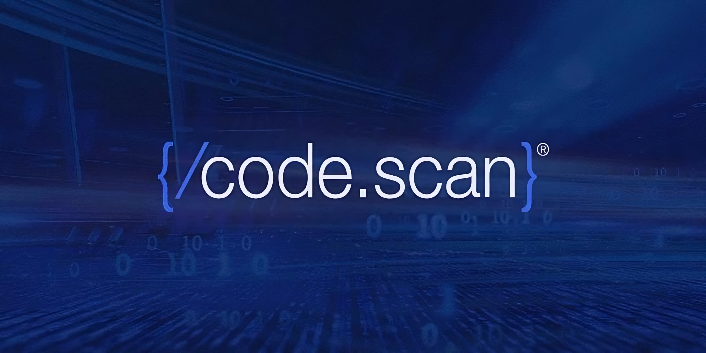

# CodeScan Release Notes

<figure><figcaption></figcaption></figure>

CodeScan offers three primary deployment options: [Cloud](cloud-releases/), [Self-Hosted](on-premise-releases/), and [Government](../ar-govcloud-documentation/). Release notes and information are available for each deployment type.
