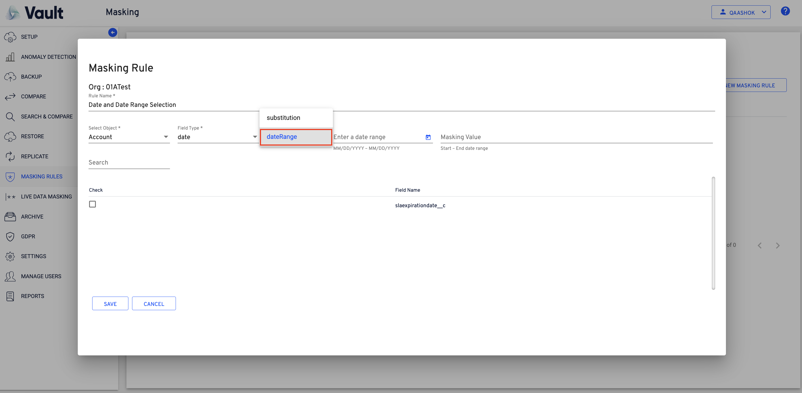
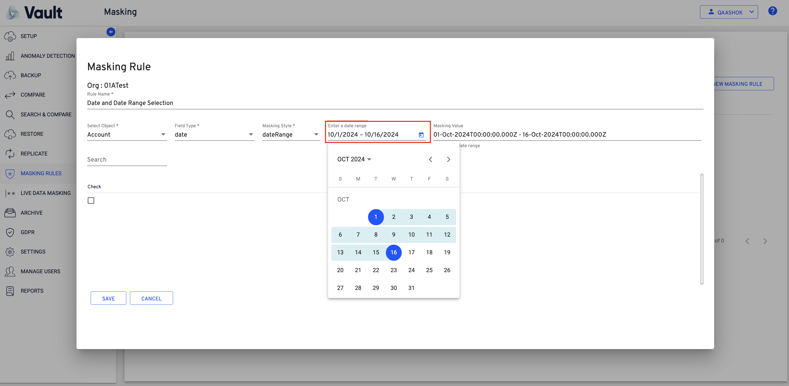

# Vault Release Notes 26.0



## Vault Release Notes 26.2.0

**Release Date: 08 Jul 2026**

#### Salesforce Data Anomaly Detection and Recovery 

Vault now includes Salesforce data anomaly detection and recovery capabilities. This enhancement helps identify unusual Salesforce data changes, review anomalies through dashboards and alerts, and recover affected records with greater precision.

<figure><figcaption></figcaption></figure>

#### Context-Aware Synthetic Data Masking 

Vault now supports synthetic data masking. Masked values are generated based on the original data type, such as names, email addresses, and phone numbers, that are realistic while helping protect sensitive information.

<figure><figcaption></figcaption></figure>

#### Pattern-Based Field Masking 

Pattern-based field masking has been added to support more precise protection of sensitive data. This enhancement identifies and replaces only the sensitive portions of field values, such as embedded email addresses, account numbers, and other sensitive text.

<figure><figcaption></figcaption></figure>

#### Secure Vault APIs for AutoRABIT Tool Integrations 

Secure Vault APIs have been introduced to support machine-to-machine integrations with other AutoRABIT tools. These APIs enable external workflows to trigger Vault jobs, track job progress, and retrieve results more efficiently.

<figure><figcaption></figcaption></figure>

#### Enhanced Log Segregation 

Log files are now enhanced for faster troubleshooting, more targeted support investigations, and more efficient audit-related analysis.

#### AWS SDK Upgrade 

AWS SDK is upgraded to address known vulnerabilities and long-term maintainability.

#### Column Adjustment and View Customization 

Supported Vault views now allow columns to be resized and selected based on preference. This improves readability and helps focus on the most relevant information in table-based views.

#### Full Backup Execution Reliability for Sandbox Orgs 

An issue where full backup jobs for sandbox orgs could remain stuck for an extended period has been resolved. This improves backup reliability and reduces interruptions caused by long-running jobs.

***

## Vault Release Notes 26.1.9

**Release Date: 24 Jun 2026**

**Sandbox Backup — Incorrect Failure Status on Partial Component Errors**\
Addressed an issue in the Vault Sandbox Backup module where a backup job was reported as **Failed** even when the majority of components were successfully backed up. The failure was triggered by specific error types in individual components, causing the entire job status to reflect as a complete failure rather than a partial success. This fix improves the accuracy and clarity of backup job status reporting.

**Backup Module: Toggle State Retention on the Data Tab**

Fixed an issue in the Backup module where changing the ON/OFF toggle on the **Data** tab incorrectly redirected the view to the **MetaData** tab. The **Data** tab now remains active after the toggle state is updated.

***

## Vault Release Notes 26.1.8

**Release Date: 10 Jun 2026**

**Backup Configuration Retention Period Fix**

Fixed a validation issue where the Backup Configuration retention field was restricted to a maximum of 9 years. Users can now configure retention values up to 99 years, enabling proper long-term retention policies.

**Vault Replicate Job Schedule Issue**

Fixed an issue where scheduled Replication Jobs were not triggering at their configured times. Customers who configured a Replication Job with a daily schedule and specific interval observed that the job would not trigger as expected.

***

## Vault Release Notes 26.1.7

**Release Date: 3 June 2026**

**Export Vault User List with Access & Login Details**

Vault Admins can now export the complete list of users along with key access and activity details. This enables faster user access reviews, simplifies compliance and audit reporting, and reduces dependency on support for user access reports.

**Vault Logging Out Immediately After Login**

Fixed an issue where Vault was logging users out immediately after a successful login, preventing access to the application entirely.

**Email Messages & Campaign Members Failing During Replication**

Resolved replication failures for Email Messages and Campaign Members. Email Messages and Campaign Members are failing with errors, even though the associated Leads and Contacts were successfully created in the target org. Cross-reference ID resolution during replication has been corrected.

**Corrupted Log Files for Failed Records**

Fixed an issue where downloading failed records log files resulted in corrupted files that could not be opened in Excel or CSV viewers. The root cause was a file format mismatch; now the log files will be downloaded in a format that opens correctly without manual renaming or extraction.

**Search & Compare Job History Table Data Misalignment**

Fixed a display issue in the Search & Compare Job History page where table data was misaligned with column headers. Row values appeared under incorrect columns, and Job Info icons were stacked vertically instead of being aligned with their respective rows. The table now renders correctly with proper column alignment.

**Schema Settings Lost When Saving Replication Configuration**

Fixed a bug where saved schema settings were lost after editing and saving a Replication Configuration. If a schema was already associated with a config and the user edited other fields, the schema would be silently removed upon saving. Schema selections are now correctly preserved across edits.

***

## Vault Release Notes 26.1.6

**Release Date: 20 May 2026**

**Restore Summary Not Visible in Vault Job**

Fixed an issue where the Restore Summary was not visible in the Vault job.

**Backup Jobs Not Loading in the Replicate Module**

Resolved an issue where Backup Job details were not displayed in the Replicate module. The issue was caused by a missing null check in the backend query, which prevented backup job information from loading correctly.

***

## Vault Release Notes 26.1.5

**Release Date: 06 May 2026**

**Enhance Authentication Event Logging with Detailed Failure Reasons**

* Enhanced the authentication logging framework to capture granular failure reasons for all authentication attempts across UI login, API, and service-to-service flows. Logs follow a structured CEF format and are searchable by username, customerId, failureReason, and timestamp.

**Upgrade Salesforce APIs to Spring '26 (v66)**

* Upgraded all Salesforce APIs from the current version to v66 (Spring '26) to leverage new capabilities, improved performance, and stay compliant with customer Salesforce org versions.

**Field-Level Restoration Not Working as Expected**

* Fixed an issue where field-level restoration from a compare job failed to restore blank/null values when using the "Select field" option, even with "Override data with blank values" enabled. Full-record restoration worked correctly; the fix ensures field-level selection also honors the override setting.

**Schema Search Showing "Path Not Found"**

* Fixed an issue in Archive Configuration where searching for parent or child schemas incorrectly displayed a "Path Not Found" message instead of the expected schema hierarchy results.

**Backup Configuration Screen Freezing on Object Deselection**

* Fixed a UI freeze that occurred when selecting/deselecting Data or Metadata objects during Backup and Replication configuration setup.

## Vault Release Notes 26.1.4

**Release Date: 29 April 2026**

**Replication Job Configuration — Target Org Update Issue**\
Resolved an issue where modifying a Replication Job Configuration to update the Target Org resulted in an "Invalid Request" error, requiring the job to be recreated. Additionally, records uploaded via CSV were not displaying correctly during edit. Both issues have been addressed, allowing seamless updates and proper data visibility.

**Accounts Backup Download Issue**\
Fixed a problem where downloading the Accounts object from a backup job failed with a request error, causing the loading process to stall indefinitely. The download process now completes successfully across environments.

**Activity Log User Information Display**\
Addressed an intermittent issue where Activity Log entries displayed null values instead of the associated user details. User information is now consistently captured and displayed correctly.

**Archive Deletion Navigation Behavior**\
Corrected the navigation flow after deleting a configuration from the Archive section. The interface now remains within the Archive view instead of redirecting to another section.

***

## Vault Release Notes 26.1.3

**Release Date: 22 April 2026**

**Configurable** **Session Timeout**\
Administrators can now define session timeout duration from **Settings → General**. The configured value is centrally enforced for all users during authenticated API sessions.

* Applies to all users within the customer environment
* Enforced from the next login session onward
* Does not impact already active sessions

This enhancement improves session management and security control across the organization.

**High‑Frequency Logging**

Introduces fine-grained logging for storage operations to enhance troubleshooting and observability of I/O operations to storage.

**Backup Logging Improvements**

Refined logs to provide clearer insights into backup status processes, balancing visibility and log volume.

**Enhanced Audit Logging for User Sessions & Role Changes**

Added detailed audit logs for user sessions and role management activities to improve traceability for compliance and security.

**Backup Performance Improvement**

Optimized rich text field processing during backup to significantly reduce backup runtime, especially for orgs with extensive rich text content.

**Restore Fix — Hierarchical Child Object Not Processed**

Corrected an issue where restore jobs were not processing child objects in hierarchical schemas, ensuring complete data restoration.

**Improved Backup Status Reporting**\
Addressed an issue where the overall backup summary status did not align with the detailed component-level results. In some cases, components marked as failed in the summary were shown as successful in the detailed view. Additionally, certain data sets incorrectly reported errors despite having no records.

This fix ensures:

* Consistency between summary and detailed backup statuses
* Accurate reporting of component-level results
* Proper handling of empty data sets, eliminating false error indications

***

## Vault Release Notes 26.1.2

**Release Date: 08 April 2026**

**Vault On‑prem search & compare failure**

* Resolved failures in Vault On‑prem search and compare jobs to ensure jobs complete successfully.

**Partial child records Fetched When “Include All Child Objects” selected**

* Corrected Replicate behavior so “Include All Child Objects” now processes all expected child records.

**Resolved Data Type Mismatch in Search Jobs**

Fixed an issue where data type mismatches between source data and schema caused errors during Search job execution.

**Masking info icon shown without rules**

* Updated UI to hide the masking info icon when no masking rules are configured.

**Slow compare jobs for same dataset**

* Improved Search & Compare performance where compare jobs were taking significantly longer than earlier runs on the same dataset.

**Restore module missing for sub‑user**

* Identified that the missing module issue was caused by insufficient permissions, and enhanced the error handling to display a clear and informative message indicating the permission constraint.

**nCino backup retention mismatch**

* Aligned backup retention details so configuration and edit views show consistent values for nCino backups.

**Sub‑user org registration failure**

* Resolved issues causing org registration to fail for sub‑users.

**Date range masking timestamp shift**

* Fixed a defect where date range masking altered the timestamp for datetime records.

**“Edit Client Keys” auth flow issues**

* Addressed authentication flow problems in the “Edit Client Keys” screen to provide a reliable sign‑in experience.

**Retention period edit view mismatch**

* Corrected retention period editing so years, months, and days are all displayed consistently instead of only days.

**No max limit shown for retention period**

* Added validation/feedback so the maximum allowed retention limit is enforced and clearly shown.

**Task restore records mismatch**

* Fixed Task Restore so it now restores the correct set of records as expected.

**Date range masking issues in Replicate & Live Masking**

* Resolved date range masking inconsistencies affecting both Replicate and Live Data Masking configurations.

**Synthetic backup record count higher than actual**

* Fixed synthetic backup logic so generated record counts now align with actual data volumes.

**Vault on‑prem checklist**

* Introduced/updated an on‑prem validation checklist for Vault deployments to standardize setup and verification.

**Performance degradation in parallel Search & Compare**

* Optimized system resources and job handling to reduce CPU, memory, and I/O bottlenecks during parallel Search & Compare jobs.

**Errors when exporting >100K records**

* Resolved authentication issues that caused errors when exporting large datasets

***

## Vault Release Notes 26.1.1

**Release Date: 25 March 2026**

**Range-Based Date Masking for Sensitive Date Fields**\
Introduced range‑based date masking for sensitive date fields, enabling more flexible and realistic anonymization by shifting dates within configurable ranges.

<figure><figcaption></figcaption></figure>

<figure><figcaption></figcaption></figure>

**Error while creating backup config with filter**\
Fixed an error occurring when creating backup configurations with filters, so filtered backup configs can now be created reliably.

**Intermittent archive job failure**\
Resolved intermittent archive job failures caused by “Failed to write backup to storage” errors, improving archive job reliability.

**Live Data Masking - Auto-delete of Local Masking Rules**\
Fixed an issue where local masking rules were not automatically deleted when their associated Live Data Masking configuration was removed, preventing leftover rules.

**Search bar missing in field selection during configuration creation**\
Added the missing search bar in the field selection section when creating Search & Compare configurations, making it easier to find and select fields.

**Order of latest snapshot records in compare screen**\
Adjusted snapshot ordering on the compare screen, so the latest snapshot records now display in the correct lower section, improving readability of comparisons.

**Backup download email content mismatch**\
Corrected the email template triggered for backup downloads so its content now accurately reflects the download action rather than showing backup summary text.

**Search & Compare | Improved Failure Messaging**\
Improved failure messaging by displaying a clearer message “Job failed. Please review the job logs for more details”, within the job details view, guiding users to review job logs for more information when a job fails.

**Case Sensitivity toggle in Search & Compare**\
Added a case sensitivity toggle in Search & Compare, allowing users to choose whether text comparisons are case‑sensitive or case‑insensitive.

**Metadata restore issues**\
Introduced a rollback capability for failed jobs, enabling recovery of missing files and resolution of metadata-related errors.

**Environment-based backup retention policy**\
Implemented environment‑based backup retention policies, allowing distinct retention behavior for Production versus Sandbox environments and correcting existing sandbox retention settings.

**Reports failing to replicate in target org**\
Fixed a problem that caused certain reports to fail replication to target orgs, improving reliability and coverage for report replication.

**Compare job stuck “In Progress” with lengthy Customer ID**\
Resolved an issue where compare jobs could remain stuck “In Progress” when the Customer ID was unusually long, improving job completion reliability.

**Boolean config field accepts uppercase value without validation**\
Improved validation for boolean configuration fields in Search & Compare so invalid uppercase values are no longer accepted without proper validation.

**Config updates not reflected in the generated query**\
Fixed an issue where updates to the selected object in Search & Compare configuration edits were not reflected in the generated query, ensuring configuration changes take effect correctly.

**Provided Retry option for Live Data Masking**\
Introduced a Retry option for Live Data Masking jobs, allowing users to quickly rerun failed masking operations without recreating the configuration.

**Unable to access/login to Vault**\
Fixed a login issue that prevented some users from accessing Vault, improving authentication stability and reducing access errors.

**Restore seems stuck**\
Resolved an issue where certain restore jobs are not retaining the partial selection of the records. After the fix is rolled-out the partial selection of the records is being retained.

**Unable to replicate files larger than 10MB**\
Fixed an issue that prevented replication of files larger than 10 MB, ensuring large files are now handled correctly during replication.

***

## Vault Release Notes 26.1.0

**Release Date: 4 March 2026**

**Search Across Backups and Archives**

Vault now enables advanced searches across Backups and Archives within a selectable six-month time span using an intuitive query builder. Users can define specific criteria, execute the search configuration, and identify data from Archives & Backups.

<figure><figcaption></figcaption></figure>

The feature allows comparison of selected snapshots to pinpoint changes across Orgs based on the defined criteria. Once differences are identified, the **Review and Restore** capability enables targeted data restoration, ensuring precise recovery of required records.

<figure><figcaption></figcaption></figure>

This enhancement streamlines historical data analysis and controlled restoration from backups and archives.

<figure><figcaption></figcaption></figure>


**Note:**

The **Search & Compare** functionality is supported only for data available in **AWS S3**. Data stored outside AWS S3 is not supported for Search & Compare operations.


**Salesforce Org Registration – Enhanced to Support External Client Apps**

Updated the Salesforce Org registration flow to use OAuth 2.0 aligned with Salesforce’s requirement to support OAuth flow through External Connected Apps. The enhanced guided setup enables secure onboarding of Production and Sandbox environments with real-time validation, encrypted credential storage, automatic token management, actionable error guidance, environment health visibility, and complete audit logging.

#### Multi-Factor Authentication – QR Code Display

Resolved an issue where the QR code was not displayed during the multi-factor authentication (MFA) setup process. This fix ensures that the QR code is properly generated and available during authentication setup, allowing users to complete MFA configuration successfully.

<figure><figcaption></figcaption></figure>

**SSO Login – SAML Issuer Handling Fix**

Resolved an issue where users could encounter login failures when authenticating through SSO due to improper handling of the SAML issuer during validation. The authentication process has been updated to correctly process the issuer value, ensuring successful login when the required attributes are provided by the Identity Provider.
